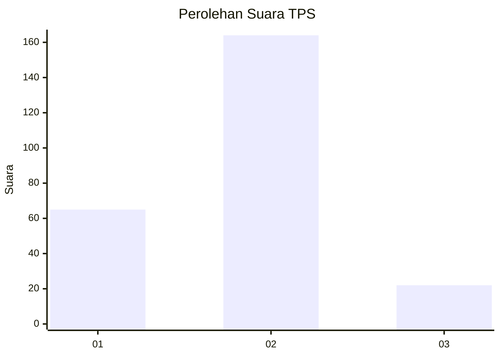
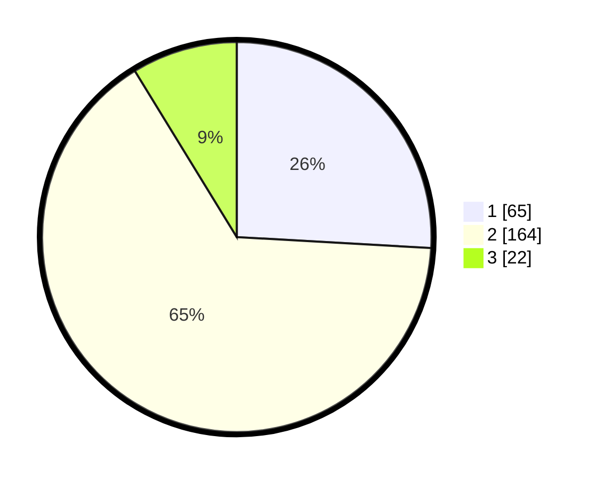

# Hasil

## Grafik

## Tabel

| No. | Nama Paslon    | Suara | Suara (raw) | Persentase |
|:--- |:-------------- | -----:| -----------:| ----------:|
| 1   | ANIES MUHAIMIN | 65    | [65][p-1]   | 25,90      |
| 2   | PRABOWO GIBRAN | 164   | [164][p-2]  | 65,34      |
| 3   | GANJAR MAHFUD  | 22    | [22][p-3]   | 8,76       |

[p-1]: https://github.com/gigit-pemilu/pemilu-2024-65-kalimantan-utara/blob/main/pilpres/hitung-suara/sub/65-kalimantan-utara/sub/01-bulungan/sub/01-tanjung-palas/sub/1001-tanjung-palas-hulu/sub/004-tps/sub/paslon-1.txt
[p-2]: https://github.com/gigit-pemilu/pemilu-2024-65-kalimantan-utara/blob/main/pilpres/hitung-suara/sub/65-kalimantan-utara/sub/01-bulungan/sub/01-tanjung-palas/sub/1001-tanjung-palas-hulu/sub/004-tps/sub/paslon-2.txt
[p-3]: https://github.com/gigit-pemilu/pemilu-2024-65-kalimantan-utara/blob/main/pilpres/hitung-suara/sub/65-kalimantan-utara/sub/01-bulungan/sub/01-tanjung-palas/sub/1001-tanjung-palas-hulu/sub/004-tps/sub/paslon-3.txt

## Foto C Plano

https://sirekap-obj-formc.kpu.go.id/d074/pemilu/ppwp/65/01/01/10/01/6501011001004-20240217-175607--16317522-e289-4ee8-88b5-2fc729c189f2.jpg

https://sirekap-obj-formc.kpu.go.id/d074/pemilu/ppwp/65/01/01/10/01/6501011001004-20240217-175608--49f55693-0465-4527-90fe-3470f5bfb7fc.jpg

https://sirekap-obj-formc.kpu.go.id/d074/pemilu/ppwp/65/01/01/10/01/6501011001004-20240217-175607--546f8f04-ba48-476c-8568-8f4290870dfd.jpg

## Metadata

| Key        | Value               |
| ---------- | ------------------- |
| Time Stamp | 2024-02-24 22:31:28 |

## DATA PEMILIH TETAP

Jumlah pemilih dalam DPT: **279**.
 * L: **141**.
 * P: **138**.

## DATA PENGGUNA HAK PILIH

Jumlah pengguna hak pilih dalam DPT: **245**.
 * L: **121**.
 * P: **124**.

Jumlah pengguna hak pilih dalam DPTb: **3**.
 * L: **3**.
 * P: **0**.

Jumlah pengguna hak pilih dalam DPK: **8**.
 * L: **5**.
 * P: **3**.

Jumlah pengguna hak pilih: **256**.
 * L: **129**.
 * P: **128**.

## JUMLAH SUARA SAH DAN TIDAK SAH

JUMLAH SELURUH SUARA SAH: **251**.

JUMLAH SUARA TIDAK SAH: **5**.

JUMLAH SELURUH SUARA SAH DAN SUARA TIDAK SAH: **256**.

