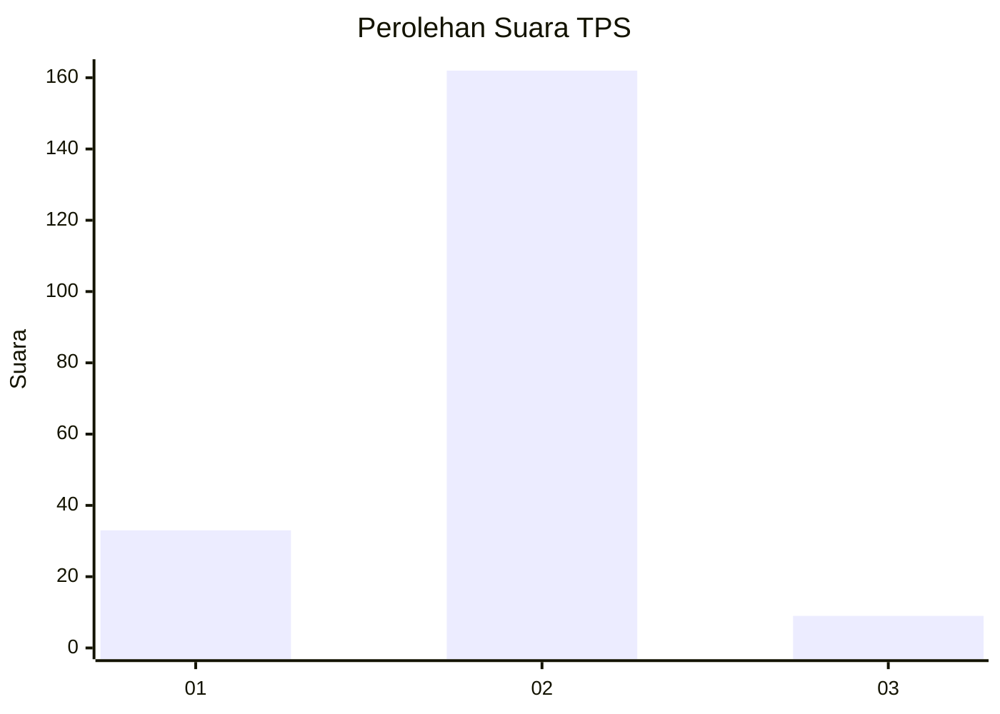
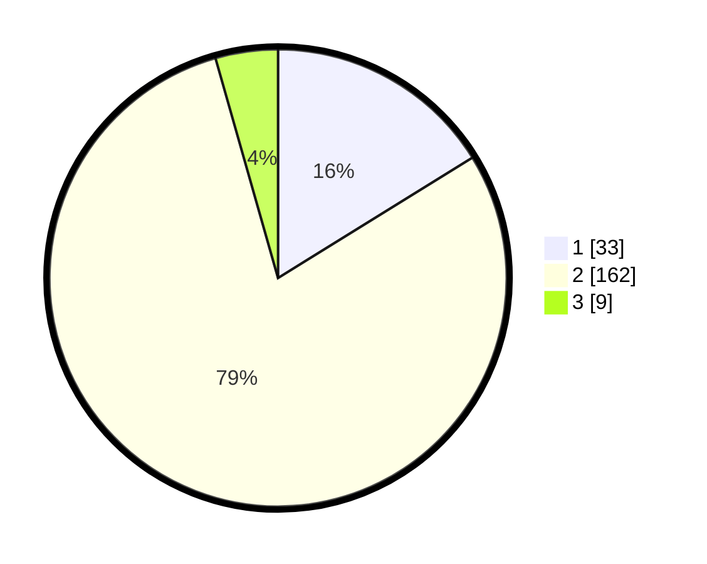

# Hasil

## Grafik

## Tabel

| No. | Nama Paslon    | Suara | Suara (raw) | Persentase |
|:--- |:-------------- | -----:| -----------:| ----------:|
| 1   | ANIES MUHAIMIN | 33    | [33][p-1]   | 16,18      |
| 2   | PRABOWO GIBRAN | 162   | [162][p-2]  | 79,41      |
| 3   | GANJAR MAHFUD  | 9     | [9][p-3]    | 4,41       |

[p-1]: https://github.com/gigit-pemilu/pemilu-2024-65-kalimantan-utara/blob/main/pilpres/hitung-suara/sub/65-kalimantan-utara/sub/01-bulungan/sub/01-tanjung-palas/sub/1002-tanjung-palas-tengah/sub/001-tps/sub/paslon-1.txt
[p-2]: https://github.com/gigit-pemilu/pemilu-2024-65-kalimantan-utara/blob/main/pilpres/hitung-suara/sub/65-kalimantan-utara/sub/01-bulungan/sub/01-tanjung-palas/sub/1002-tanjung-palas-tengah/sub/001-tps/sub/paslon-2.txt
[p-3]: https://github.com/gigit-pemilu/pemilu-2024-65-kalimantan-utara/blob/main/pilpres/hitung-suara/sub/65-kalimantan-utara/sub/01-bulungan/sub/01-tanjung-palas/sub/1002-tanjung-palas-tengah/sub/001-tps/sub/paslon-3.txt

## Foto C Plano

https://sirekap-obj-formc.kpu.go.id/a71e/pemilu/ppwp/65/01/01/10/02/6501011002001-20240217-165407--a78e8d5b-c67f-4c73-9a0f-d8ccf3a62047.jpg

https://sirekap-obj-formc.kpu.go.id/a71e/pemilu/ppwp/65/01/01/10/02/6501011002001-20240217-165409--29dfe820-26eb-4863-bc96-989d6fe6a7aa.jpg

https://sirekap-obj-formc.kpu.go.id/a71e/pemilu/ppwp/65/01/01/10/02/6501011002001-20240217-165408--142530c9-a1bc-41e5-b116-d499d7986317.jpg

## Metadata

| Key        | Value               |
| ---------- | ------------------- |
| Time Stamp | 2024-02-24 22:31:28 |

## DATA PEMILIH TETAP

Jumlah pemilih dalam DPT: **211**.
 * L: **111**.
 * P: **100**.

## DATA PENGGUNA HAK PILIH

Jumlah pengguna hak pilih dalam DPT: **188**.
 * L: **93**.
 * P: **95**.

Jumlah pengguna hak pilih dalam DPTb: **2**.
 * L: **1**.
 * P: **1**.

Jumlah pengguna hak pilih dalam DPK: **17**.
 * L: **9**.
 * P: **8**.

Jumlah pengguna hak pilih: **207**.
 * L: **103**.
 * P: **104**.

## JUMLAH SUARA SAH DAN TIDAK SAH

JUMLAH SELURUH SUARA SAH: **204**.

JUMLAH SUARA TIDAK SAH: **3**.

JUMLAH SELURUH SUARA SAH DAN SUARA TIDAK SAH: **207**.

