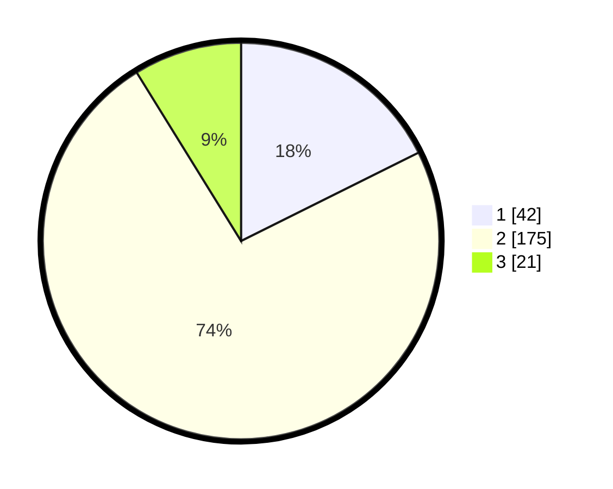

# Hasil

## Grafik

## Tabel

| No. | Nama Paslon    | Suara | Suara (raw) | Persentase |
|:--- |:-------------- | -----:| -----------:| ----------:|
| 1   | ANIES MUHAIMIN | 42    | [42][p-1]   | 17,65      |
| 2   | PRABOWO GIBRAN | 175   | [175][p-2]  | 73,53      |
| 3   | GANJAR MAHFUD  | 21    | [21][p-3]   | 8,82       |

[p-1]: https://github.com/gigit-pemilu/pemilu-2024-65-kalimantan-utara/blob/main/pilpres/hitung-suara/sub/65-kalimantan-utara/sub/01-bulungan/sub/09-sekatak/sub/2001-sekatak-buji/sub/004-tps/sub/paslon-1.txt
[p-2]: https://github.com/gigit-pemilu/pemilu-2024-65-kalimantan-utara/blob/main/pilpres/hitung-suara/sub/65-kalimantan-utara/sub/01-bulungan/sub/09-sekatak/sub/2001-sekatak-buji/sub/004-tps/sub/paslon-2.txt
[p-3]: https://github.com/gigit-pemilu/pemilu-2024-65-kalimantan-utara/blob/main/pilpres/hitung-suara/sub/65-kalimantan-utara/sub/01-bulungan/sub/09-sekatak/sub/2001-sekatak-buji/sub/004-tps/sub/paslon-3.txt

## Foto C Plano

https://sirekap-obj-formc.kpu.go.id/9fea/pemilu/ppwp/65/01/09/20/01/6501092001004-20240214-231107--9ef15490-10bd-4194-963f-ca29c823a880.jpg

https://sirekap-obj-formc.kpu.go.id/9fea/pemilu/ppwp/65/01/09/20/01/6501092001004-20240214-231205--9595ce13-2bf4-403a-88c7-4a6d9ae055d9.jpg

https://sirekap-obj-formc.kpu.go.id/9fea/pemilu/ppwp/65/01/09/20/01/6501092001004-20240214-231253--9a26bc25-801d-4a7a-8e1f-98af2613215b.jpg

## Metadata

| Key        | Value               |
| ---------- | ------------------- |
| Time Stamp | 2024-02-15 18:30:25 |

