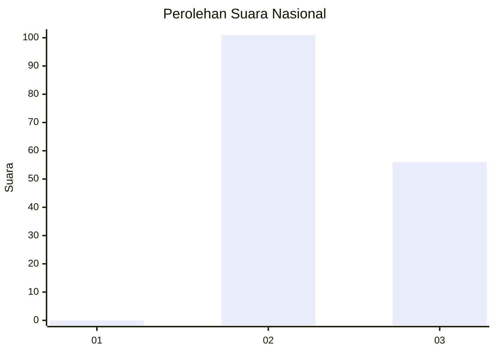
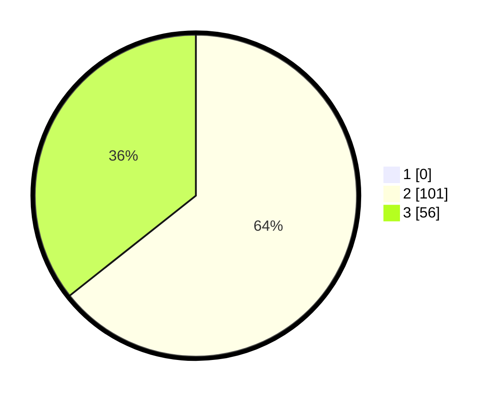

# Hasil

## Grafik

## Tabel

| No. | Nama Paslon    | Suara | Suara (raw) | Persentase |
|:--- |:-------------- | -----:| -----------:| ----------:|
| 1   | ANIES MUHAIMIN | 0     | [0][p-1]    | 0,00       |
| 2   | PRABOWO GIBRAN | 101   | [101][p-2]  | 64,33      |
| 3   | GANJAR MAHFUD  | 56    | [56][p-3]   | 35,67      |

[p-1]: https://github.com/gigit-pemilu/pemilu-2024/blob/main/pilpres/hitung-suara/sub/65-kalimantan-utara/sub/02-malinau/sub/07-malinau-utara/sub/2002-luso/sub/001-tps/sub/paslon-1.txt
[p-2]: https://github.com/gigit-pemilu/pemilu-2024/blob/main/pilpres/hitung-suara/sub/65-kalimantan-utara/sub/02-malinau/sub/07-malinau-utara/sub/2002-luso/sub/001-tps/sub/paslon-2.txt
[p-3]: https://github.com/gigit-pemilu/pemilu-2024/blob/main/pilpres/hitung-suara/sub/65-kalimantan-utara/sub/02-malinau/sub/07-malinau-utara/sub/2002-luso/sub/001-tps/sub/paslon-3.txt

## Foto C Plano

https://sirekap-obj-formc.kpu.go.id/1d8b/pemilu/ppwp/65/02/07/20/02/6502072002001-20240215-015044--05c63183-5d1c-4a21-9dcf-40048f29ce8a.jpg

https://sirekap-obj-formc.kpu.go.id/1d8b/pemilu/ppwp/65/02/07/20/02/6502072002001-20240215-020132--2089352d-4f67-4b1d-a523-953c9e5aa0cc.jpg

https://sirekap-obj-formc.kpu.go.id/1d8b/pemilu/ppwp/65/02/07/20/02/6502072002001-20240215-020250--c42e4fe6-2401-423e-bfa7-32112f7e5cd3.jpg

## Metadata

| Key        | Value               |
| ---------- | ------------------- |
| Time Stamp | 2024-02-21 08:00:00 |

