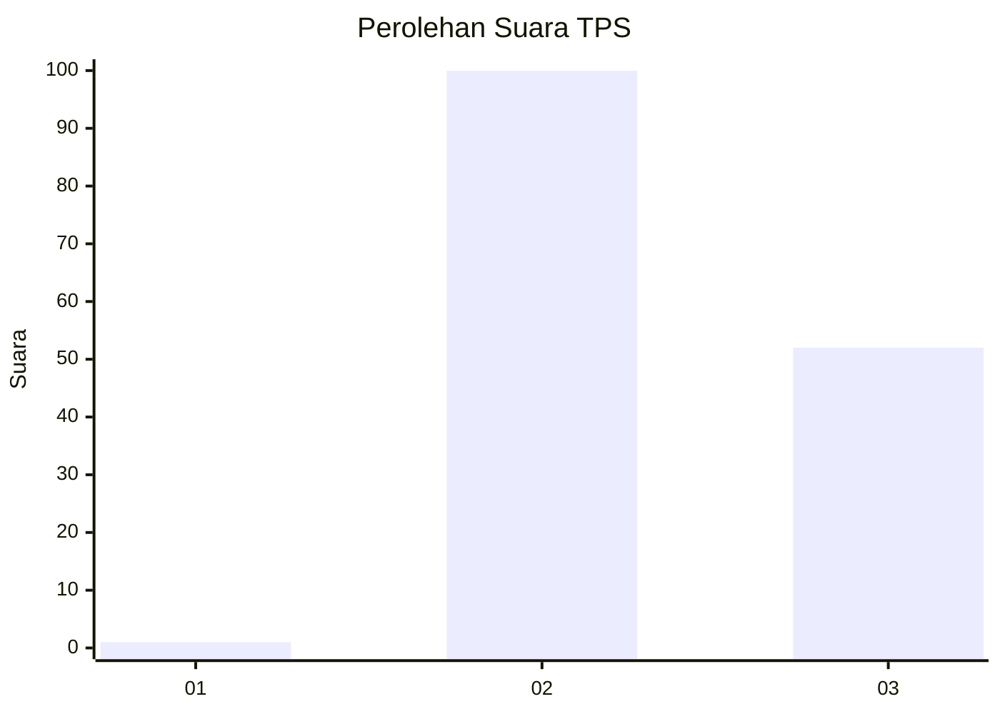
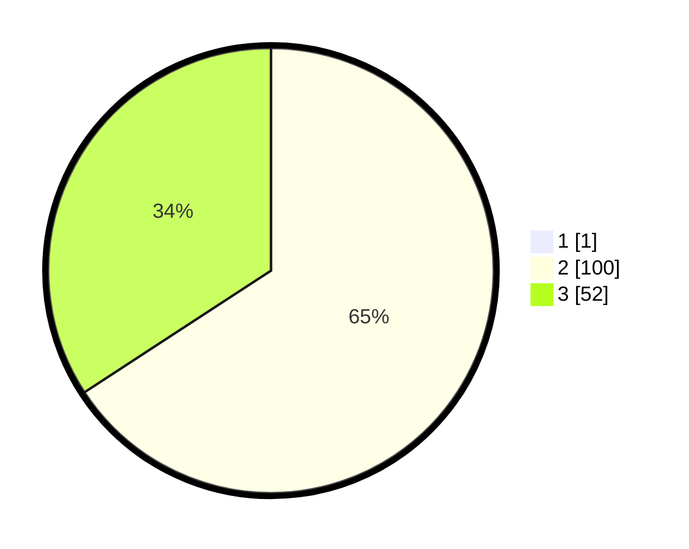

# Hasil

## Grafik

## Tabel

| No. | Nama Paslon    | Suara | Suara (raw) | Persentase |
|:--- |:-------------- | -----:| -----------:| ----------:|
| 1   | ANIES MUHAIMIN | 1     | [1][p-1]    | 0,65       |
| 2   | PRABOWO GIBRAN | 100   | [100][p-2]  | 65,36      |
| 3   | GANJAR MAHFUD  | 52    | [52][p-3]   | 33,99      |

[p-1]: https://github.com/gigit-pemilu/pemilu-2024-65-kalimantan-utara/blob/main/pilpres/hitung-suara/sub/65-kalimantan-utara/sub/02-malinau/sub/07-malinau-utara/sub/2002-luso/sub/002-tps/sub/paslon-1.txt
[p-2]: https://github.com/gigit-pemilu/pemilu-2024-65-kalimantan-utara/blob/main/pilpres/hitung-suara/sub/65-kalimantan-utara/sub/02-malinau/sub/07-malinau-utara/sub/2002-luso/sub/002-tps/sub/paslon-2.txt
[p-3]: https://github.com/gigit-pemilu/pemilu-2024-65-kalimantan-utara/blob/main/pilpres/hitung-suara/sub/65-kalimantan-utara/sub/02-malinau/sub/07-malinau-utara/sub/2002-luso/sub/002-tps/sub/paslon-3.txt

## Foto C Plano

https://sirekap-obj-formc.kpu.go.id/759d/pemilu/ppwp/65/02/07/20/02/6502072002002-20240214-225912--9ddfb06b-d5fe-42f3-94ab-8fdff6f54a36.jpg

https://sirekap-obj-formc.kpu.go.id/759d/pemilu/ppwp/65/02/07/20/02/6502072002002-20240214-230201--3c927f5f-f0d8-4edb-a0a1-a7ebfb7efe48.jpg

https://sirekap-obj-formc.kpu.go.id/759d/pemilu/ppwp/65/02/07/20/02/6502072002002-20240214-230339--4d50b4c7-7410-40a8-b9fc-9342005bea72.jpg

## Metadata

| Key        | Value               |
| ---------- | ------------------- |
| Time Stamp | 2024-02-24 22:31:28 |

