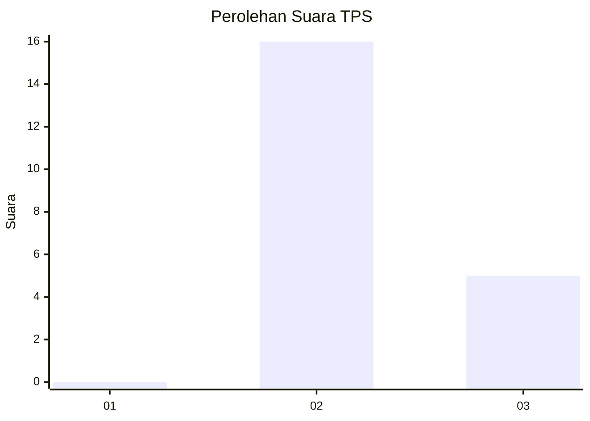
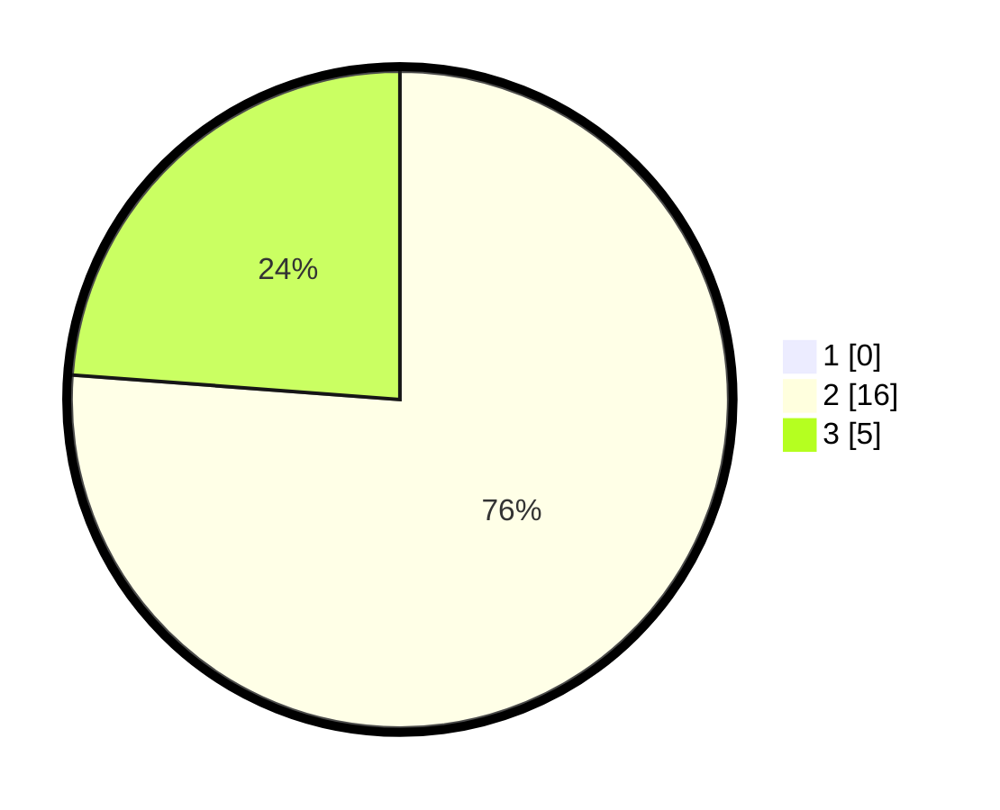

# Hasil

## Grafik

## Tabel

| No. | Nama Paslon    | Suara | Suara (raw) | Persentase |
|:--- |:-------------- | -----:| -----------:| ----------:|
| 1   | ANIES MUHAIMIN | 0     | [0][p-1]    | 0,00       |
| 2   | PRABOWO GIBRAN | 16    | [16][p-2]   | 76,19      |
| 3   | GANJAR MAHFUD  | 5     | [5][p-3]    | 23,81      |

[p-1]: https://github.com/gigit-pemilu/pemilu-2024-65-kalimantan-utara/blob/main/pilpres/hitung-suara/sub/65-kalimantan-utara/sub/02-malinau/sub/09-sungai-boh/sub/2004-long-top/sub/001-tps/sub/paslon-1.txt
[p-2]: https://github.com/gigit-pemilu/pemilu-2024-65-kalimantan-utara/blob/main/pilpres/hitung-suara/sub/65-kalimantan-utara/sub/02-malinau/sub/09-sungai-boh/sub/2004-long-top/sub/001-tps/sub/paslon-2.txt
[p-3]: https://github.com/gigit-pemilu/pemilu-2024-65-kalimantan-utara/blob/main/pilpres/hitung-suara/sub/65-kalimantan-utara/sub/02-malinau/sub/09-sungai-boh/sub/2004-long-top/sub/001-tps/sub/paslon-3.txt

## Foto C Plano

https://sirekap-obj-formc.kpu.go.id/d856/pemilu/ppwp/65/02/09/20/04/6502092004001-20240214-123458--31b589f1-237f-4a65-a01d-86944aff4226.jpg

https://sirekap-obj-formc.kpu.go.id/d856/pemilu/ppwp/65/02/09/20/04/6502092004001-20240214-123157--0dc3e0ea-9ec3-48f5-9b6e-8176ce8fef92.jpg

https://sirekap-obj-formc.kpu.go.id/d856/pemilu/ppwp/65/02/09/20/04/6502092004001-20240214-123313--c296f5e1-dda5-4e95-8604-3381ca8826fb.jpg

## Metadata

| Key        | Value               |
| ---------- | ------------------- |
| Time Stamp | 2024-02-15 23:29:50 |

