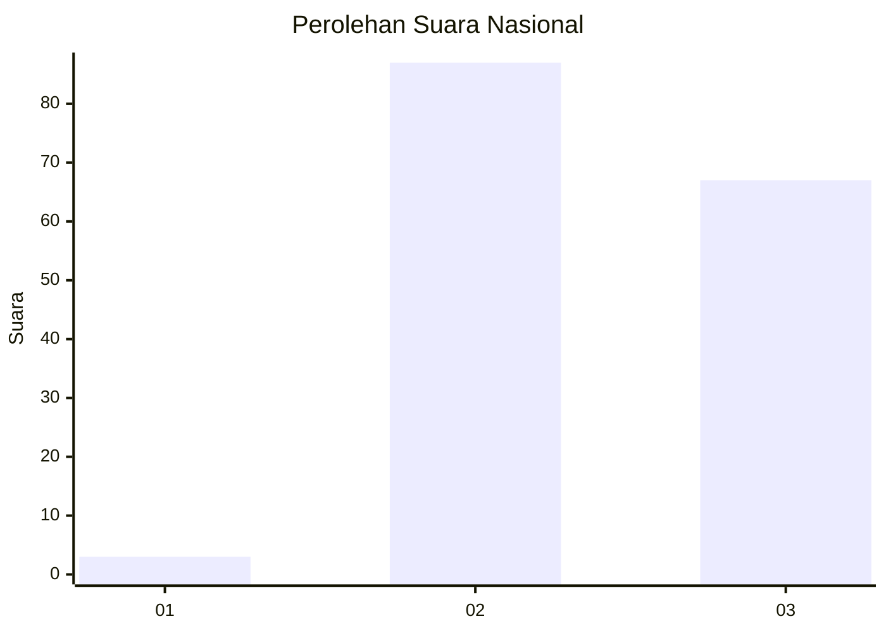
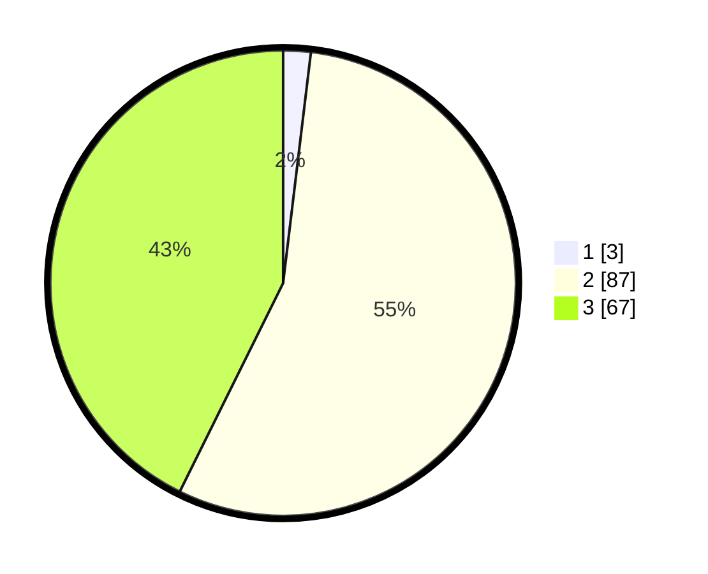

# Hasil

## Grafik

## Tabel

| No. | Nama Paslon    | Suara | Suara (raw) | Persentase |
|:--- |:-------------- | -----:| -----------:| ----------:|
| 1   | ANIES MUHAIMIN | 3     | [3][p-1]    | 1,91       |
| 2   | PRABOWO GIBRAN | 87    | [87][p-2]   | 55,41      |
| 3   | GANJAR MAHFUD  | 67    | [67][p-3]   | 42,68      |

[p-1]: https://github.com/gigit-pemilu/pemilu-2024/blob/main/pilpres/hitung-suara/sub/65-kalimantan-utara/sub/02-malinau/sub/10-kayan-selatan/sub/2004-sungai-barang/sub/001-tps/sub/paslon-1.txt
[p-2]: https://github.com/gigit-pemilu/pemilu-2024/blob/main/pilpres/hitung-suara/sub/65-kalimantan-utara/sub/02-malinau/sub/10-kayan-selatan/sub/2004-sungai-barang/sub/001-tps/sub/paslon-2.txt
[p-3]: https://github.com/gigit-pemilu/pemilu-2024/blob/main/pilpres/hitung-suara/sub/65-kalimantan-utara/sub/02-malinau/sub/10-kayan-selatan/sub/2004-sungai-barang/sub/001-tps/sub/paslon-3.txt

## Foto C Plano

https://sirekap-obj-formc.kpu.go.id/ddba/pemilu/ppwp/65/02/10/20/04/6502102004001-20240215-071833--f3ba2c88-a7ef-4e61-b80a-977ad8e026b2.jpg

https://sirekap-obj-formc.kpu.go.id/ddba/pemilu/ppwp/65/02/10/20/04/6502102004001-20240215-072011--f8c5bede-32ed-4759-a62e-87813789179c.jpg

https://sirekap-obj-formc.kpu.go.id/ddba/pemilu/ppwp/65/02/10/20/04/6502102004001-20240215-072145--977d65c0-3b4c-413e-acac-0ea908394041.jpg

## Metadata

| Key        | Value               |
| ---------- | ------------------- |
| Time Stamp | 2024-02-15 23:29:50 |

