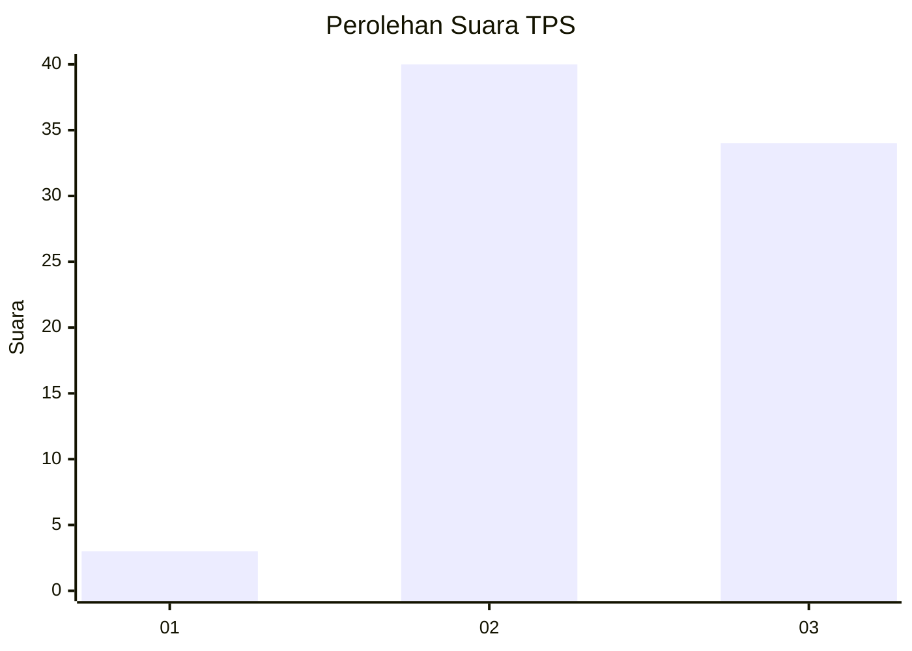
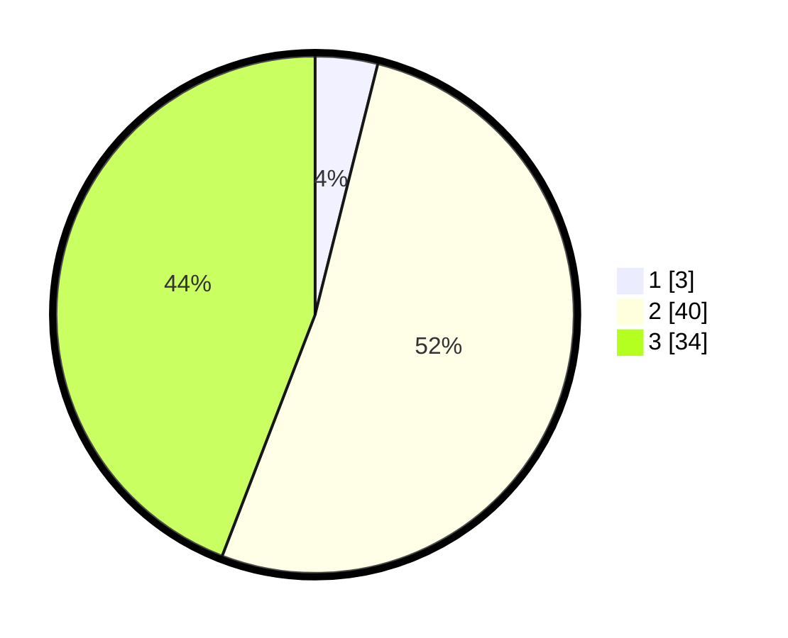

# Hasil

## Grafik

## Tabel

| No. | Nama Paslon    | Suara | Suara (raw) | Persentase |
|:--- |:-------------- | -----:| -----------:| ----------:|
| 1   | ANIES MUHAIMIN | 3     | [3][p-1]    | 3,90       |
| 2   | PRABOWO GIBRAN | 40    | [40][p-2]   | 51,95      |
| 3   | GANJAR MAHFUD  | 34    | [34][p-3]   | 44,16      |

[p-1]: https://github.com/gigit-pemilu/pemilu-2024-65-kalimantan-utara/blob/main/pilpres/hitung-suara/sub/65-kalimantan-utara/sub/02-malinau/sub/11-bahau-hulu/sub/2006-long-kemuat/sub/001-tps/sub/paslon-1.txt
[p-2]: https://github.com/gigit-pemilu/pemilu-2024-65-kalimantan-utara/blob/main/pilpres/hitung-suara/sub/65-kalimantan-utara/sub/02-malinau/sub/11-bahau-hulu/sub/2006-long-kemuat/sub/001-tps/sub/paslon-2.txt
[p-3]: https://github.com/gigit-pemilu/pemilu-2024-65-kalimantan-utara/blob/main/pilpres/hitung-suara/sub/65-kalimantan-utara/sub/02-malinau/sub/11-bahau-hulu/sub/2006-long-kemuat/sub/001-tps/sub/paslon-3.txt

## Foto C Plano

https://sirekap-obj-formc.kpu.go.id/3d61/pemilu/ppwp/65/02/11/20/06/6502112006001-20240215-041530--79119eba-6971-4581-a6a5-afbb6a4f3c1b.jpg

https://sirekap-obj-formc.kpu.go.id/3d61/pemilu/ppwp/65/02/11/20/06/6502112006001-20240215-041546--e4b88800-64bf-4534-a353-3fd03d2f70c9.jpg

https://sirekap-obj-formc.kpu.go.id/3d61/pemilu/ppwp/65/02/11/20/06/6502112006001-20240215-041556--bbef93d1-8122-47fa-a907-509ea3b4a310.jpg

## Metadata

| Key        | Value               |
| ---------- | ------------------- |
| Time Stamp | 2024-02-15 23:29:50 |

