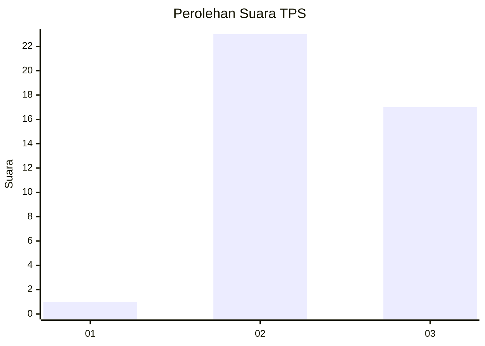
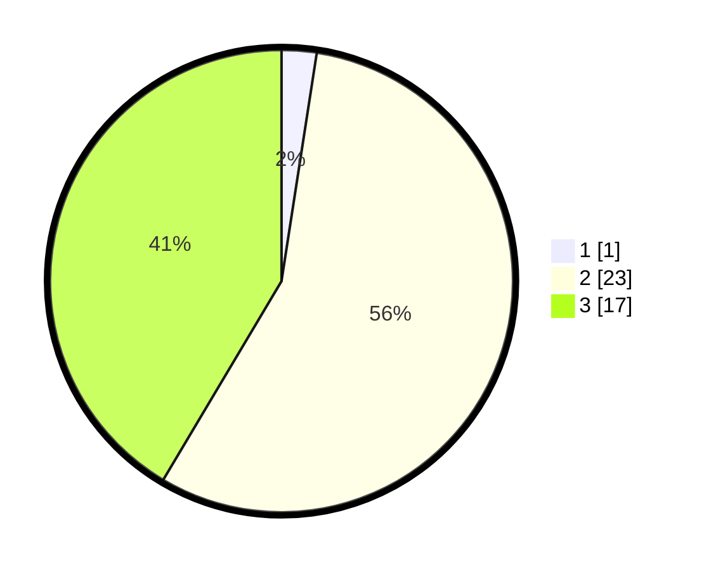

# Hasil

## Grafik

## Tabel

| No. | Nama Paslon    | Suara | Suara (raw) | Persentase |
|:--- |:-------------- | -----:| -----------:| ----------:|
| 1   | ANIES MUHAIMIN | 1     | [1][p-1]    | 2,44       |
| 2   | PRABOWO GIBRAN | 23    | [23][p-2]   | 56,10      |
| 3   | GANJAR MAHFUD  | 17    | [17][p-3]   | 41,46      |

[p-1]: https://github.com/gigit-pemilu/pemilu-2024-65-kalimantan-utara/blob/main/pilpres/hitung-suara/sub/65-kalimantan-utara/sub/02-malinau/sub/12-mentarang-hulu/sub/2002-lung-kebinu/sub/001-tps/sub/paslon-1.txt
[p-2]: https://github.com/gigit-pemilu/pemilu-2024-65-kalimantan-utara/blob/main/pilpres/hitung-suara/sub/65-kalimantan-utara/sub/02-malinau/sub/12-mentarang-hulu/sub/2002-lung-kebinu/sub/001-tps/sub/paslon-2.txt
[p-3]: https://github.com/gigit-pemilu/pemilu-2024-65-kalimantan-utara/blob/main/pilpres/hitung-suara/sub/65-kalimantan-utara/sub/02-malinau/sub/12-mentarang-hulu/sub/2002-lung-kebinu/sub/001-tps/sub/paslon-3.txt

## Foto C Plano

https://sirekap-obj-formc.kpu.go.id/6a52/pemilu/ppwp/65/02/12/20/02/6502122002001-20240214-205845--ffcbd79e-0793-4baa-b9fc-f11735c047f4.jpg

https://sirekap-obj-formc.kpu.go.id/6a52/pemilu/ppwp/65/02/12/20/02/6502122002001-20240214-210015--fa86fd3f-9bf9-4b32-a8be-8a98848b8bc8.jpg

https://sirekap-obj-formc.kpu.go.id/6a52/pemilu/ppwp/65/02/12/20/02/6502122002001-20240214-210100--ae13fc02-d094-4d31-8b3a-e5f6ba5ca5e7.jpg

## Metadata

| Key        | Value               |
| ---------- | ------------------- |
| Time Stamp | 2024-02-19 06:16:00 |

## DATA PEMILIH TETAP

Jumlah pemilih dalam DPT: **56**.
 * L: **27**.
 * P: **29**.

## DATA PENGGUNA HAK PILIH

Jumlah pengguna hak pilih dalam DPT: **39**.
 * L: **21**.
 * P: **18**.

Jumlah pengguna hak pilih dalam DPTb: **2**.
 * L: **1**.
 * P: **1**.

Jumlah pengguna hak pilih dalam DPK: **0**.
 * L: **0**.
 * P: **0**.

Jumlah pengguna hak pilih: **41**.
 * L: **22**.
 * P: **19**.

## JUMLAH SUARA SAH DAN TIDAK SAH

JUMLAH SELURUH SUARA SAH: **41**.

JUMLAH SUARA TIDAK SAH: **1**.

JUMLAH SELURUH SUARA SAH DAN SUARA TIDAK SAH: **42**.

