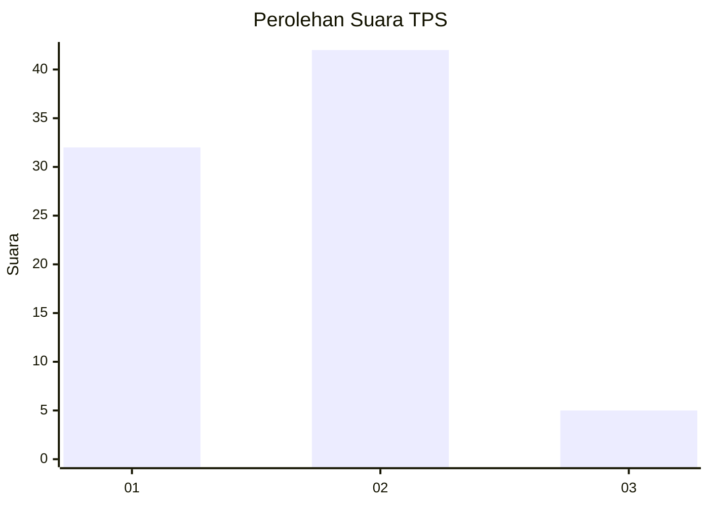
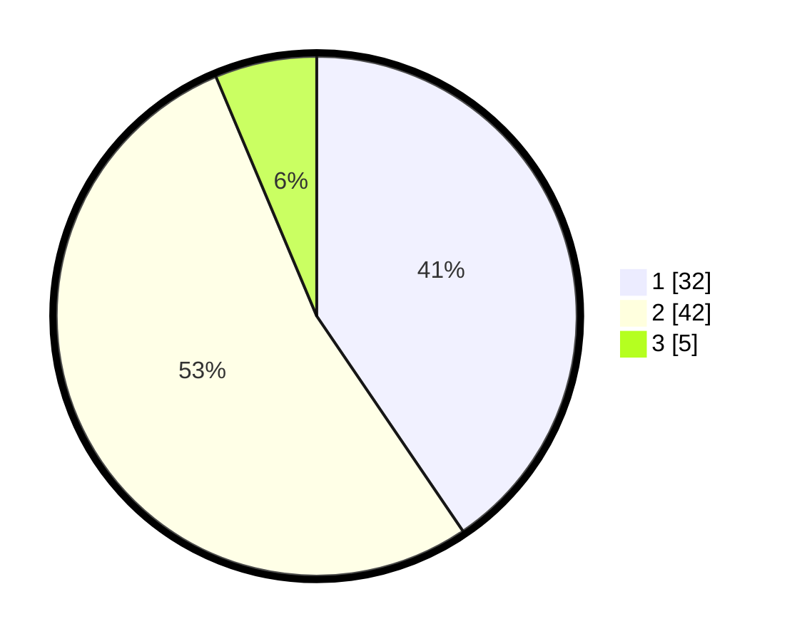

# Hasil

## Grafik

## Tabel

| No. | Nama Paslon    | Suara | Suara (raw) | Persentase |
|:--- |:-------------- | -----:| -----------:| ----------:|
| 1   | ANIES MUHAIMIN | 32    | [32][p-1]   | 40,51      |
| 2   | PRABOWO GIBRAN | 42    | [42][p-2]   | 53,16      |
| 3   | GANJAR MAHFUD  | 5     | [5][p-3]    | 6,33       |

[p-1]: https://github.com/gigit-pemilu/pemilu-2024-65-kalimantan-utara/blob/main/pilpres/hitung-suara/sub/65-kalimantan-utara/sub/03-nunukan/sub/02-nunukan/sub/1001-nunukan-timur/sub/010-tps/sub/paslon-1.txt
[p-2]: https://github.com/gigit-pemilu/pemilu-2024-65-kalimantan-utara/blob/main/pilpres/hitung-suara/sub/65-kalimantan-utara/sub/03-nunukan/sub/02-nunukan/sub/1001-nunukan-timur/sub/010-tps/sub/paslon-2.txt
[p-3]: https://github.com/gigit-pemilu/pemilu-2024-65-kalimantan-utara/blob/main/pilpres/hitung-suara/sub/65-kalimantan-utara/sub/03-nunukan/sub/02-nunukan/sub/1001-nunukan-timur/sub/010-tps/sub/paslon-3.txt

## Foto C Plano

https://sirekap-obj-formc.kpu.go.id/493a/pemilu/ppwp/65/03/02/10/01/6503021001010-20240214-232246--42b865f0-bd6c-4481-a21e-caadbb80f226.jpg

https://sirekap-obj-formc.kpu.go.id/493a/pemilu/ppwp/65/03/02/10/01/6503021001010-20240214-230614--cd88cb64-5190-451d-a6f9-60e3cfe9e32a.jpg

https://sirekap-obj-formc.kpu.go.id/493a/pemilu/ppwp/65/03/02/10/01/6503021001010-20240214-230732--557338c8-9110-4afb-a623-bff93d4bfd82.jpg

## Metadata

| Key        | Value               |
| ---------- | ------------------- |
| Time Stamp | 2024-02-15 20:30:46 |

