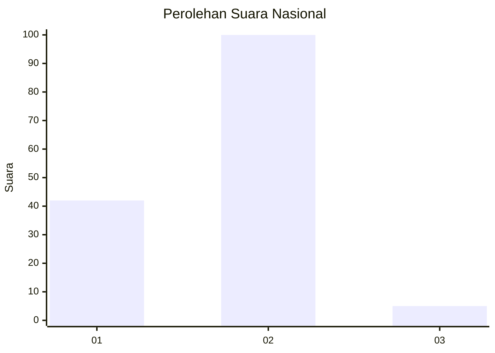
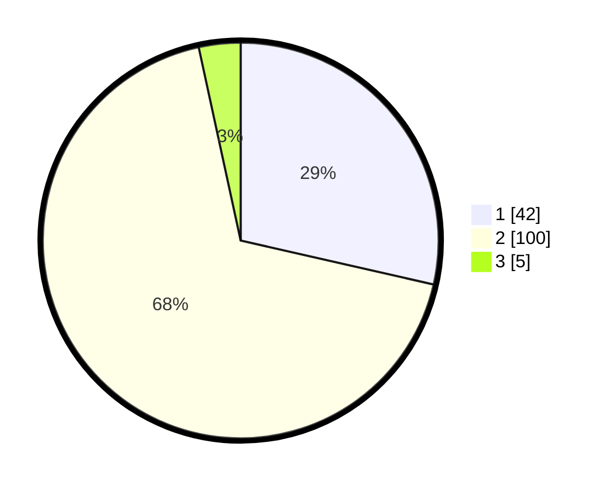

# Hasil

## Grafik

## Tabel

| No. | Nama Paslon    | Suara | Suara (raw) | Persentase |
|:--- |:-------------- | -----:| -----------:| ----------:|
| 1   | ANIES MUHAIMIN | 42    | [42][p-1]   | 28,57      |
| 2   | PRABOWO GIBRAN | 100   | [100][p-2]  | 68,03      |
| 3   | GANJAR MAHFUD  | 5     | [5][p-3]    | 3,40       |

[p-1]: https://github.com/gigit-pemilu/pemilu-2024/blob/main/pilpres/hitung-suara/sub/65-kalimantan-utara/sub/03-nunukan/sub/02-nunukan/sub/1001-nunukan-timur/sub/012-tps/sub/paslon-1.txt
[p-2]: https://github.com/gigit-pemilu/pemilu-2024/blob/main/pilpres/hitung-suara/sub/65-kalimantan-utara/sub/03-nunukan/sub/02-nunukan/sub/1001-nunukan-timur/sub/012-tps/sub/paslon-2.txt
[p-3]: https://github.com/gigit-pemilu/pemilu-2024/blob/main/pilpres/hitung-suara/sub/65-kalimantan-utara/sub/03-nunukan/sub/02-nunukan/sub/1001-nunukan-timur/sub/012-tps/sub/paslon-3.txt

## Foto C Plano

https://sirekap-obj-formc.kpu.go.id/5840/pemilu/ppwp/65/03/02/10/01/6503021001012-20240214-234313--eb61ed53-3d37-49e2-9433-50117bef07e4.jpg

https://sirekap-obj-formc.kpu.go.id/5840/pemilu/ppwp/65/03/02/10/01/6503021001012-20240214-234337--0a6d41fa-0547-4e02-9e34-8a5e7466e8fb.jpg

https://sirekap-obj-formc.kpu.go.id/5840/pemilu/ppwp/65/03/02/10/01/6503021001012-20240214-234422--b4d68a56-9d9e-4386-93b2-3466361833a3.jpg

## Metadata

| Key        | Value               |
| ---------- | ------------------- |
| Time Stamp | 2024-02-15 20:30:46 |

