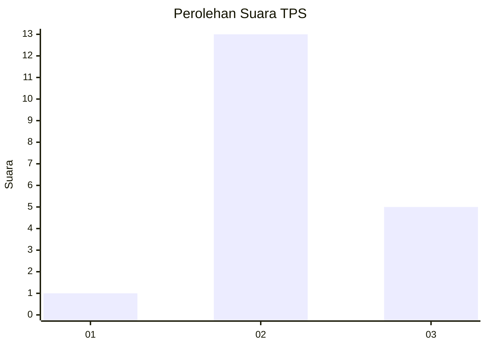
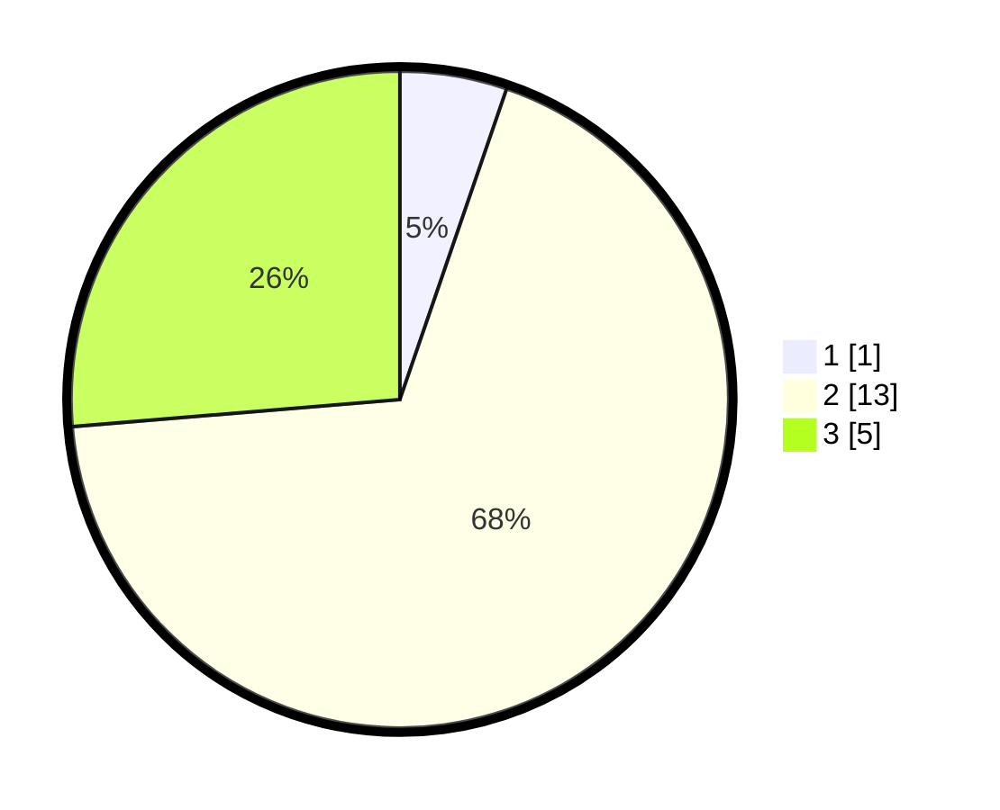

# Hasil

## Grafik

## Tabel

| No. | Nama Paslon    | Suara | Suara (raw) | Persentase |
|:--- |:-------------- | -----:| -----------:| ----------:|
| 1   | ANIES MUHAIMIN | 1     | [1][p-1]    | 5,26       |
| 2   | PRABOWO GIBRAN | 13    | [13][p-2]   | 68,42      |
| 3   | GANJAR MAHFUD  | 5     | [5][p-3]    | 26,32      |

[p-1]: https://github.com/gigit-pemilu/pemilu-2024-65-kalimantan-utara/blob/main/pilpres/hitung-suara/sub/65-kalimantan-utara/sub/03-nunukan/sub/03-sembakung/sub/2009-pelaju/sub/002-tps/sub/paslon-1.txt
[p-2]: https://github.com/gigit-pemilu/pemilu-2024-65-kalimantan-utara/blob/main/pilpres/hitung-suara/sub/65-kalimantan-utara/sub/03-nunukan/sub/03-sembakung/sub/2009-pelaju/sub/002-tps/sub/paslon-2.txt
[p-3]: https://github.com/gigit-pemilu/pemilu-2024-65-kalimantan-utara/blob/main/pilpres/hitung-suara/sub/65-kalimantan-utara/sub/03-nunukan/sub/03-sembakung/sub/2009-pelaju/sub/002-tps/sub/paslon-3.txt

## Foto C Plano

https://sirekap-obj-formc.kpu.go.id/246d/pemilu/ppwp/65/03/03/20/09/6503032009002-20240214-220359--c0717930-79d1-4fd7-bfd9-e32b2372a2f0.jpg

https://sirekap-obj-formc.kpu.go.id/246d/pemilu/ppwp/65/03/03/20/09/6503032009002-20240214-220523--0ec05a81-d609-4e44-af2a-9a6a8d0f7f5d.jpg

https://sirekap-obj-formc.kpu.go.id/246d/pemilu/ppwp/65/03/03/20/09/6503032009002-20240214-220633--bf474fa6-070e-44a7-8c47-121103efd169.jpg

## Metadata

| Key        | Value               |
| ---------- | ------------------- |
| Time Stamp | 2024-02-15 22:00:27 |

