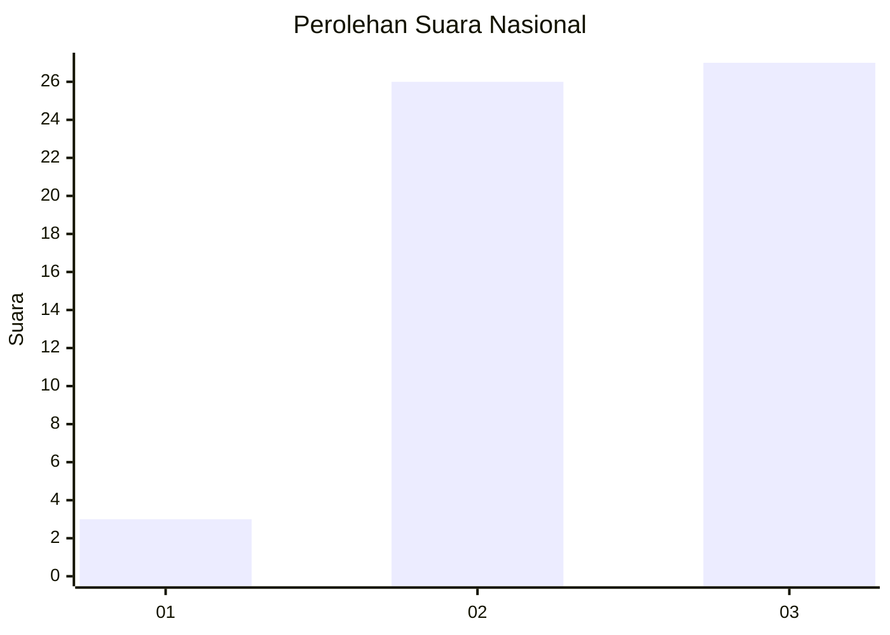
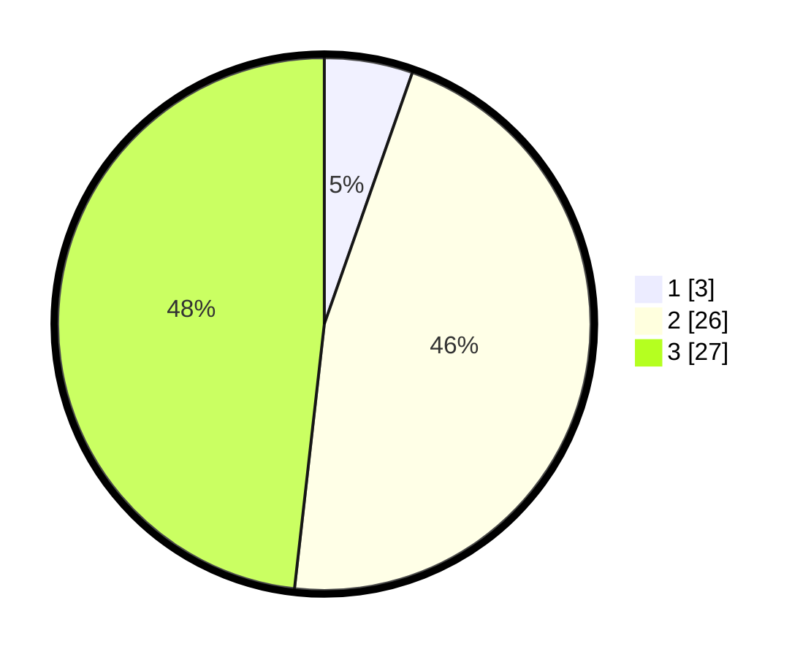

# Hasil

## Grafik

## Tabel

| No. | Nama Paslon    | Suara | Suara (raw) | Persentase |
|:--- |:-------------- | -----:| -----------:| ----------:|
| 1   | ANIES MUHAIMIN | 3     | [3][p-1]    | 5,36       |
| 2   | PRABOWO GIBRAN | 26    | [26][p-2]   | 46,43      |
| 3   | GANJAR MAHFUD  | 27    | [27][p-3]   | 48,21      |

[p-1]: https://github.com/gigit-pemilu/pemilu-2024/blob/main/pilpres/hitung-suara/sub/65-kalimantan-utara/sub/03-nunukan/sub/04-lumbis/sub/2003-dabulon/sub/001-tps/sub/paslon-1.txt
[p-2]: https://github.com/gigit-pemilu/pemilu-2024/blob/main/pilpres/hitung-suara/sub/65-kalimantan-utara/sub/03-nunukan/sub/04-lumbis/sub/2003-dabulon/sub/001-tps/sub/paslon-2.txt
[p-3]: https://github.com/gigit-pemilu/pemilu-2024/blob/main/pilpres/hitung-suara/sub/65-kalimantan-utara/sub/03-nunukan/sub/04-lumbis/sub/2003-dabulon/sub/001-tps/sub/paslon-3.txt

## Foto C Plano

https://sirekap-obj-formc.kpu.go.id/4ed2/pemilu/ppwp/65/03/04/20/03/6503042003001-20240214-235212--2be124e5-f33c-4db8-8bb7-cf06926d1a63.jpg

https://sirekap-obj-formc.kpu.go.id/4ed2/pemilu/ppwp/65/03/04/20/03/6503042003001-20240214-235307--e9984917-5d4a-4f10-8a91-ec1dc3eb4cc9.jpg

https://sirekap-obj-formc.kpu.go.id/4ed2/pemilu/ppwp/65/03/04/20/03/6503042003001-20240214-235459--1e3ff5c7-6d23-413c-babe-54d0c46fe314.jpg

## Metadata

| Key        | Value               |
| ---------- | ------------------- |
| Time Stamp | 2024-02-15 22:00:27 |

