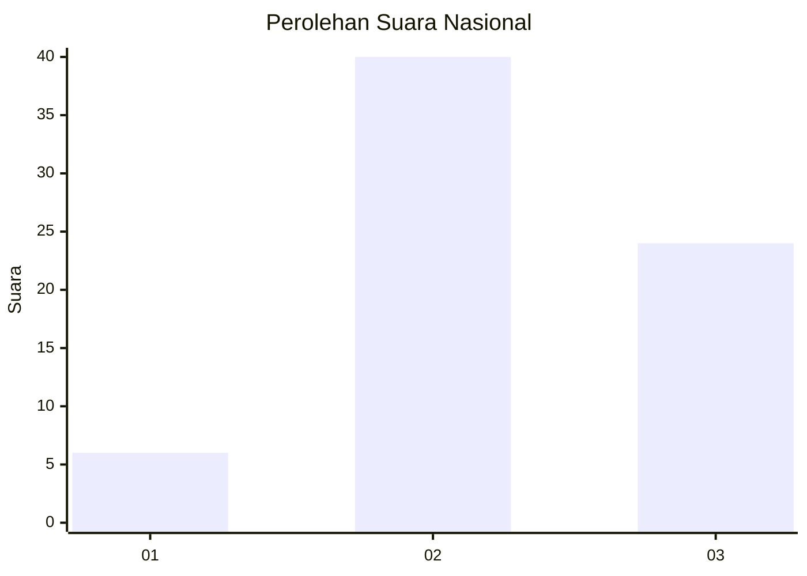
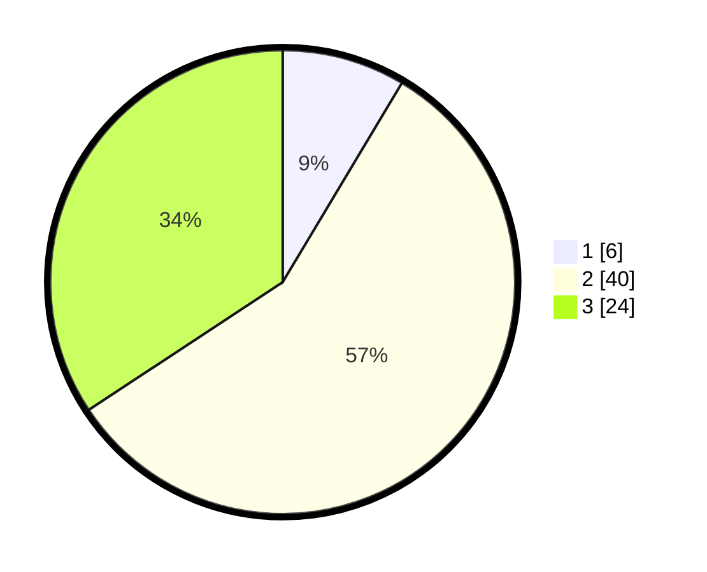

# Hasil

## Grafik

## Tabel

| No. | Nama Paslon    | Suara | Suara (raw) | Persentase |
|:--- |:-------------- | -----:| -----------:| ----------:|
| 1   | ANIES MUHAIMIN | 6     | [6][p-1]    | 8,57       |
| 2   | PRABOWO GIBRAN | 40    | [40][p-2]   | 57,14      |
| 3   | GANJAR MAHFUD  | 24    | [24][p-3]   | 34,29      |

[p-1]: https://github.com/gigit-pemilu/pemilu-2024/blob/main/pilpres/hitung-suara/sub/65-kalimantan-utara/sub/03-nunukan/sub/04-lumbis/sub/2004-taluan/sub/001-tps/sub/paslon-1.txt
[p-2]: https://github.com/gigit-pemilu/pemilu-2024/blob/main/pilpres/hitung-suara/sub/65-kalimantan-utara/sub/03-nunukan/sub/04-lumbis/sub/2004-taluan/sub/001-tps/sub/paslon-2.txt
[p-3]: https://github.com/gigit-pemilu/pemilu-2024/blob/main/pilpres/hitung-suara/sub/65-kalimantan-utara/sub/03-nunukan/sub/04-lumbis/sub/2004-taluan/sub/001-tps/sub/paslon-3.txt

## Foto C Plano

https://sirekap-obj-formc.kpu.go.id/9ab2/pemilu/ppwp/65/03/04/20/04/6503042004001-20240222-153236--d5ab6e32-997a-493e-b24b-69d8369436b2.jpg

https://sirekap-obj-formc.kpu.go.id/9ab2/pemilu/ppwp/65/03/04/20/04/6503042004001-20240222-153537--f2b94bac-9a04-47d1-866b-cb9d859a3419.jpg

https://sirekap-obj-formc.kpu.go.id/9ab2/pemilu/ppwp/65/03/04/20/04/6503042004001-20240222-153416--a0e01bb4-8149-49d4-9423-8a2189bcd267.jpg

## Metadata

| Key        | Value               |
| ---------- | ------------------- |
| Time Stamp | 2024-02-24 22:31:28 |

