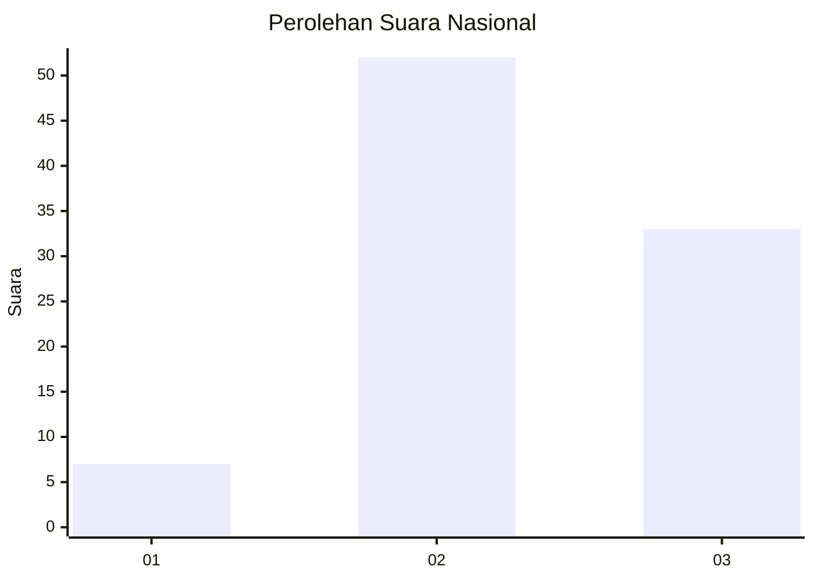
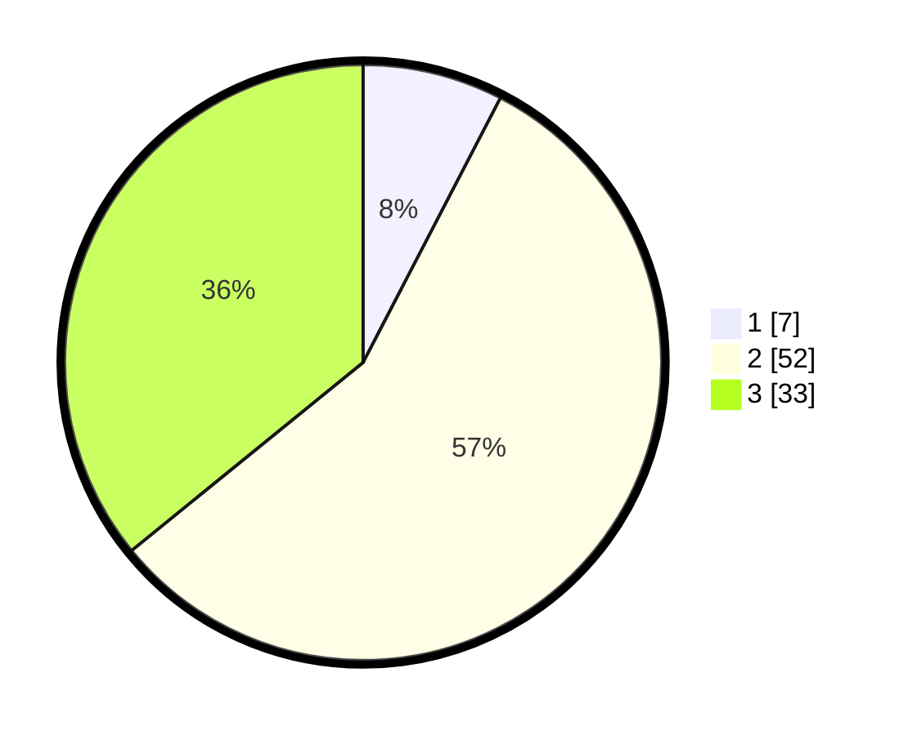

# Hasil

## Grafik

## Tabel

| No. | Nama Paslon    | Suara | Suara (raw) | Persentase |
|:--- |:-------------- | -----:| -----------:| ----------:|
| 1   | ANIES MUHAIMIN | 7     | [7][p-1]    | 7,61       |
| 2   | PRABOWO GIBRAN | 52    | [52][p-2]   | 56,52      |
| 3   | GANJAR MAHFUD  | 33    | [33][p-3]   | 35,87      |

[p-1]: https://github.com/gigit-pemilu/pemilu-2024/blob/main/pilpres/hitung-suara/sub/65-kalimantan-utara/sub/03-nunukan/sub/04-lumbis/sub/2005-podong/sub/001-tps/sub/paslon-1.txt
[p-2]: https://github.com/gigit-pemilu/pemilu-2024/blob/main/pilpres/hitung-suara/sub/65-kalimantan-utara/sub/03-nunukan/sub/04-lumbis/sub/2005-podong/sub/001-tps/sub/paslon-2.txt
[p-3]: https://github.com/gigit-pemilu/pemilu-2024/blob/main/pilpres/hitung-suara/sub/65-kalimantan-utara/sub/03-nunukan/sub/04-lumbis/sub/2005-podong/sub/001-tps/sub/paslon-3.txt

## Foto C Plano

https://sirekap-obj-formc.kpu.go.id/a243/pemilu/ppwp/65/03/04/20/05/6503042005001-20240222-124506--22a0b551-9c74-4faa-95ca-f1ff0ec5f634.jpg

https://sirekap-obj-formc.kpu.go.id/a243/pemilu/ppwp/65/03/04/20/05/6503042005001-20240222-124531--2cc48694-647f-48e7-b2b0-db0c31b2229c.jpg

https://sirekap-obj-formc.kpu.go.id/a243/pemilu/ppwp/65/03/04/20/05/6503042005001-20240222-124705--3f6ce163-0aec-4a06-9245-4ffcf95e1a24.jpg

## Metadata

| Key        | Value               |
| ---------- | ------------------- |
| Time Stamp | 2024-02-22 14:00:00 |

