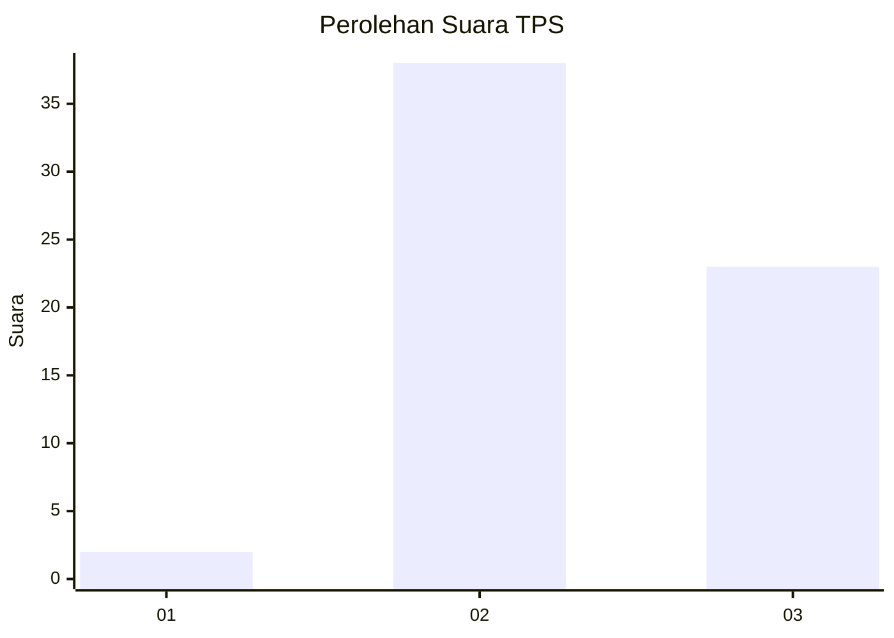
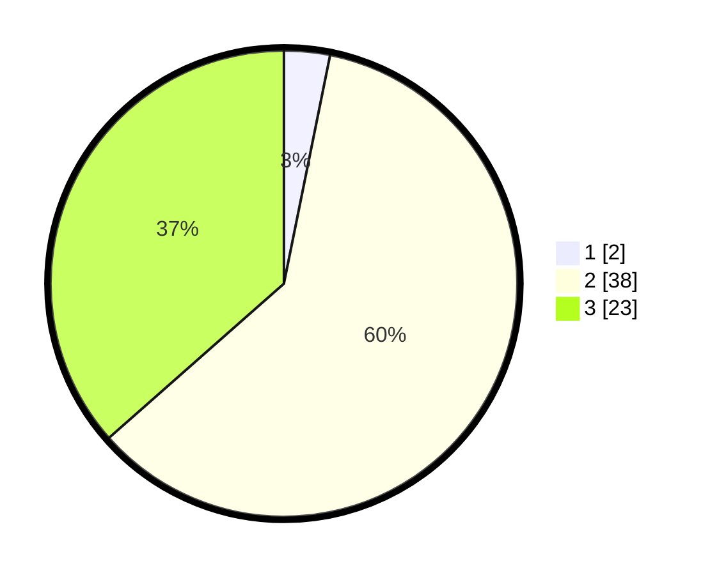

# Hasil

## Grafik

## Tabel

| No. | Nama Paslon    | Suara | Suara (raw) | Persentase |
|:--- |:-------------- | -----:| -----------:| ----------:|
| 1   | ANIES MUHAIMIN | 2     | [2][p-1]    | 3,17       |
| 2   | PRABOWO GIBRAN | 38    | [38][p-2]   | 60,32      |
| 3   | GANJAR MAHFUD  | 23    | [23][p-3]   | 36,51      |

[p-1]: https://github.com/gigit-pemilu/pemilu-2024-65-kalimantan-utara/blob/main/pilpres/hitung-suara/sub/65-kalimantan-utara/sub/03-nunukan/sub/04-lumbis/sub/2007-siawang/sub/001-tps/sub/paslon-1.txt
[p-2]: https://github.com/gigit-pemilu/pemilu-2024-65-kalimantan-utara/blob/main/pilpres/hitung-suara/sub/65-kalimantan-utara/sub/03-nunukan/sub/04-lumbis/sub/2007-siawang/sub/001-tps/sub/paslon-2.txt
[p-3]: https://github.com/gigit-pemilu/pemilu-2024-65-kalimantan-utara/blob/main/pilpres/hitung-suara/sub/65-kalimantan-utara/sub/03-nunukan/sub/04-lumbis/sub/2007-siawang/sub/001-tps/sub/paslon-3.txt

## Foto C Plano

https://sirekap-obj-formc.kpu.go.id/5491/pemilu/ppwp/65/03/04/20/07/6503042007001-20240224-215638--16474d75-5a8d-45a5-bd1d-113ce022ffa2.jpg

https://sirekap-obj-formc.kpu.go.id/5491/pemilu/ppwp/65/03/04/20/07/6503042007001-20240224-215804--3ff4a6cb-d591-46f9-94af-944ce4c0a03f.jpg

https://sirekap-obj-formc.kpu.go.id/5491/pemilu/ppwp/65/03/04/20/07/6503042007001-20240224-215832--a32af3ac-cfc1-41b1-9f25-5def5d99fde0.jpg

## Metadata

| Key        | Value               |
| ---------- | ------------------- |
| Time Stamp | 2024-02-24 22:31:28 |

