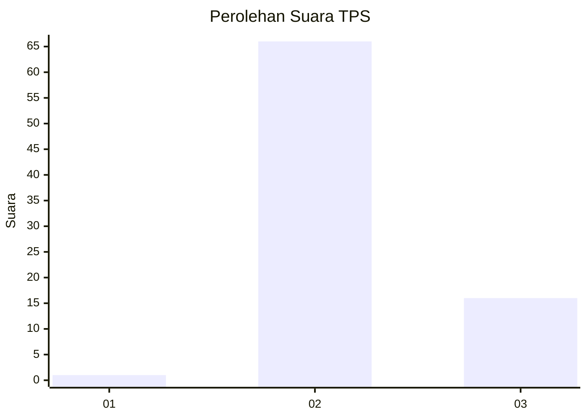
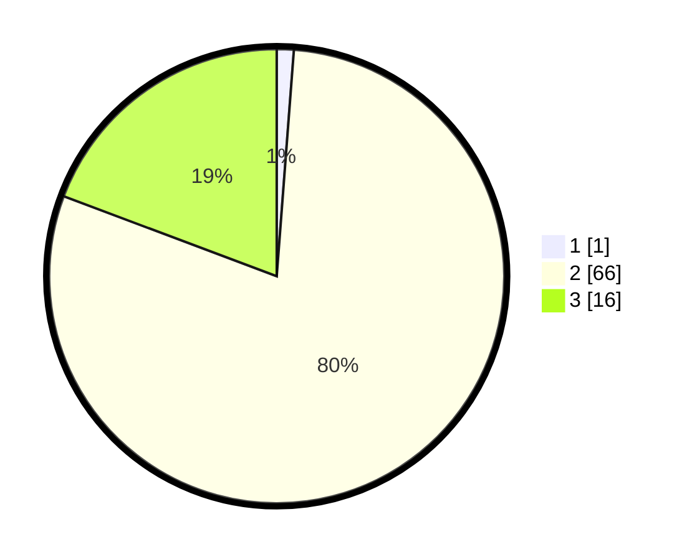

# Hasil

## Grafik

## Tabel

| No. | Nama Paslon    | Suara | Suara (raw) | Persentase |
|:--- |:-------------- | -----:| -----------:| ----------:|
| 1   | ANIES MUHAIMIN | 1     | [1][p-1]    | 1,20       |
| 2   | PRABOWO GIBRAN | 66    | [66][p-2]   | 79,52      |
| 3   | GANJAR MAHFUD  | 16    | [16][p-3]   | 19,28      |

[p-1]: https://github.com/gigit-pemilu/pemilu-2024-65-kalimantan-utara/blob/main/pilpres/hitung-suara/sub/65-kalimantan-utara/sub/03-nunukan/sub/04-lumbis/sub/2010-sasibu/sub/001-tps/sub/paslon-1.txt
[p-2]: https://github.com/gigit-pemilu/pemilu-2024-65-kalimantan-utara/blob/main/pilpres/hitung-suara/sub/65-kalimantan-utara/sub/03-nunukan/sub/04-lumbis/sub/2010-sasibu/sub/001-tps/sub/paslon-2.txt
[p-3]: https://github.com/gigit-pemilu/pemilu-2024-65-kalimantan-utara/blob/main/pilpres/hitung-suara/sub/65-kalimantan-utara/sub/03-nunukan/sub/04-lumbis/sub/2010-sasibu/sub/001-tps/sub/paslon-3.txt

## Foto C Plano

https://sirekap-obj-formc.kpu.go.id/6bb7/pemilu/ppwp/65/03/04/20/10/6503042010001-20240223-170547--5e441126-a2eb-4ded-9df1-9cfb1d4b5fba.jpg

https://sirekap-obj-formc.kpu.go.id/6bb7/pemilu/ppwp/65/03/04/20/10/6503042010001-20240223-170602--708c005b-a9d3-4c62-b7d6-6a7b2591fae1.jpg

https://sirekap-obj-formc.kpu.go.id/6bb7/pemilu/ppwp/65/03/04/20/10/6503042010001-20240223-170619--e338a006-2c9b-47a0-9d23-cf15419a70fa.jpg

## Metadata

| Key        | Value               |
| ---------- | ------------------- |
| Time Stamp | 2024-02-24 22:31:28 |

