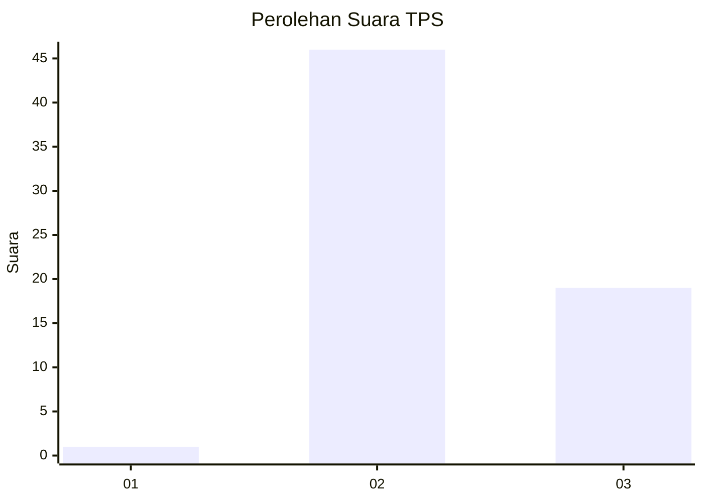
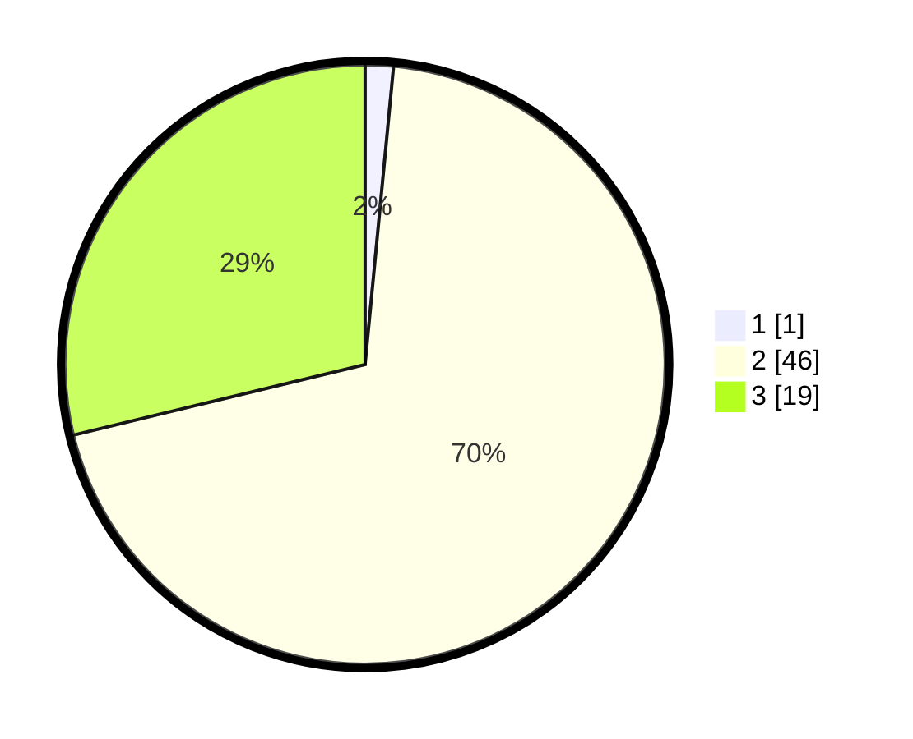

# Hasil

## Grafik

## Tabel

| No. | Nama Paslon    | Suara | Suara (raw) | Persentase |
|:--- |:-------------- | -----:| -----------:| ----------:|
| 1   | ANIES MUHAIMIN | 1     | [1][p-1]    | 1,52       |
| 2   | PRABOWO GIBRAN | 46    | [46][p-2]   | 69,70      |
| 3   | GANJAR MAHFUD  | 19    | [19][p-3]   | 28,79      |

[p-1]: https://github.com/gigit-pemilu/pemilu-2024-65-kalimantan-utara/blob/main/pilpres/hitung-suara/sub/65-kalimantan-utara/sub/03-nunukan/sub/04-lumbis/sub/2011-saludan/sub/001-tps/sub/paslon-1.txt
[p-2]: https://github.com/gigit-pemilu/pemilu-2024-65-kalimantan-utara/blob/main/pilpres/hitung-suara/sub/65-kalimantan-utara/sub/03-nunukan/sub/04-lumbis/sub/2011-saludan/sub/001-tps/sub/paslon-2.txt
[p-3]: https://github.com/gigit-pemilu/pemilu-2024-65-kalimantan-utara/blob/main/pilpres/hitung-suara/sub/65-kalimantan-utara/sub/03-nunukan/sub/04-lumbis/sub/2011-saludan/sub/001-tps/sub/paslon-3.txt

## Foto C Plano

https://sirekap-obj-formc.kpu.go.id/db6e/pemilu/ppwp/65/03/04/20/11/6503042011001-20240221-231722--fdc1d563-21cc-4053-90dc-68d533f39b11.jpg

https://sirekap-obj-formc.kpu.go.id/db6e/pemilu/ppwp/65/03/04/20/11/6503042011001-20240221-231807--aa0373cb-7fde-4127-bb35-24bb94e597b0.jpg

https://sirekap-obj-formc.kpu.go.id/db6e/pemilu/ppwp/65/03/04/20/11/6503042011001-20240221-231847--3925295c-e6bf-4d97-92ff-d724e190e953.jpg

## Metadata

| Key        | Value               |
| ---------- | ------------------- |
| Time Stamp | 2024-02-24 22:31:28 |

