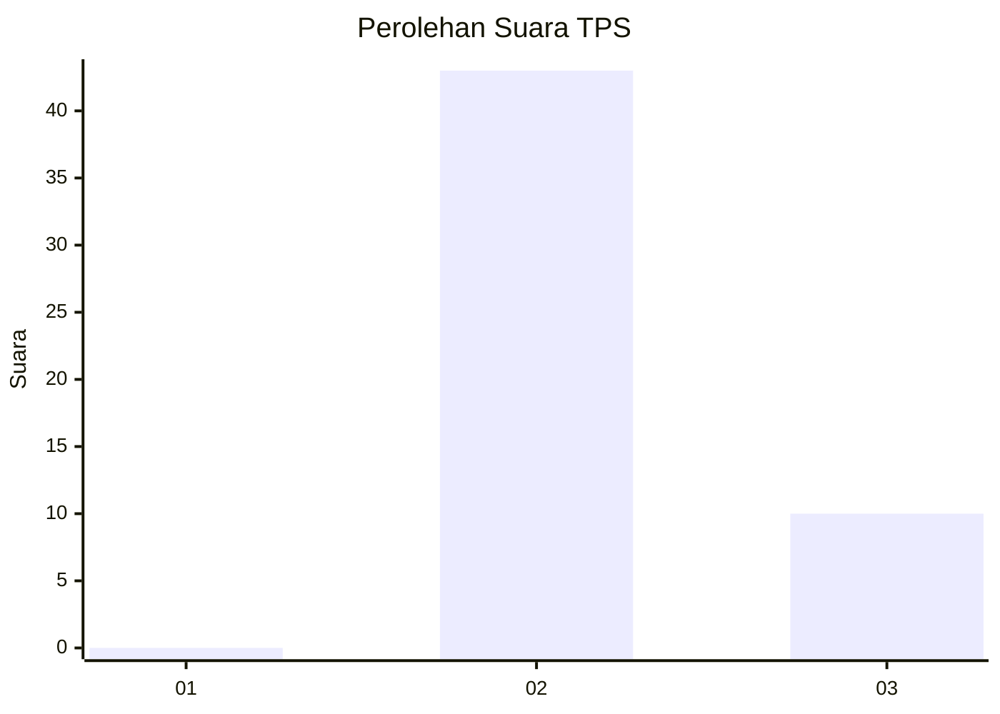
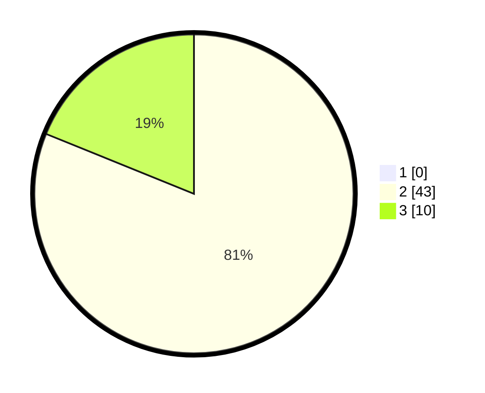

# Hasil

## Grafik

## Tabel

| No. | Nama Paslon    | Suara | Suara (raw) | Persentase |
|:--- |:-------------- | -----:| -----------:| ----------:|
| 1   | ANIES MUHAIMIN | 0     | [0][p-1]    | 0,00       |
| 2   | PRABOWO GIBRAN | 43    | [43][p-2]   | 81,13      |
| 3   | GANJAR MAHFUD  | 10    | [10][p-3]   | 18,87      |

[p-1]: https://github.com/gigit-pemilu/pemilu-2024-65-kalimantan-utara/blob/main/pilpres/hitung-suara/sub/65-kalimantan-utara/sub/03-nunukan/sub/04-lumbis/sub/2012-semalat/sub/001-tps/sub/paslon-1.txt
[p-2]: https://github.com/gigit-pemilu/pemilu-2024-65-kalimantan-utara/blob/main/pilpres/hitung-suara/sub/65-kalimantan-utara/sub/03-nunukan/sub/04-lumbis/sub/2012-semalat/sub/001-tps/sub/paslon-2.txt
[p-3]: https://github.com/gigit-pemilu/pemilu-2024-65-kalimantan-utara/blob/main/pilpres/hitung-suara/sub/65-kalimantan-utara/sub/03-nunukan/sub/04-lumbis/sub/2012-semalat/sub/001-tps/sub/paslon-3.txt

## Foto C Plano

https://sirekap-obj-formc.kpu.go.id/590e/pemilu/ppwp/65/03/04/20/12/6503042012001-20240223-153847--d081db9c-6fcb-4eb6-a8dc-f21c67aecdf4.jpg

https://sirekap-obj-formc.kpu.go.id/590e/pemilu/ppwp/65/03/04/20/12/6503042012001-20240223-153858--c2b53e80-7323-4cfc-8956-e733d42794eb.jpg

https://sirekap-obj-formc.kpu.go.id/590e/pemilu/ppwp/65/03/04/20/12/6503042012001-20240223-153935--166820cf-a4cc-4b8d-afd3-a19b302b3112.jpg

## Metadata

| Key        | Value               |
| ---------- | ------------------- |
| Time Stamp | 2024-02-24 22:31:28 |

