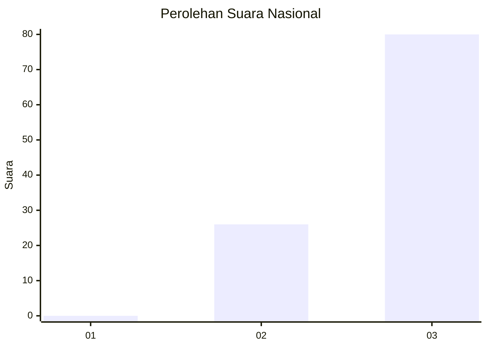
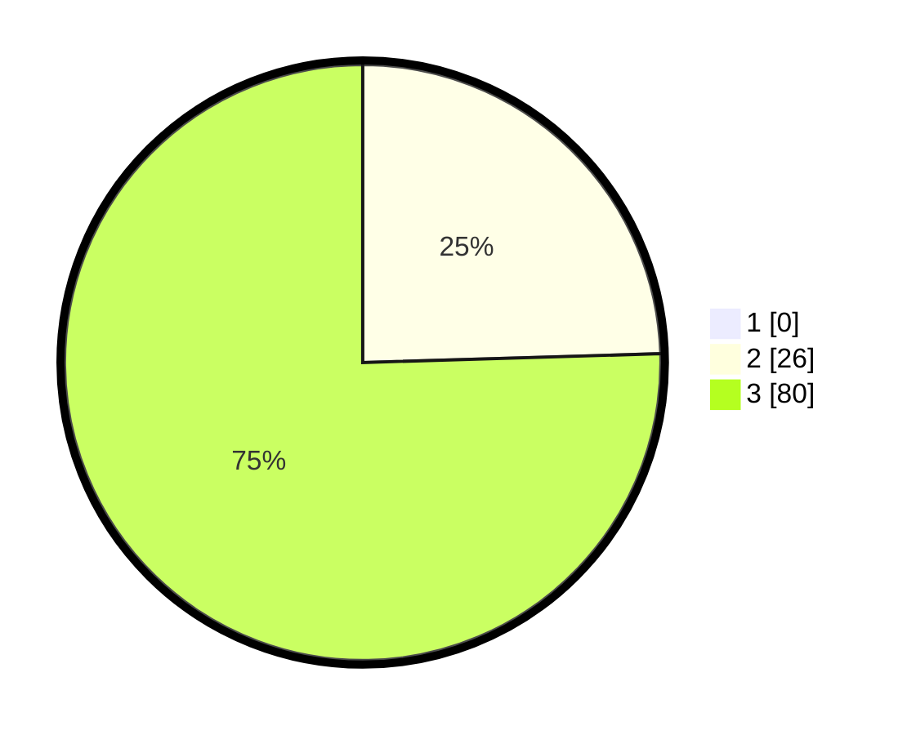

# Hasil

## Grafik

## Tabel

| No. | Nama Paslon    | Suara | Suara (raw) | Persentase |
|:--- |:-------------- | -----:| -----------:| ----------:|
| 1   | ANIES MUHAIMIN | 0     | [0][p-1]    | 0,00       |
| 2   | PRABOWO GIBRAN | 26    | [26][p-2]   | 24,53      |
| 3   | GANJAR MAHFUD  | 80    | [80][p-3]   | 75,47      |

[p-1]: https://github.com/gigit-pemilu/pemilu-2024/blob/main/pilpres/hitung-suara/sub/65-kalimantan-utara/sub/03-nunukan/sub/04-lumbis/sub/2016-sumalumung/sub/001-tps/sub/paslon-1.txt
[p-2]: https://github.com/gigit-pemilu/pemilu-2024/blob/main/pilpres/hitung-suara/sub/65-kalimantan-utara/sub/03-nunukan/sub/04-lumbis/sub/2016-sumalumung/sub/001-tps/sub/paslon-2.txt
[p-3]: https://github.com/gigit-pemilu/pemilu-2024/blob/main/pilpres/hitung-suara/sub/65-kalimantan-utara/sub/03-nunukan/sub/04-lumbis/sub/2016-sumalumung/sub/001-tps/sub/paslon-3.txt

## Foto C Plano

https://sirekap-obj-formc.kpu.go.id/e5d8/pemilu/ppwp/65/03/04/20/16/6503042016001-20240221-192515--35e56202-cf67-4f16-9055-533c8c19e3e8.jpg

https://sirekap-obj-formc.kpu.go.id/e5d8/pemilu/ppwp/65/03/04/20/16/6503042016001-20240221-192543--0dc82401-44b4-425e-b985-6dd495e73376.jpg

https://sirekap-obj-formc.kpu.go.id/e5d8/pemilu/ppwp/65/03/04/20/16/6503042016001-20240221-192608--76aa82ec-f39c-4c4f-84ff-2ee49b75b797.jpg

## Metadata

| Key        | Value               |
| ---------- | ------------------- |
| Time Stamp | 2024-02-21 21:00:04 |

