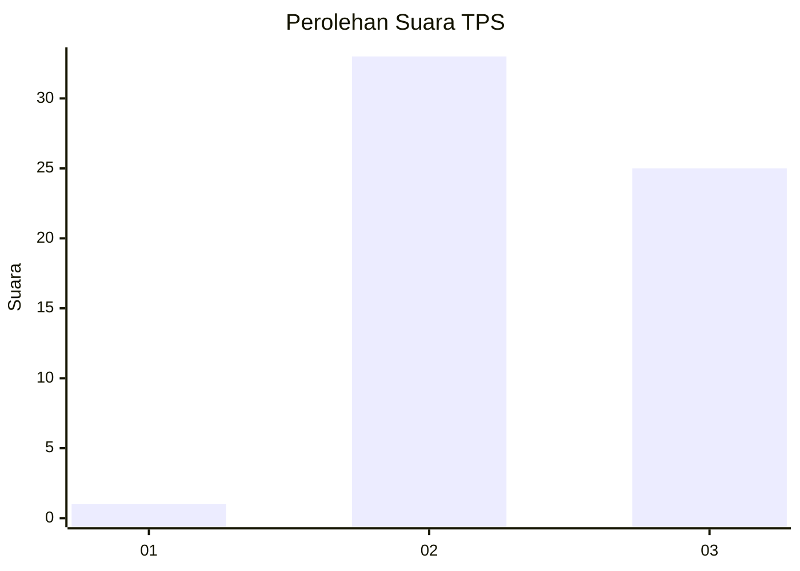
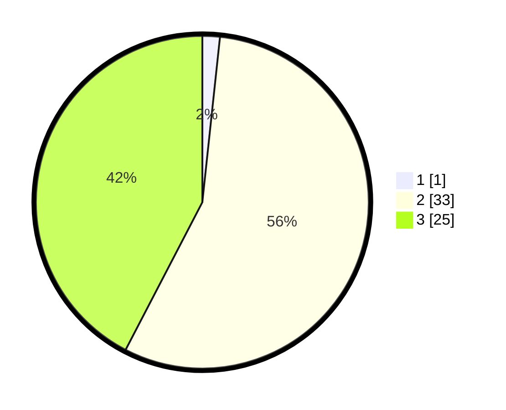

# Hasil

## Grafik

## Tabel

| No. | Nama Paslon    | Suara | Suara (raw) | Persentase |
|:--- |:-------------- | -----:| -----------:| ----------:|
| 1   | ANIES MUHAIMIN | 1     | [1][p-1]    | 1,69       |
| 2   | PRABOWO GIBRAN | 33    | [33][p-2]   | 55,93      |
| 3   | GANJAR MAHFUD  | 25    | [25][p-3]   | 42,37      |

[p-1]: https://github.com/gigit-pemilu/pemilu-2024-65-kalimantan-utara/blob/main/pilpres/hitung-suara/sub/65-kalimantan-utara/sub/03-nunukan/sub/04-lumbis/sub/2018-pulu-bulawan/sub/001-tps/sub/paslon-1.txt
[p-2]: https://github.com/gigit-pemilu/pemilu-2024-65-kalimantan-utara/blob/main/pilpres/hitung-suara/sub/65-kalimantan-utara/sub/03-nunukan/sub/04-lumbis/sub/2018-pulu-bulawan/sub/001-tps/sub/paslon-2.txt
[p-3]: https://github.com/gigit-pemilu/pemilu-2024-65-kalimantan-utara/blob/main/pilpres/hitung-suara/sub/65-kalimantan-utara/sub/03-nunukan/sub/04-lumbis/sub/2018-pulu-bulawan/sub/001-tps/sub/paslon-3.txt

## Foto C Plano

https://sirekap-obj-formc.kpu.go.id/0a93/pemilu/ppwp/65/03/04/20/18/6503042018001-20240222-152946--35a206e4-58ab-4aae-985c-8567ac9e7c39.jpg

https://sirekap-obj-formc.kpu.go.id/0a93/pemilu/ppwp/65/03/04/20/18/6503042018001-20240222-153016--26325a42-12bc-43b7-a4ef-55b3897261b0.jpg

https://sirekap-obj-formc.kpu.go.id/0a93/pemilu/ppwp/65/03/04/20/18/6503042018001-20240222-153030--cb1b25f9-d88b-43ca-a23c-7b9360e65821.jpg

## Metadata

| Key        | Value               |
| ---------- | ------------------- |
| Time Stamp | 2024-02-22 22:00:00 |

