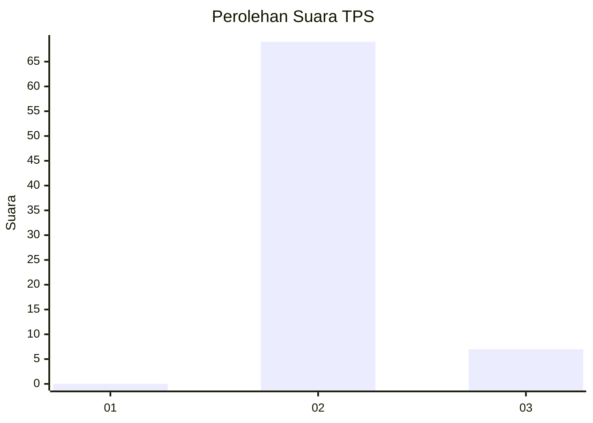
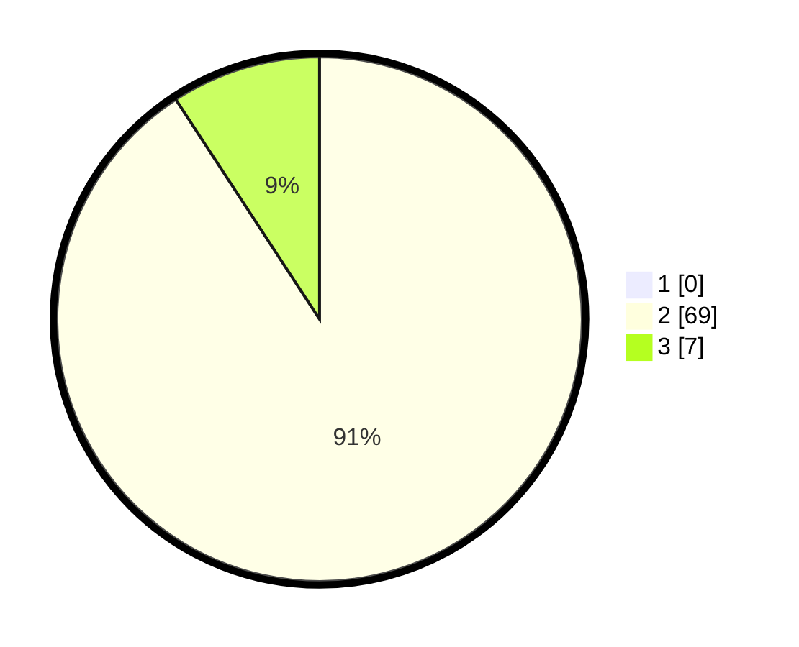

# Hasil

## Grafik

## Tabel

| No. | Nama Paslon    | Suara | Suara (raw) | Persentase |
|:--- |:-------------- | -----:| -----------:| ----------:|
| 1   | ANIES MUHAIMIN | 0     | [0][p-1]    | 0,00       |
| 2   | PRABOWO GIBRAN | 69    | [69][p-2]   | 90,79      |
| 3   | GANJAR MAHFUD  | 7     | [7][p-3]    | 9,21       |

[p-1]: https://github.com/gigit-pemilu/pemilu-2024-65-kalimantan-utara/blob/main/pilpres/hitung-suara/sub/65-kalimantan-utara/sub/03-nunukan/sub/04-lumbis/sub/2024-likos/sub/001-tps/sub/paslon-1.txt
[p-2]: https://github.com/gigit-pemilu/pemilu-2024-65-kalimantan-utara/blob/main/pilpres/hitung-suara/sub/65-kalimantan-utara/sub/03-nunukan/sub/04-lumbis/sub/2024-likos/sub/001-tps/sub/paslon-2.txt
[p-3]: https://github.com/gigit-pemilu/pemilu-2024-65-kalimantan-utara/blob/main/pilpres/hitung-suara/sub/65-kalimantan-utara/sub/03-nunukan/sub/04-lumbis/sub/2024-likos/sub/001-tps/sub/paslon-3.txt

## Foto C Plano

https://sirekap-obj-formc.kpu.go.id/2ca5/pemilu/ppwp/65/03/04/20/24/6503042024001-20240222-081425--5280ca84-72cb-4414-9d15-97593be5c1cc.jpg

https://sirekap-obj-formc.kpu.go.id/2ca5/pemilu/ppwp/65/03/04/20/24/6503042024001-20240222-081510--a2a8c007-fc2c-4c37-98ec-391283729b31.jpg

https://sirekap-obj-formc.kpu.go.id/2ca5/pemilu/ppwp/65/03/04/20/24/6503042024001-20240222-081552--74a01b5f-82dd-4151-9bfa-ec38f9b60038.jpg

## Metadata

| Key        | Value               |
| ---------- | ------------------- |
| Time Stamp | 2024-02-22 11:00:00 |

