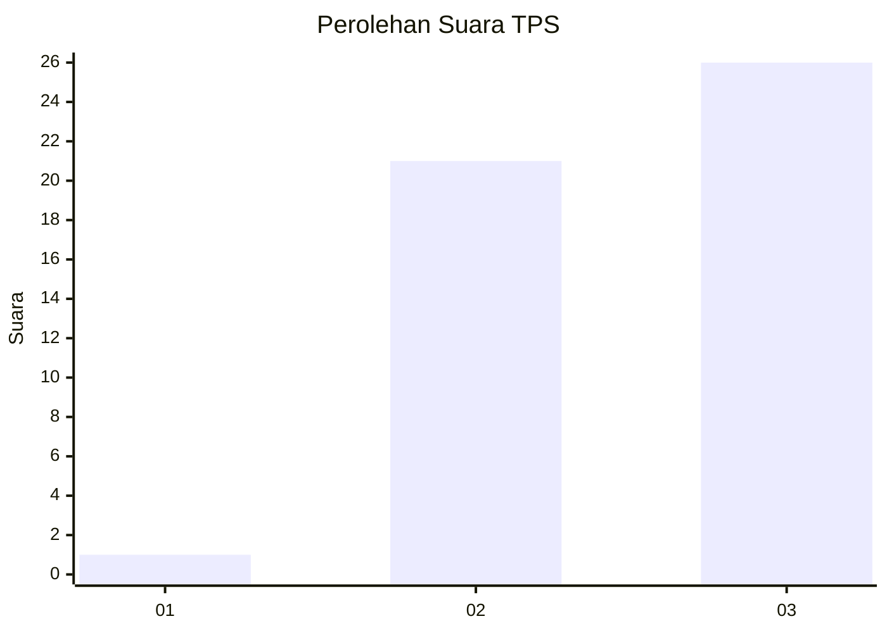
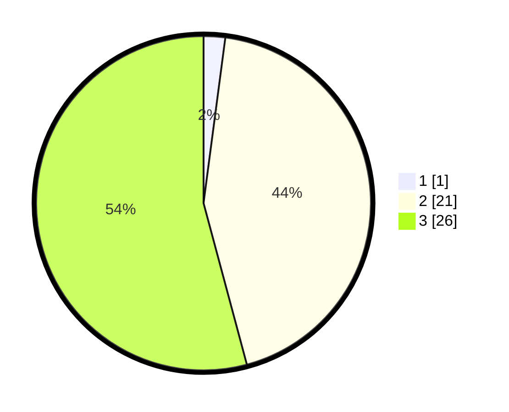

# Hasil

## Grafik

## Tabel

| No. | Nama Paslon    | Suara | Suara (raw) | Persentase |
|:--- |:-------------- | -----:| -----------:| ----------:|
| 1   | ANIES MUHAIMIN | 1     | [1][p-1]    | 2,08       |
| 2   | PRABOWO GIBRAN | 21    | [21][p-2]   | 43,75      |
| 3   | GANJAR MAHFUD  | 26    | [26][p-3]   | 54,17      |

[p-1]: https://github.com/gigit-pemilu/pemilu-2024-65-kalimantan-utara/blob/main/pilpres/hitung-suara/sub/65-kalimantan-utara/sub/03-nunukan/sub/04-lumbis/sub/2027-pa'lemumut/sub/001-tps/sub/paslon-1.txt
[p-2]: https://github.com/gigit-pemilu/pemilu-2024-65-kalimantan-utara/blob/main/pilpres/hitung-suara/sub/65-kalimantan-utara/sub/03-nunukan/sub/04-lumbis/sub/2027-pa'lemumut/sub/001-tps/sub/paslon-2.txt
[p-3]: https://github.com/gigit-pemilu/pemilu-2024-65-kalimantan-utara/blob/main/pilpres/hitung-suara/sub/65-kalimantan-utara/sub/03-nunukan/sub/04-lumbis/sub/2027-pa'lemumut/sub/001-tps/sub/paslon-3.txt

## Foto C Plano

https://sirekap-obj-formc.kpu.go.id/10a5/pemilu/ppwp/65/03/04/20/27/6503042027001-20240221-100543--9d080b45-230e-45e9-8050-0384a59f49b9.jpg

https://sirekap-obj-formc.kpu.go.id/10a5/pemilu/ppwp/65/03/04/20/27/6503042027001-20240221-100807--44ee8200-a7cc-43f6-b9ea-1e5d1b8dcf08.jpg

https://sirekap-obj-formc.kpu.go.id/10a5/pemilu/ppwp/65/03/04/20/27/6503042027001-20240221-100839--500c5cc3-82c8-45ea-9699-ba595ffff0d8.jpg

## Metadata

| Key        | Value               |
| ---------- | ------------------- |
| Time Stamp | 2024-02-21 11:00:00 |

