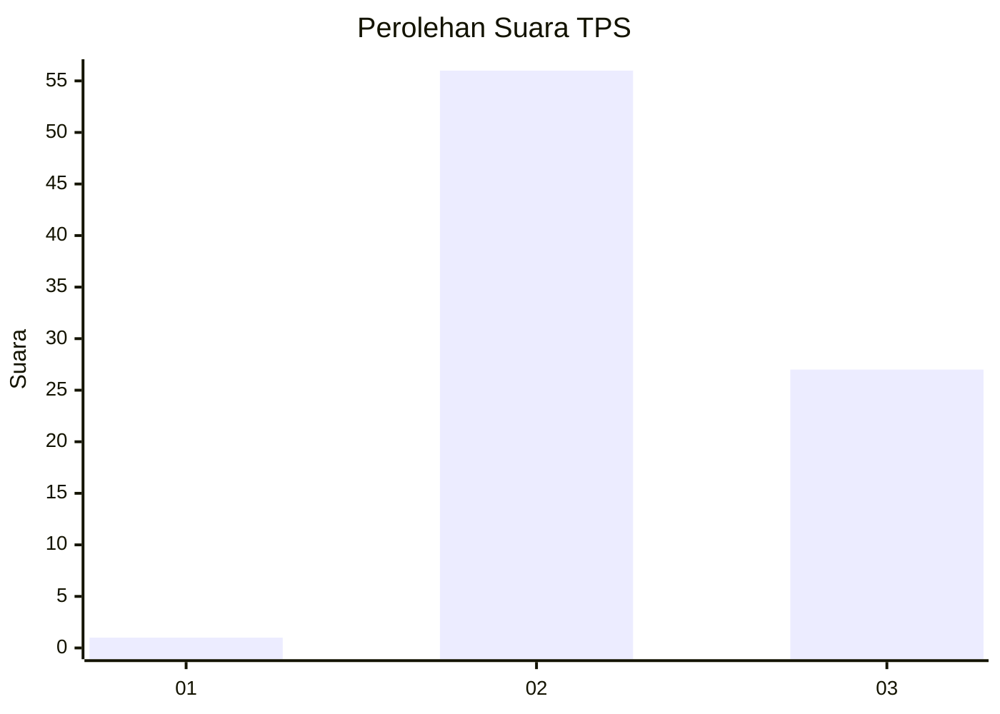
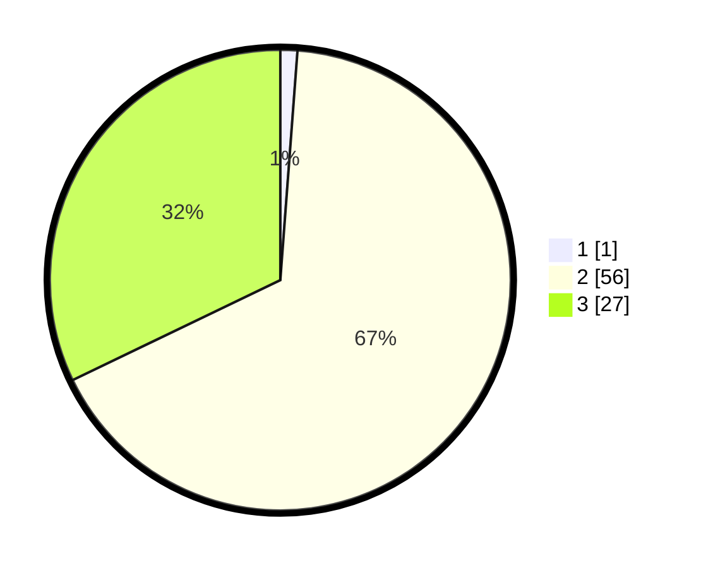

# Hasil

## Grafik

## Tabel

| No. | Nama Paslon    | Suara | Suara (raw) | Persentase |
|:--- |:-------------- | -----:| -----------:| ----------:|
| 1   | ANIES MUHAIMIN | 1     | [1][p-1]    | 1,19       |
| 2   | PRABOWO GIBRAN | 56    | [56][p-2]   | 66,67      |
| 3   | GANJAR MAHFUD  | 27    | [27][p-3]   | 32,14      |

[p-1]: https://github.com/gigit-pemilu/pemilu-2024-65-kalimantan-utara/blob/main/pilpres/hitung-suara/sub/65-kalimantan-utara/sub/03-nunukan/sub/05-krayan/sub/2002-pa'-padi/sub/001-tps/sub/paslon-1.txt
[p-2]: https://github.com/gigit-pemilu/pemilu-2024-65-kalimantan-utara/blob/main/pilpres/hitung-suara/sub/65-kalimantan-utara/sub/03-nunukan/sub/05-krayan/sub/2002-pa'-padi/sub/001-tps/sub/paslon-2.txt
[p-3]: https://github.com/gigit-pemilu/pemilu-2024-65-kalimantan-utara/blob/main/pilpres/hitung-suara/sub/65-kalimantan-utara/sub/03-nunukan/sub/05-krayan/sub/2002-pa'-padi/sub/001-tps/sub/paslon-3.txt

## Foto C Plano

https://sirekap-obj-formc.kpu.go.id/a6a8/pemilu/ppwp/65/03/05/20/02/6503052002001-20240215-001702--072d9458-8db4-49ee-a731-2058063b6cde.jpg

https://sirekap-obj-formc.kpu.go.id/a6a8/pemilu/ppwp/65/03/05/20/02/6503052002001-20240215-002733--9aa419e9-c7f9-4118-a110-473345bc2772.jpg

https://sirekap-obj-formc.kpu.go.id/a6a8/pemilu/ppwp/65/03/05/20/02/6503052002001-20240215-002827--f475080c-803c-4c13-9bfb-96fa96cb9cfb.jpg

## Metadata

| Key        | Value               |
| ---------- | ------------------- |
| Time Stamp | 2024-02-15 22:30:27 |

