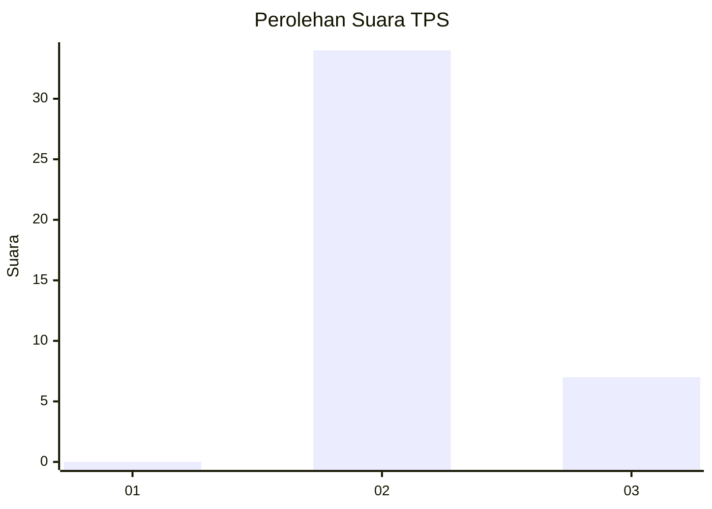
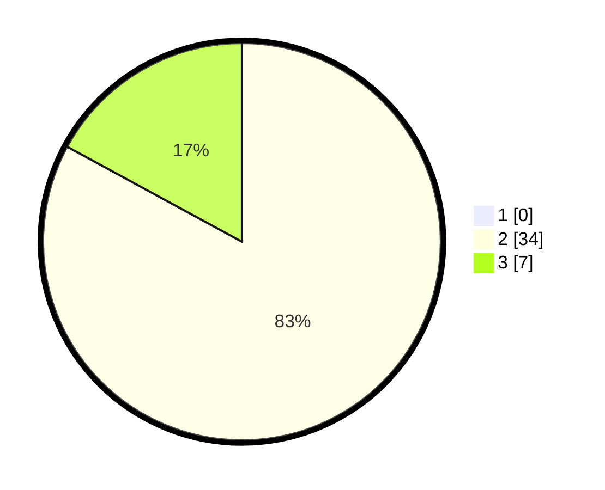

# Hasil

## Grafik

## Tabel

| No. | Nama Paslon    | Suara | Suara (raw) | Persentase |
|:--- |:-------------- | -----:| -----------:| ----------:|
| 1   | ANIES MUHAIMIN | 0     | [0][p-1]    | 0,00       |
| 2   | PRABOWO GIBRAN | 34    | [34][p-2]   | 82,93      |
| 3   | GANJAR MAHFUD  | 7     | [7][p-3]    | 17,07      |

[p-1]: https://github.com/gigit-pemilu/pemilu-2024-65-kalimantan-utara/blob/main/pilpres/hitung-suara/sub/65-kalimantan-utara/sub/03-nunukan/sub/05-krayan/sub/2065-pa'-putuk/sub/001-tps/sub/paslon-1.txt
[p-2]: https://github.com/gigit-pemilu/pemilu-2024-65-kalimantan-utara/blob/main/pilpres/hitung-suara/sub/65-kalimantan-utara/sub/03-nunukan/sub/05-krayan/sub/2065-pa'-putuk/sub/001-tps/sub/paslon-2.txt
[p-3]: https://github.com/gigit-pemilu/pemilu-2024-65-kalimantan-utara/blob/main/pilpres/hitung-suara/sub/65-kalimantan-utara/sub/03-nunukan/sub/05-krayan/sub/2065-pa'-putuk/sub/001-tps/sub/paslon-3.txt

## Foto C Plano

https://sirekap-obj-formc.kpu.go.id/539f/pemilu/ppwp/65/03/05/20/65/6503052065001-20240215-102126--a4770ecc-a772-41f5-b74f-b632966ce8e1.jpg

https://sirekap-obj-formc.kpu.go.id/539f/pemilu/ppwp/65/03/05/20/65/6503052065001-20240215-102243--4cc1a0e5-edf3-443b-8379-072d118748ed.jpg

https://sirekap-obj-formc.kpu.go.id/539f/pemilu/ppwp/65/03/05/20/65/6503052065001-20240215-102310--faf2cb63-72f3-4dd6-9df8-bc3556462674.jpg

## Metadata

| Key        | Value               |
| ---------- | ------------------- |
| Time Stamp | 2024-02-15 22:30:27 |

