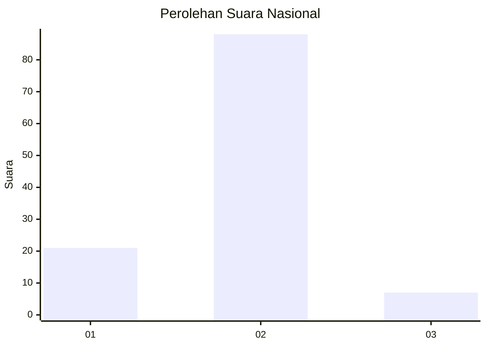
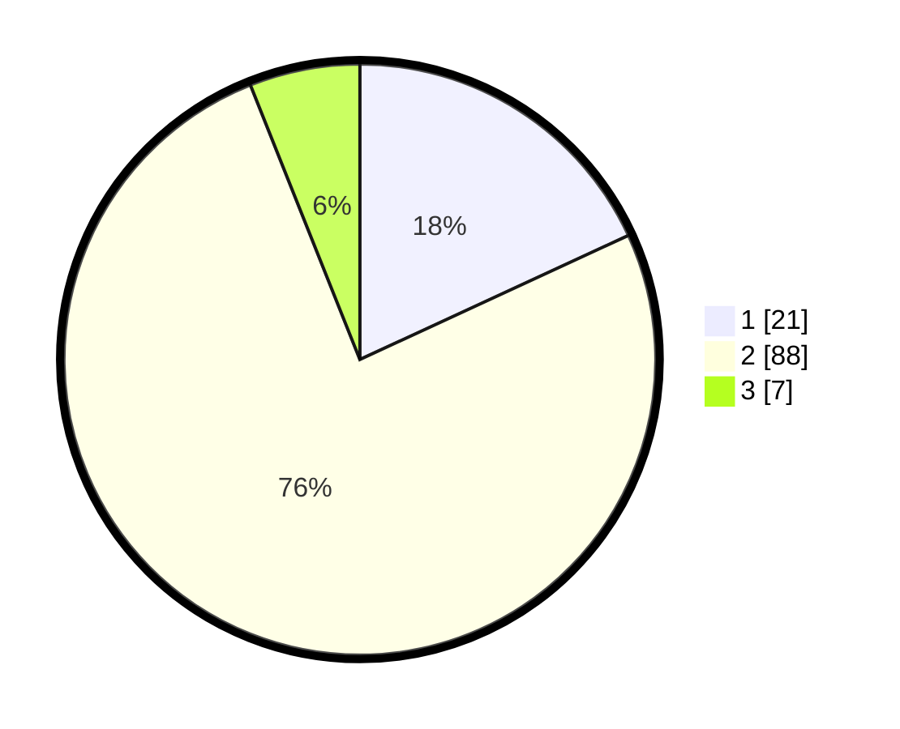

# Hasil

## Grafik

## Tabel

| No. | Nama Paslon    | Suara | Suara (raw) | Persentase |
|:--- |:-------------- | -----:| -----------:| ----------:|
| 1   | ANIES MUHAIMIN | 21    | [21][p-1]   | 18,10      |
| 2   | PRABOWO GIBRAN | 88    | [88][p-2]   | 75,86      |
| 3   | GANJAR MAHFUD  | 7     | [7][p-3]    | 6,03       |

[p-1]: https://github.com/gigit-pemilu/pemilu-2024/blob/main/pilpres/hitung-suara/sub/65-kalimantan-utara/sub/03-nunukan/sub/06-sebuku/sub/2001-pembeliangan/sub/012-tps/sub/paslon-1.txt
[p-2]: https://github.com/gigit-pemilu/pemilu-2024/blob/main/pilpres/hitung-suara/sub/65-kalimantan-utara/sub/03-nunukan/sub/06-sebuku/sub/2001-pembeliangan/sub/012-tps/sub/paslon-2.txt
[p-3]: https://github.com/gigit-pemilu/pemilu-2024/blob/main/pilpres/hitung-suara/sub/65-kalimantan-utara/sub/03-nunukan/sub/06-sebuku/sub/2001-pembeliangan/sub/012-tps/sub/paslon-3.txt

## Foto C Plano

https://sirekap-obj-formc.kpu.go.id/7546/pemilu/ppwp/65/03/06/20/01/6503062001012-20240215-192355--487fcd25-938e-4b1d-81cf-5027fb742ba6.jpg

https://sirekap-obj-formc.kpu.go.id/7546/pemilu/ppwp/65/03/06/20/01/6503062001012-20240215-192610--72dedd47-18d4-4de0-a15c-f54ca2b0b45a.jpg

https://sirekap-obj-formc.kpu.go.id/7546/pemilu/ppwp/65/03/06/20/01/6503062001012-20240215-192442--0e13057c-ada2-4e5b-a56d-3fdb75b592e6.jpg

## Metadata

| Key        | Value               |
| ---------- | ------------------- |
| Time Stamp | 2024-02-16 00:00:26 |

