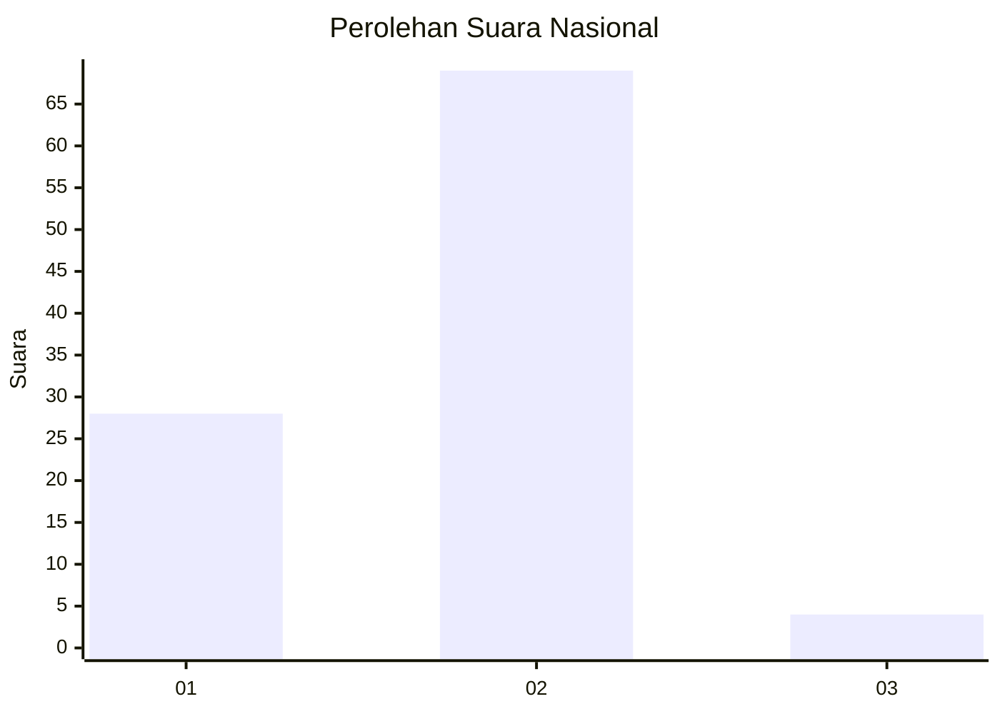
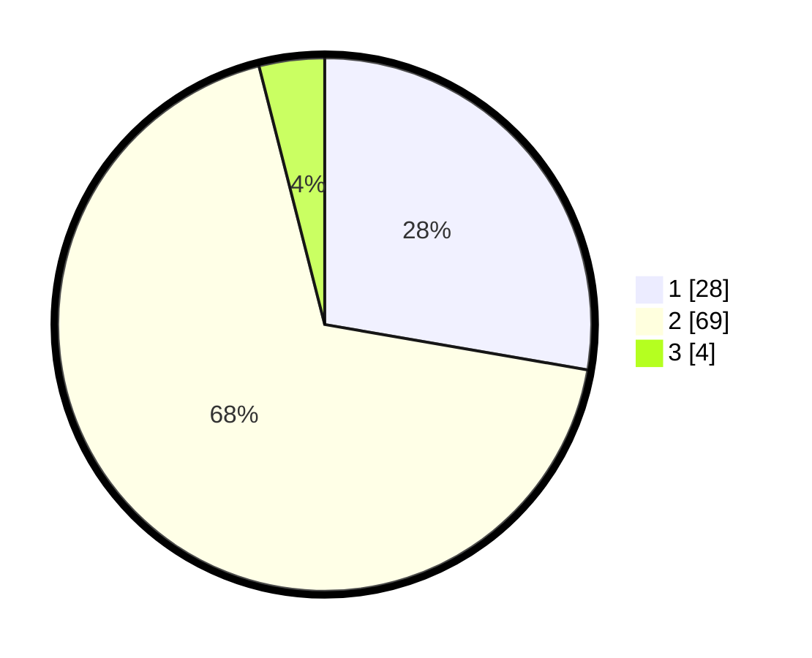

# Hasil

## Grafik

## Tabel

| No. | Nama Paslon    | Suara | Suara (raw) | Persentase |
|:--- |:-------------- | -----:| -----------:| ----------:|
| 1   | ANIES MUHAIMIN | 28    | [28][p-1]   | 27,72      |
| 2   | PRABOWO GIBRAN | 69    | [69][p-2]   | 68,32      |
| 3   | GANJAR MAHFUD  | 4     | [4][p-3]    | 3,96       |

[p-1]: https://github.com/gigit-pemilu/pemilu-2024/blob/main/pilpres/hitung-suara/sub/65-kalimantan-utara/sub/03-nunukan/sub/06-sebuku/sub/2001-pembeliangan/sub/014-tps/sub/paslon-1.txt
[p-2]: https://github.com/gigit-pemilu/pemilu-2024/blob/main/pilpres/hitung-suara/sub/65-kalimantan-utara/sub/03-nunukan/sub/06-sebuku/sub/2001-pembeliangan/sub/014-tps/sub/paslon-2.txt
[p-3]: https://github.com/gigit-pemilu/pemilu-2024/blob/main/pilpres/hitung-suara/sub/65-kalimantan-utara/sub/03-nunukan/sub/06-sebuku/sub/2001-pembeliangan/sub/014-tps/sub/paslon-3.txt

## Foto C Plano

https://sirekap-obj-formc.kpu.go.id/a4d7/pemilu/ppwp/65/03/06/20/01/6503062001014-20240215-224900--632acb03-a202-48b6-8f39-2e5bd6e5e232.jpg

https://sirekap-obj-formc.kpu.go.id/a4d7/pemilu/ppwp/65/03/06/20/01/6503062001014-20240215-224327--e6a41e9a-154c-4f87-8c0b-1728bfb2f079.jpg

https://sirekap-obj-formc.kpu.go.id/a4d7/pemilu/ppwp/65/03/06/20/01/6503062001014-20240215-224552--36d73a7b-93f3-4090-89a2-ca3f741e708d.jpg

## Metadata

| Key        | Value               |
| ---------- | ------------------- |
| Time Stamp | 2024-02-16 03:00:26 |

