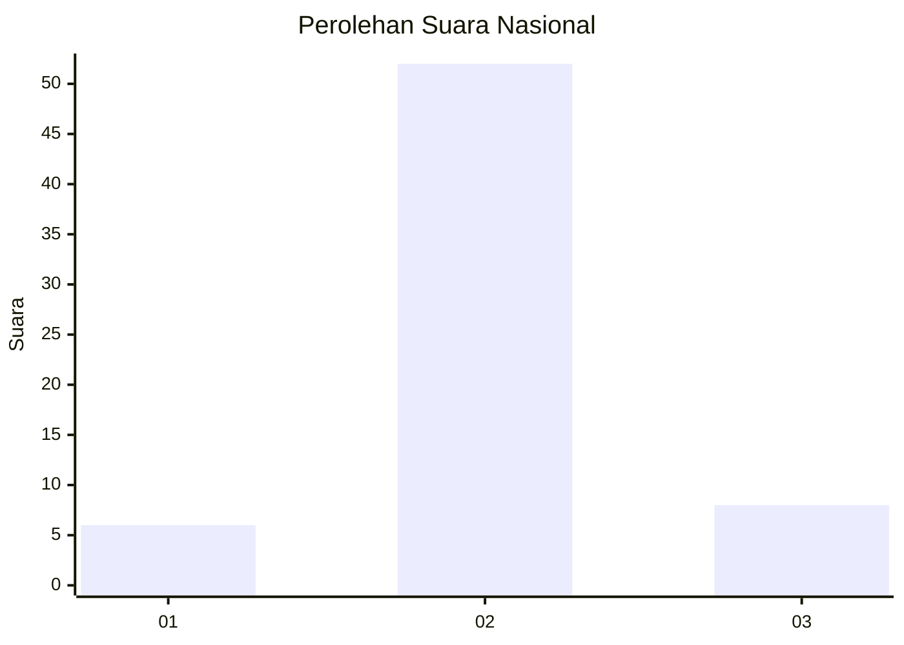
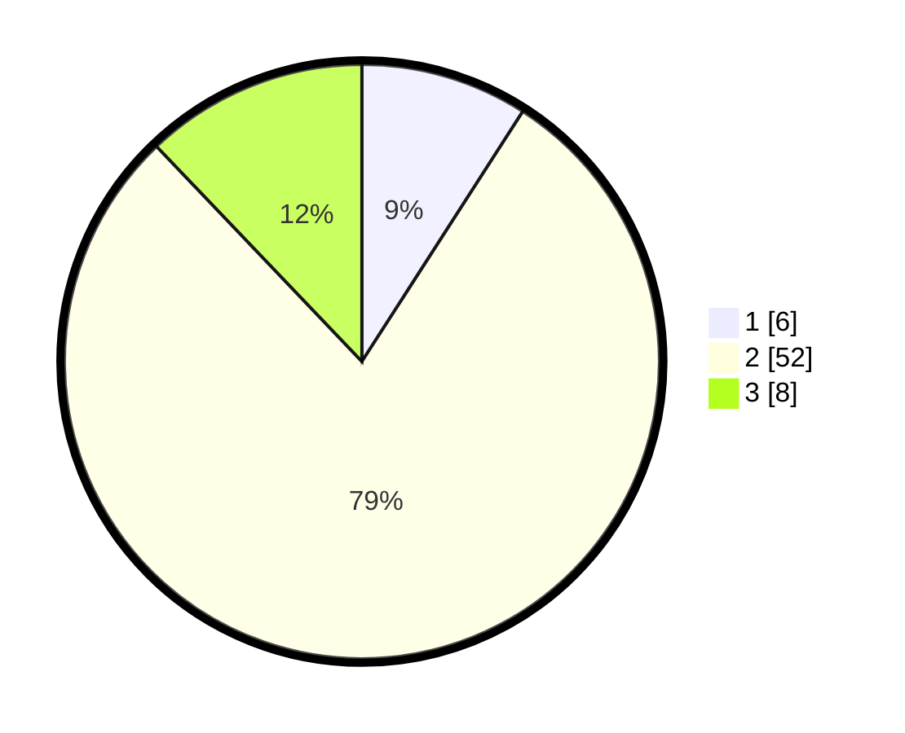

# Hasil

## Grafik

## Tabel

| No. | Nama Paslon    | Suara | Suara (raw) | Persentase |
|:--- |:-------------- | -----:| -----------:| ----------:|
| 1   | ANIES MUHAIMIN | 6     | [6][p-1]    | 9,09       |
| 2   | PRABOWO GIBRAN | 52    | [52][p-2]   | 78,79      |
| 3   | GANJAR MAHFUD  | 8     | [8][p-3]    | 12,12      |

[p-1]: https://github.com/gigit-pemilu/pemilu-2024/blob/main/pilpres/hitung-suara/sub/65-kalimantan-utara/sub/03-nunukan/sub/06-sebuku/sub/2001-pembeliangan/sub/015-tps/sub/paslon-1.txt
[p-2]: https://github.com/gigit-pemilu/pemilu-2024/blob/main/pilpres/hitung-suara/sub/65-kalimantan-utara/sub/03-nunukan/sub/06-sebuku/sub/2001-pembeliangan/sub/015-tps/sub/paslon-2.txt
[p-3]: https://github.com/gigit-pemilu/pemilu-2024/blob/main/pilpres/hitung-suara/sub/65-kalimantan-utara/sub/03-nunukan/sub/06-sebuku/sub/2001-pembeliangan/sub/015-tps/sub/paslon-3.txt

## Foto C Plano

https://sirekap-obj-formc.kpu.go.id/99c0/pemilu/ppwp/65/03/06/20/01/6503062001015-20240217-143114--6d0973bd-3985-435d-bd3f-d3e4d7389010.jpg

https://sirekap-obj-formc.kpu.go.id/99c0/pemilu/ppwp/65/03/06/20/01/6503062001015-20240217-143112--39cd6916-29e1-4064-b10d-8cfc179c863b.jpg

https://sirekap-obj-formc.kpu.go.id/99c0/pemilu/ppwp/65/03/06/20/01/6503062001015-20240217-143112--ffb6e241-c664-469d-aad7-ff9d0a6fff46.jpg

## Metadata

| Key        | Value               |
| ---------- | ------------------- |
| Time Stamp | 2024-02-17 16:00:02 |

