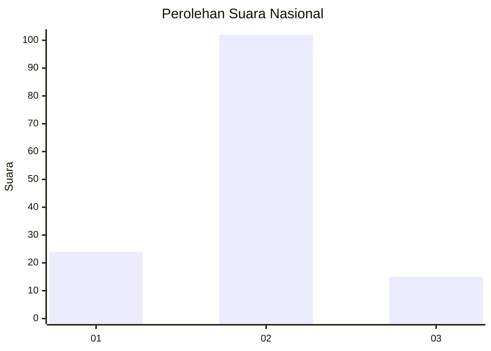
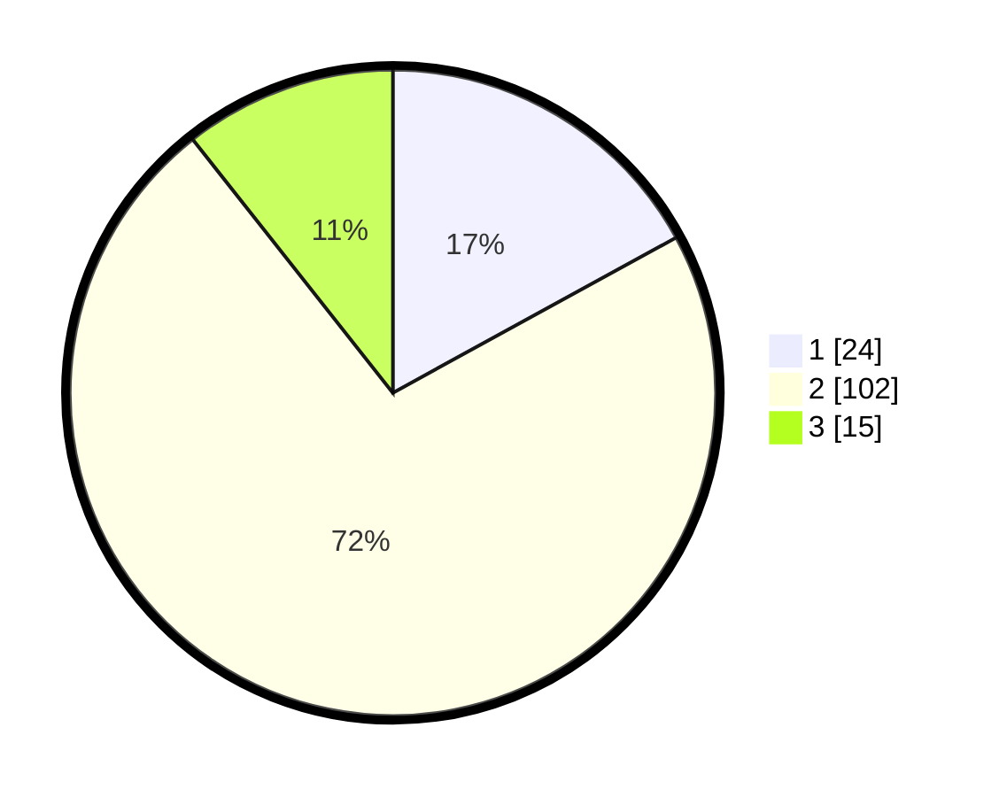

# Hasil

## Grafik

## Tabel

| No. | Nama Paslon    | Suara | Suara (raw) | Persentase |
|:--- |:-------------- | -----:| -----------:| ----------:|
| 1   | ANIES MUHAIMIN | 24    | [24][p-1]   | 17,02      |
| 2   | PRABOWO GIBRAN | 102   | [102][p-2]  | 72,34      |
| 3   | GANJAR MAHFUD  | 15    | [15][p-3]   | 10,64      |

[p-1]: https://github.com/gigit-pemilu/pemilu-2024/blob/main/pilpres/hitung-suara/sub/65-kalimantan-utara/sub/03-nunukan/sub/06-sebuku/sub/2001-pembeliangan/sub/903-tps/sub/paslon-1.txt
[p-2]: https://github.com/gigit-pemilu/pemilu-2024/blob/main/pilpres/hitung-suara/sub/65-kalimantan-utara/sub/03-nunukan/sub/06-sebuku/sub/2001-pembeliangan/sub/903-tps/sub/paslon-2.txt
[p-3]: https://github.com/gigit-pemilu/pemilu-2024/blob/main/pilpres/hitung-suara/sub/65-kalimantan-utara/sub/03-nunukan/sub/06-sebuku/sub/2001-pembeliangan/sub/903-tps/sub/paslon-3.txt

## Foto C Plano

https://sirekap-obj-formc.kpu.go.id/85e5/pemilu/ppwp/65/03/06/20/01/6503062001903-20240214-141856--df6d6c43-94aa-4bb4-9d40-94e66157aea8.jpg

https://sirekap-obj-formc.kpu.go.id/85e5/pemilu/ppwp/65/03/06/20/01/6503062001903-20240214-155214--af6baf63-3d79-4f9c-9bce-98663163fd4a.jpg

https://sirekap-obj-formc.kpu.go.id/85e5/pemilu/ppwp/65/03/06/20/01/6503062001903-20240214-155218--5739331f-4d53-4716-9580-70f3ac82a75c.jpg

## Metadata

| Key        | Value               |
| ---------- | ------------------- |
| Time Stamp | 2024-02-15 22:30:27 |

