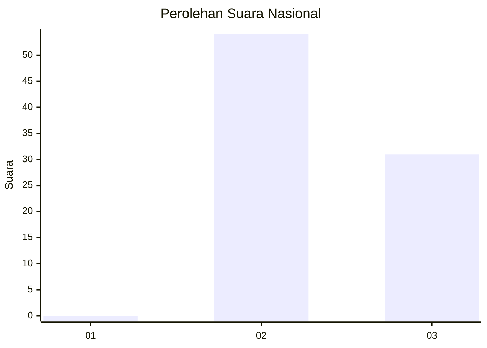
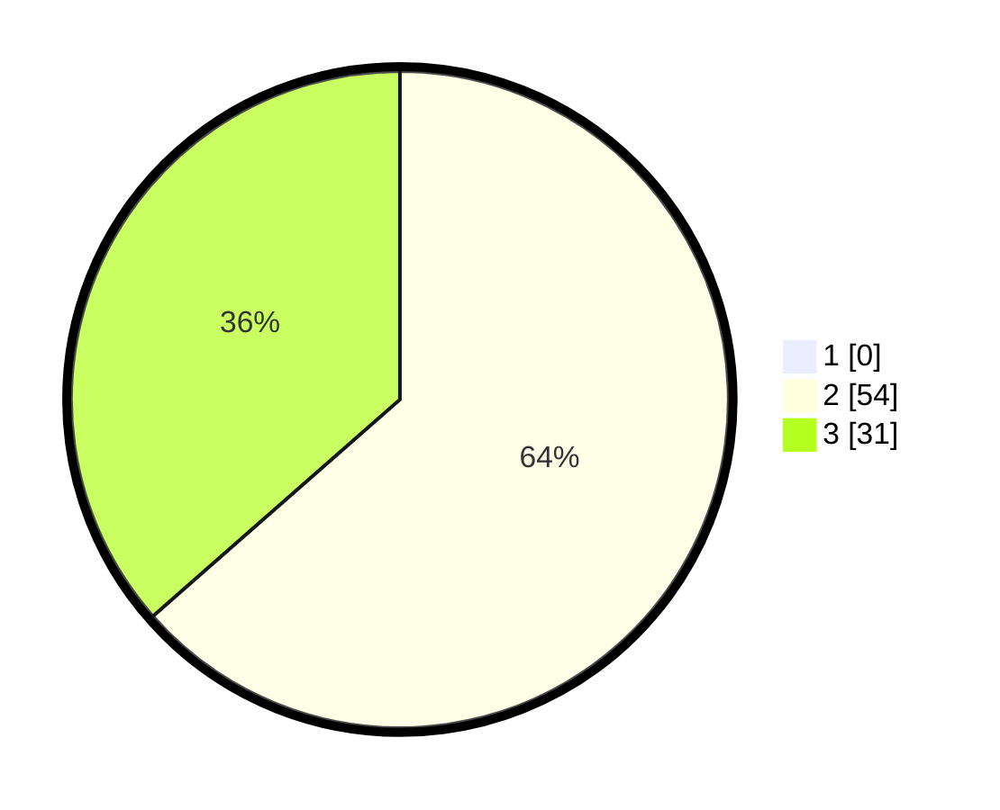

# Hasil

## Grafik

## Tabel

| No. | Nama Paslon    | Suara | Suara (raw) | Persentase |
|:--- |:-------------- | -----:| -----------:| ----------:|
| 1   | ANIES MUHAIMIN | 0     | [0][p-1]    | 0,00       |
| 2   | PRABOWO GIBRAN | 54    | [54][p-2]   | 63,53      |
| 3   | GANJAR MAHFUD  | 31    | [31][p-3]   | 36,47      |

[p-1]: https://github.com/gigit-pemilu/pemilu-2024/blob/main/pilpres/hitung-suara/sub/65-kalimantan-utara/sub/03-nunukan/sub/07-krayan-selatan/sub/2018-long-pupung/sub/001-tps/sub/paslon-1.txt
[p-2]: https://github.com/gigit-pemilu/pemilu-2024/blob/main/pilpres/hitung-suara/sub/65-kalimantan-utara/sub/03-nunukan/sub/07-krayan-selatan/sub/2018-long-pupung/sub/001-tps/sub/paslon-2.txt
[p-3]: https://github.com/gigit-pemilu/pemilu-2024/blob/main/pilpres/hitung-suara/sub/65-kalimantan-utara/sub/03-nunukan/sub/07-krayan-selatan/sub/2018-long-pupung/sub/001-tps/sub/paslon-3.txt

## Foto C Plano

https://sirekap-obj-formc.kpu.go.id/2351/pemilu/ppwp/65/03/07/20/18/6503072018001-20240215-100837--cd31702b-e032-476d-bc6e-028ac85b4fb3.jpg

https://sirekap-obj-formc.kpu.go.id/2351/pemilu/ppwp/65/03/07/20/18/6503072018001-20240215-073802--f57b2547-a85b-42e6-8a42-36663858ce8a.jpg

https://sirekap-obj-formc.kpu.go.id/2351/pemilu/ppwp/65/03/07/20/18/6503072018001-20240215-074013--32fda3b4-2ffb-4163-ac44-ba7084cab77e.jpg

## Metadata

| Key        | Value               |
| ---------- | ------------------- |
| Time Stamp | 2024-02-15 22:40:13 |

