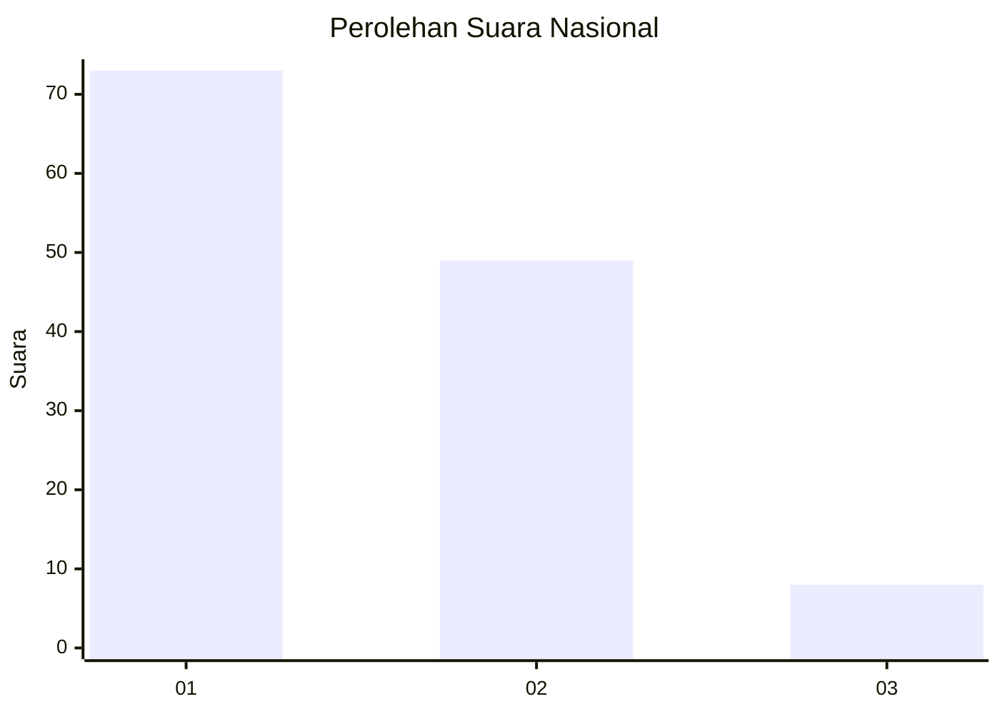
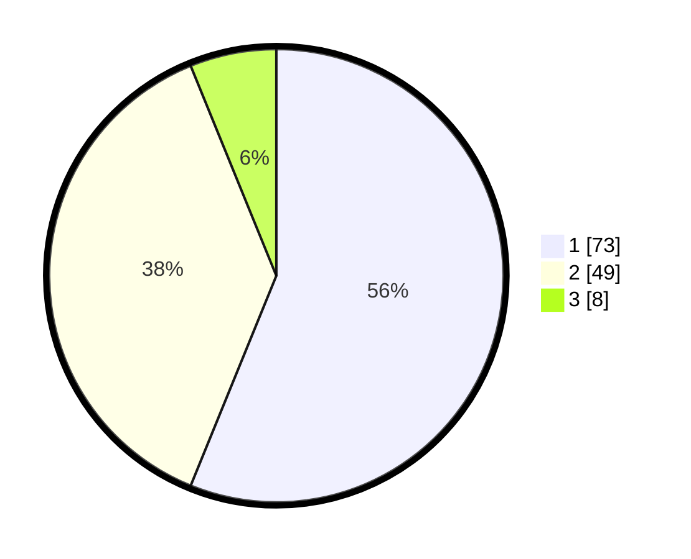

# Hasil

## Grafik

## Tabel

| No. | Nama Paslon    | Suara | Suara (raw) | Persentase |
|:--- |:-------------- | -----:| -----------:| ----------:|
| 1   | ANIES MUHAIMIN | 73    | [73][p-1]   | 56,15      |
| 2   | PRABOWO GIBRAN | 49    | [49][p-2]   | 37,69      |
| 3   | GANJAR MAHFUD  | 8     | [8][p-3]    | 6,15       |

[p-1]: https://github.com/gigit-pemilu/pemilu-2024/blob/main/pilpres/hitung-suara/sub/65-kalimantan-utara/sub/03-nunukan/sub/09-nunukan-selatan/sub/1001-selisun/sub/011-tps/sub/paslon-1.txt
[p-2]: https://github.com/gigit-pemilu/pemilu-2024/blob/main/pilpres/hitung-suara/sub/65-kalimantan-utara/sub/03-nunukan/sub/09-nunukan-selatan/sub/1001-selisun/sub/011-tps/sub/paslon-2.txt
[p-3]: https://github.com/gigit-pemilu/pemilu-2024/blob/main/pilpres/hitung-suara/sub/65-kalimantan-utara/sub/03-nunukan/sub/09-nunukan-selatan/sub/1001-selisun/sub/011-tps/sub/paslon-3.txt

## Foto C Plano

https://sirekap-obj-formc.kpu.go.id/7947/pemilu/ppwp/65/03/09/10/01/6503091001011-20240217-094710--a184a317-a410-417d-bf20-2d6590c521d1.jpg

https://sirekap-obj-formc.kpu.go.id/7947/pemilu/ppwp/65/03/09/10/01/6503091001011-20240217-094730--8650fd39-f0fe-4b78-89c3-296ac98e0b72.jpg

https://sirekap-obj-formc.kpu.go.id/7947/pemilu/ppwp/65/03/09/10/01/6503091001011-20240217-094753--f33f0729-de82-4fc3-85af-ed8ad4e2b3d9.jpg

## Metadata

| Key        | Value               |
| ---------- | ------------------- |
| Time Stamp | 2024-02-17 16:36:25 |

