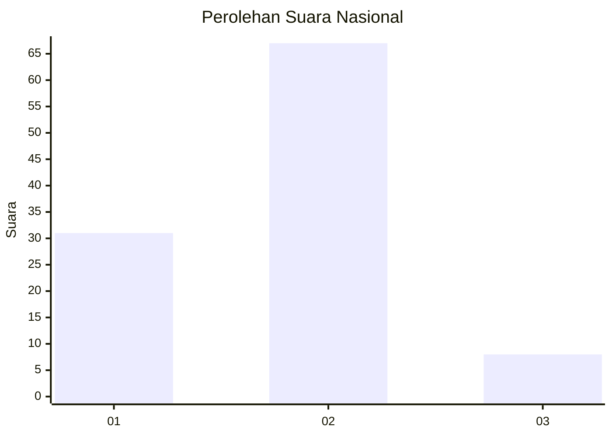
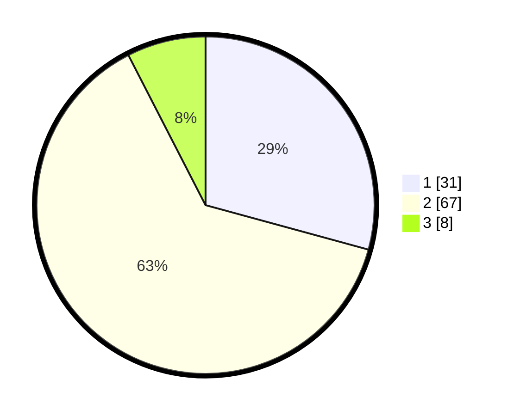

# Hasil

## Grafik

## Tabel

| No. | Nama Paslon    | Suara | Suara (raw) | Persentase |
|:--- |:-------------- | -----:| -----------:| ----------:|
| 1   | ANIES MUHAIMIN | 31    | [31][p-1]   | 29,25      |
| 2   | PRABOWO GIBRAN | 67    | [67][p-2]   | 63,21      |
| 3   | GANJAR MAHFUD  | 8     | [8][p-3]    | 7,55       |

[p-1]: https://github.com/gigit-pemilu/pemilu-2024/blob/main/pilpres/hitung-suara/sub/65-kalimantan-utara/sub/03-nunukan/sub/09-nunukan-selatan/sub/1001-selisun/sub/013-tps/sub/paslon-1.txt
[p-2]: https://github.com/gigit-pemilu/pemilu-2024/blob/main/pilpres/hitung-suara/sub/65-kalimantan-utara/sub/03-nunukan/sub/09-nunukan-selatan/sub/1001-selisun/sub/013-tps/sub/paslon-2.txt
[p-3]: https://github.com/gigit-pemilu/pemilu-2024/blob/main/pilpres/hitung-suara/sub/65-kalimantan-utara/sub/03-nunukan/sub/09-nunukan-selatan/sub/1001-selisun/sub/013-tps/sub/paslon-3.txt

## Foto C Plano

https://sirekap-obj-formc.kpu.go.id/0ef1/pemilu/ppwp/65/03/09/10/01/6503091001013-20240217-095416--4dd25eeb-feff-4bce-8d56-129875a236a7.jpg

https://sirekap-obj-formc.kpu.go.id/0ef1/pemilu/ppwp/65/03/09/10/01/6503091001013-20240217-095450--94f434e4-ab2c-47d6-9854-0b24821e3f87.jpg

https://sirekap-obj-formc.kpu.go.id/0ef1/pemilu/ppwp/65/03/09/10/01/6503091001013-20240217-095511--1182c199-37f0-4bf3-a16c-2717f2367a5a.jpg

## Metadata

| Key        | Value               |
| ---------- | ------------------- |
| Time Stamp | 2024-02-17 16:36:25 |

