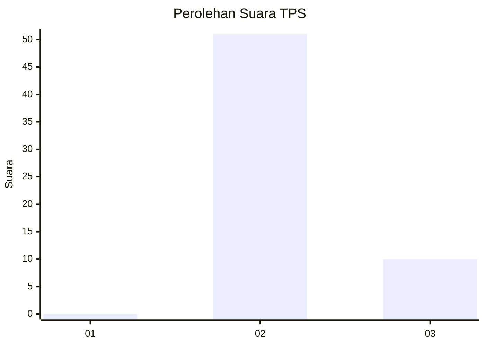
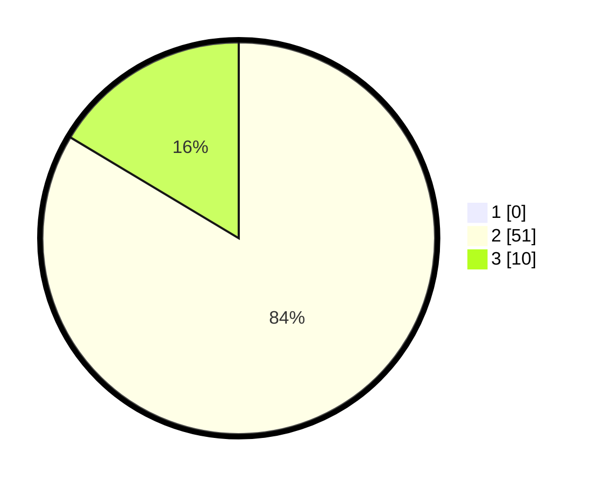

# Hasil

## Grafik

## Tabel

| No. | Nama Paslon    | Suara | Suara (raw) | Persentase |
|:--- |:-------------- | -----:| -----------:| ----------:|
| 1   | ANIES MUHAIMIN | 0     | [0][p-1]    | 0,00       |
| 2   | PRABOWO GIBRAN | 51    | [51][p-2]   | 83,61      |
| 3   | GANJAR MAHFUD  | 10    | [10][p-3]   | 16,39      |

[p-1]: https://github.com/gigit-pemilu/pemilu-2024-65-kalimantan-utara/blob/main/pilpres/hitung-suara/sub/65-kalimantan-utara/sub/03-nunukan/sub/15-lumbis-ogong/sub/2011-sungoi/sub/001-tps/sub/paslon-1.txt
[p-2]: https://github.com/gigit-pemilu/pemilu-2024-65-kalimantan-utara/blob/main/pilpres/hitung-suara/sub/65-kalimantan-utara/sub/03-nunukan/sub/15-lumbis-ogong/sub/2011-sungoi/sub/001-tps/sub/paslon-2.txt
[p-3]: https://github.com/gigit-pemilu/pemilu-2024-65-kalimantan-utara/blob/main/pilpres/hitung-suara/sub/65-kalimantan-utara/sub/03-nunukan/sub/15-lumbis-ogong/sub/2011-sungoi/sub/001-tps/sub/paslon-3.txt

## Foto C Plano

https://sirekap-obj-formc.kpu.go.id/0bae/pemilu/ppwp/65/03/15/20/11/6503152011001-20240215-020845--dafb35ba-f24d-4423-b9fd-311810c24e3f.jpg

https://sirekap-obj-formc.kpu.go.id/0bae/pemilu/ppwp/65/03/15/20/11/6503152011001-20240215-231858--8d7461ae-13ed-47f6-8e25-5b956b2bcbfe.jpg

https://sirekap-obj-formc.kpu.go.id/0bae/pemilu/ppwp/65/03/15/20/11/6503152011001-20240215-042906--df298981-d9bd-45b4-aedb-97c18d9d8769.jpg

## Metadata

| Key        | Value               |
| ---------- | ------------------- |
| Time Stamp | 2024-02-16 00:00:26 |

