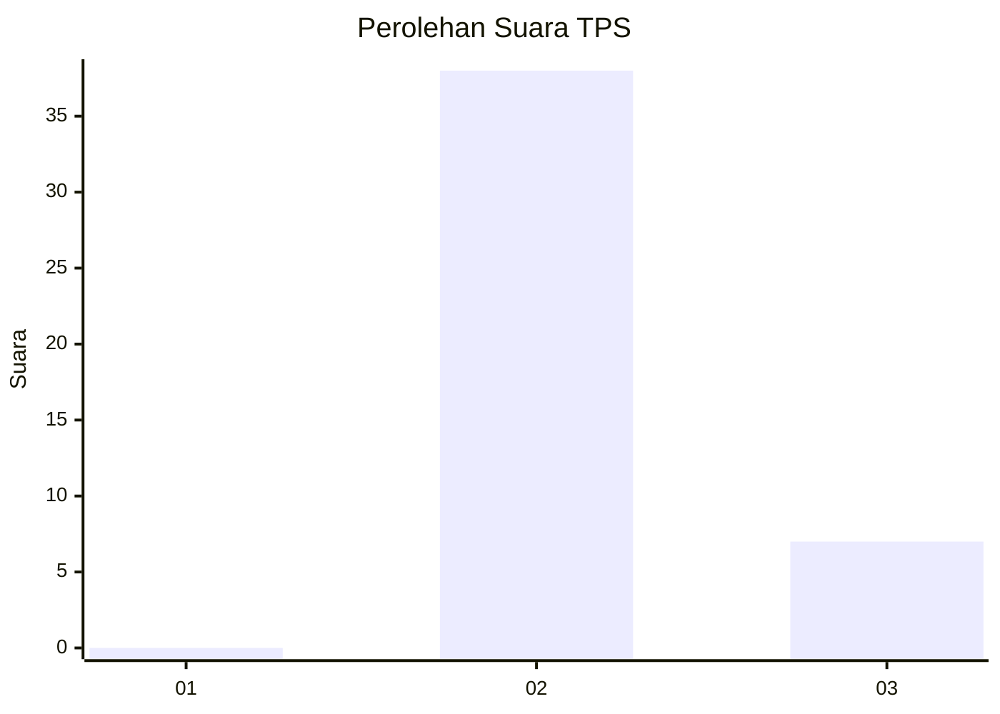
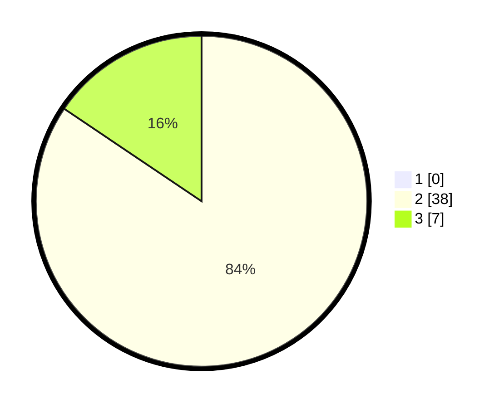

# Hasil

## Grafik

## Tabel

| No. | Nama Paslon    | Suara | Suara (raw) | Persentase |
|:--- |:-------------- | -----:| -----------:| ----------:|
| 1   | ANIES MUHAIMIN | 0     | [0][p-1]    | 0,00       |
| 2   | PRABOWO GIBRAN | 38    | [38][p-2]   | 84,44      |
| 3   | GANJAR MAHFUD  | 7     | [7][p-3]    | 15,56      |

[p-1]: https://github.com/gigit-pemilu/pemilu-2024-65-kalimantan-utara/blob/main/pilpres/hitung-suara/sub/65-kalimantan-utara/sub/03-nunukan/sub/15-lumbis-ogong/sub/2024-tumantalas/sub/001-tps/sub/paslon-1.txt
[p-2]: https://github.com/gigit-pemilu/pemilu-2024-65-kalimantan-utara/blob/main/pilpres/hitung-suara/sub/65-kalimantan-utara/sub/03-nunukan/sub/15-lumbis-ogong/sub/2024-tumantalas/sub/001-tps/sub/paslon-2.txt
[p-3]: https://github.com/gigit-pemilu/pemilu-2024-65-kalimantan-utara/blob/main/pilpres/hitung-suara/sub/65-kalimantan-utara/sub/03-nunukan/sub/15-lumbis-ogong/sub/2024-tumantalas/sub/001-tps/sub/paslon-3.txt

## Foto C Plano

https://sirekap-obj-formc.kpu.go.id/505e/pemilu/ppwp/65/03/15/20/24/6503152024001-20240214-222232--4ef0cd8c-db18-4b20-8691-2fd900d8e71c.jpg

https://sirekap-obj-formc.kpu.go.id/505e/pemilu/ppwp/65/03/15/20/24/6503152024001-20240215-085953--c766beaa-7042-4dbb-b86f-5016092acb61.jpg

https://sirekap-obj-formc.kpu.go.id/505e/pemilu/ppwp/65/03/15/20/24/6503152024001-20240214-222450--ba057f13-2c70-42e1-ae5d-9b16340a45e9.jpg

## Metadata

| Key        | Value               |
| ---------- | ------------------- |
| Time Stamp | 2024-02-16 00:00:26 |

