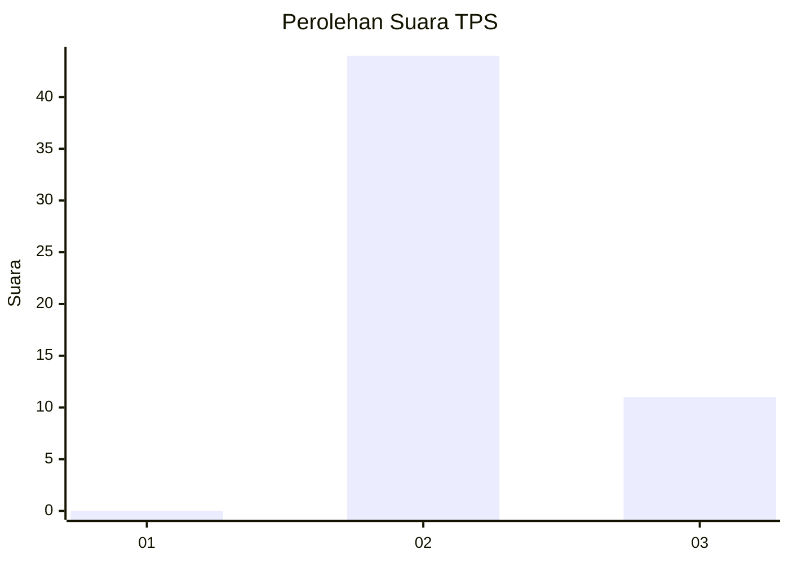
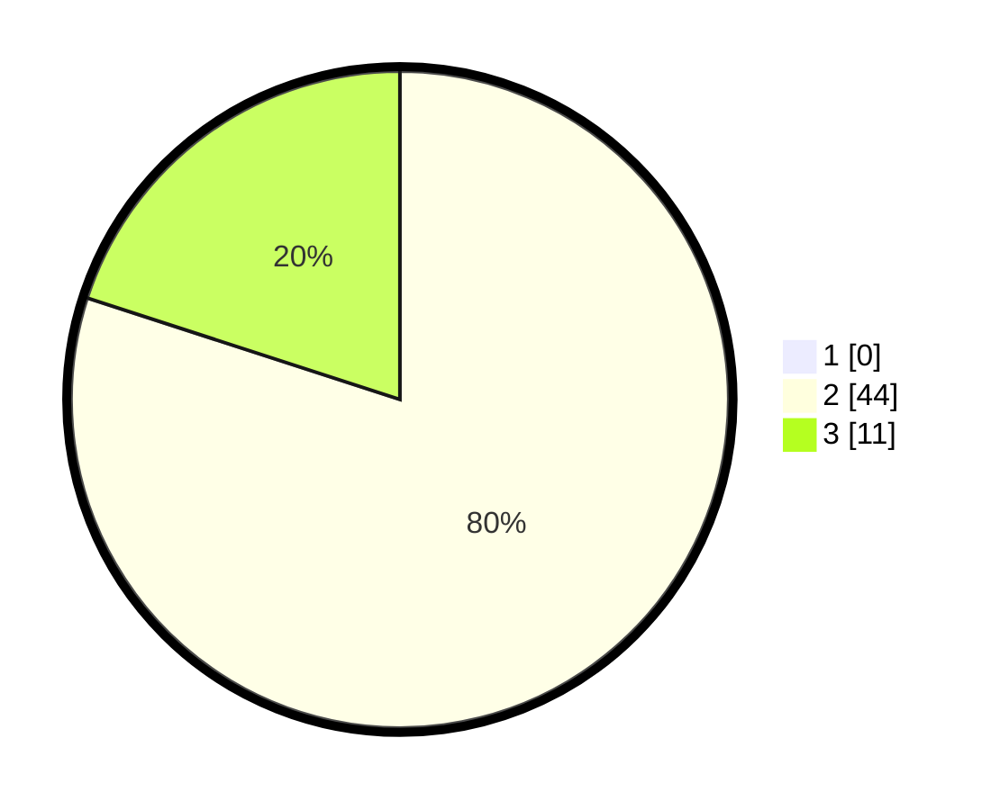

# Hasil

## Grafik

## Tabel

| No. | Nama Paslon    | Suara | Suara (raw) | Persentase |
|:--- |:-------------- | -----:| -----------:| ----------:|
| 1   | ANIES MUHAIMIN | 0     | [0][p-1]    | 0,00       |
| 2   | PRABOWO GIBRAN | 44    | [44][p-2]   | 80,00      |
| 3   | GANJAR MAHFUD  | 11    | [11][p-3]   | 20,00      |

[p-1]: https://github.com/gigit-pemilu/pemilu-2024-65-kalimantan-utara/blob/main/pilpres/hitung-suara/sub/65-kalimantan-utara/sub/03-nunukan/sub/17-krayan-tengah/sub/2002-long-rungan/sub/001-tps/sub/paslon-1.txt
[p-2]: https://github.com/gigit-pemilu/pemilu-2024-65-kalimantan-utara/blob/main/pilpres/hitung-suara/sub/65-kalimantan-utara/sub/03-nunukan/sub/17-krayan-tengah/sub/2002-long-rungan/sub/001-tps/sub/paslon-2.txt
[p-3]: https://github.com/gigit-pemilu/pemilu-2024-65-kalimantan-utara/blob/main/pilpres/hitung-suara/sub/65-kalimantan-utara/sub/03-nunukan/sub/17-krayan-tengah/sub/2002-long-rungan/sub/001-tps/sub/paslon-3.txt

## Foto C Plano

https://sirekap-obj-formc.kpu.go.id/9066/pemilu/ppwp/65/03/17/20/02/6503172002001-20240214-222101--a9a789bb-9b1e-4ad4-a796-9e14b7a1a027.jpg

https://sirekap-obj-formc.kpu.go.id/9066/pemilu/ppwp/65/03/17/20/02/6503172002001-20240214-230028--25881196-1c5f-4b5a-b374-91d1bff3cc93.jpg

https://sirekap-obj-formc.kpu.go.id/9066/pemilu/ppwp/65/03/17/20/02/6503172002001-20240214-230652--2d66c822-a4ed-4559-9c6f-073e963dfe9d.jpg

## Metadata

| Key        | Value               |
| ---------- | ------------------- |
| Time Stamp | 2024-02-16 00:30:27 |

