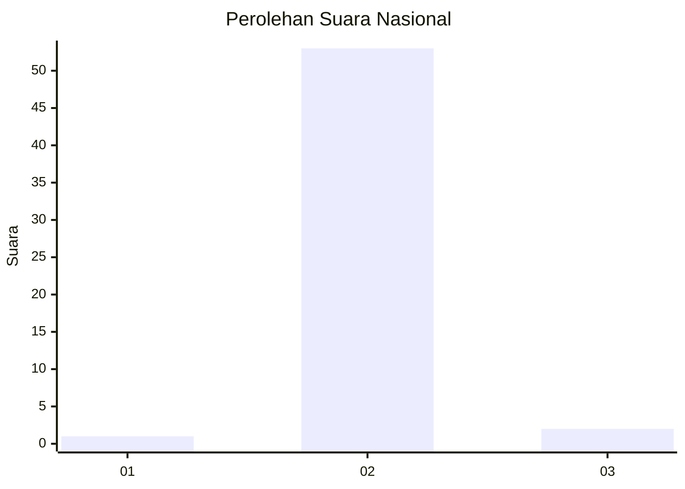
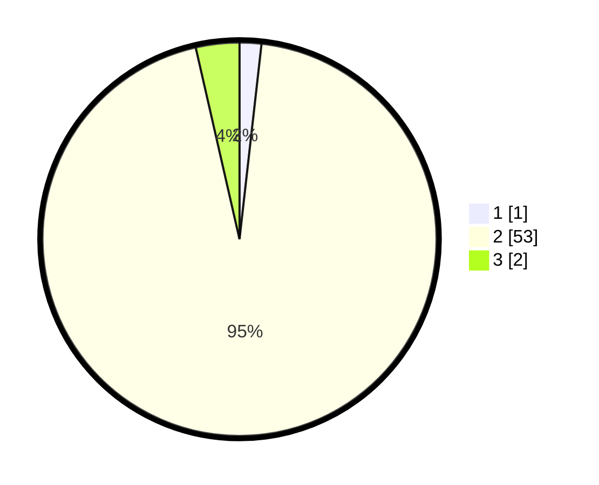

# Hasil

## Grafik

## Tabel

| No. | Nama Paslon    | Suara | Suara (raw) | Persentase |
|:--- |:-------------- | -----:| -----------:| ----------:|
| 1   | ANIES MUHAIMIN | 1     | [1][p-1]    | 1,79       |
| 2   | PRABOWO GIBRAN | 53    | [53][p-2]   | 94,64      |
| 3   | GANJAR MAHFUD  | 2     | [2][p-3]    | 3,57       |

[p-1]: https://github.com/gigit-pemilu/pemilu-2024/blob/main/pilpres/hitung-suara/sub/65-kalimantan-utara/sub/03-nunukan/sub/17-krayan-tengah/sub/2003-long-kelupan/sub/001-tps/sub/paslon-1.txt
[p-2]: https://github.com/gigit-pemilu/pemilu-2024/blob/main/pilpres/hitung-suara/sub/65-kalimantan-utara/sub/03-nunukan/sub/17-krayan-tengah/sub/2003-long-kelupan/sub/001-tps/sub/paslon-2.txt
[p-3]: https://github.com/gigit-pemilu/pemilu-2024/blob/main/pilpres/hitung-suara/sub/65-kalimantan-utara/sub/03-nunukan/sub/17-krayan-tengah/sub/2003-long-kelupan/sub/001-tps/sub/paslon-3.txt

## Foto C Plano

https://sirekap-obj-formc.kpu.go.id/4ba2/pemilu/ppwp/65/03/17/20/03/6503172003001-20240214-220603--db4011c5-83ce-4bb3-9b28-f06d0e3be4cc.jpg

https://sirekap-obj-formc.kpu.go.id/4ba2/pemilu/ppwp/65/03/17/20/03/6503172003001-20240214-220928--c81c393e-0db2-4497-9db0-a2b4ce88f899.jpg

https://sirekap-obj-formc.kpu.go.id/4ba2/pemilu/ppwp/65/03/17/20/03/6503172003001-20240214-221223--53bf5a77-423c-4825-86fb-c5452b58e732.jpg

## Metadata

| Key        | Value               |
| ---------- | ------------------- |
| Time Stamp | 2024-02-16 00:30:27 |

