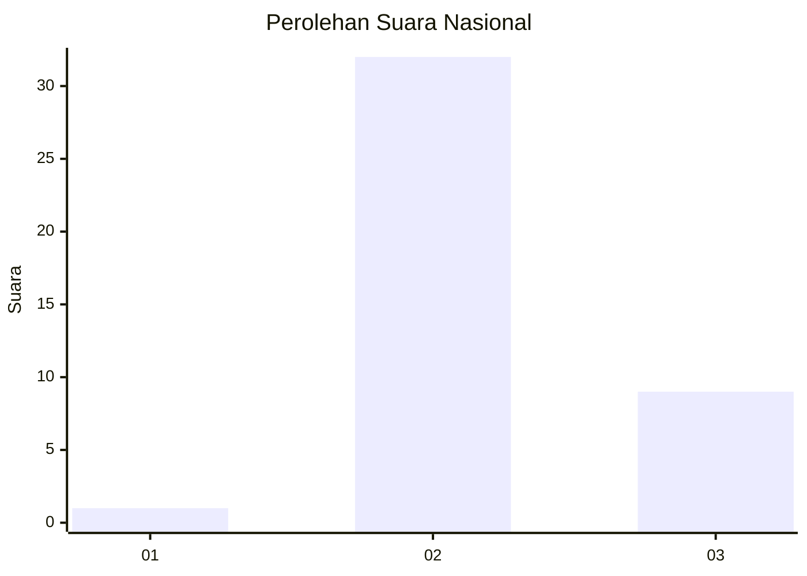
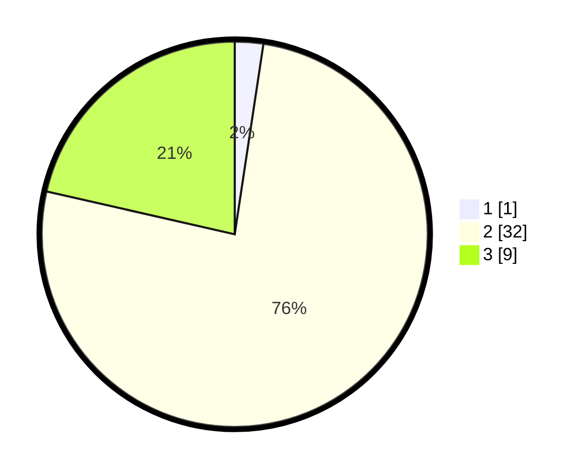

# Hasil

## Grafik

## Tabel

| No. | Nama Paslon    | Suara | Suara (raw) | Persentase |
|:--- |:-------------- | -----:| -----------:| ----------:|
| 1   | ANIES MUHAIMIN | 1     | [1][p-1]    | 2,38       |
| 2   | PRABOWO GIBRAN | 32    | [32][p-2]   | 76,19      |
| 3   | GANJAR MAHFUD  | 9     | [9][p-3]    | 21,43      |

[p-1]: https://github.com/gigit-pemilu/pemilu-2024/blob/main/pilpres/hitung-suara/sub/65-kalimantan-utara/sub/03-nunukan/sub/19-krayan-barat/sub/2004-buduk-kubul/sub/001-tps/sub/paslon-1.txt
[p-2]: https://github.com/gigit-pemilu/pemilu-2024/blob/main/pilpres/hitung-suara/sub/65-kalimantan-utara/sub/03-nunukan/sub/19-krayan-barat/sub/2004-buduk-kubul/sub/001-tps/sub/paslon-2.txt
[p-3]: https://github.com/gigit-pemilu/pemilu-2024/blob/main/pilpres/hitung-suara/sub/65-kalimantan-utara/sub/03-nunukan/sub/19-krayan-barat/sub/2004-buduk-kubul/sub/001-tps/sub/paslon-3.txt

## Foto C Plano

https://sirekap-obj-formc.kpu.go.id/61cf/pemilu/ppwp/65/03/19/20/04/6503192004001-20240215-014248--111c0d0e-3017-4da0-9ae0-6f12c6e7a065.jpg

https://sirekap-obj-formc.kpu.go.id/61cf/pemilu/ppwp/65/03/19/20/04/6503192004001-20240215-025106--7b8adbec-f804-4484-aabc-9b2bbff65dfb.jpg

https://sirekap-obj-formc.kpu.go.id/61cf/pemilu/ppwp/65/03/19/20/04/6503192004001-20240215-003458--284bf473-4ef1-4544-b11c-52f716c80ca1.jpg

## Metadata

| Key        | Value               |
| ---------- | ------------------- |
| Time Stamp | 2024-02-16 00:30:27 |

