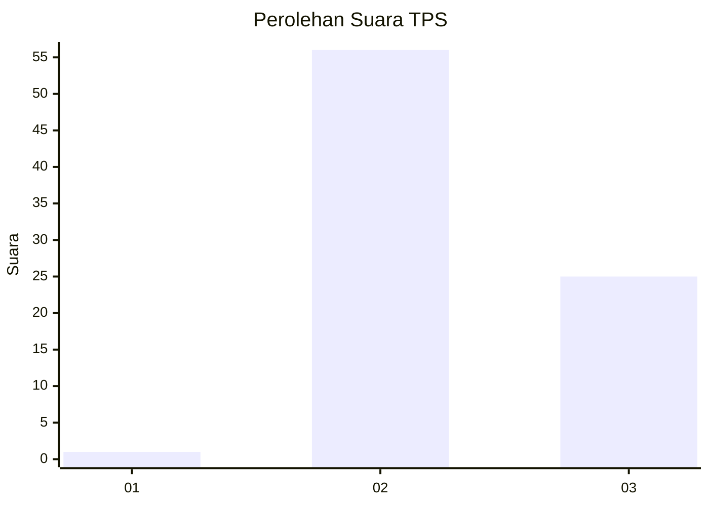
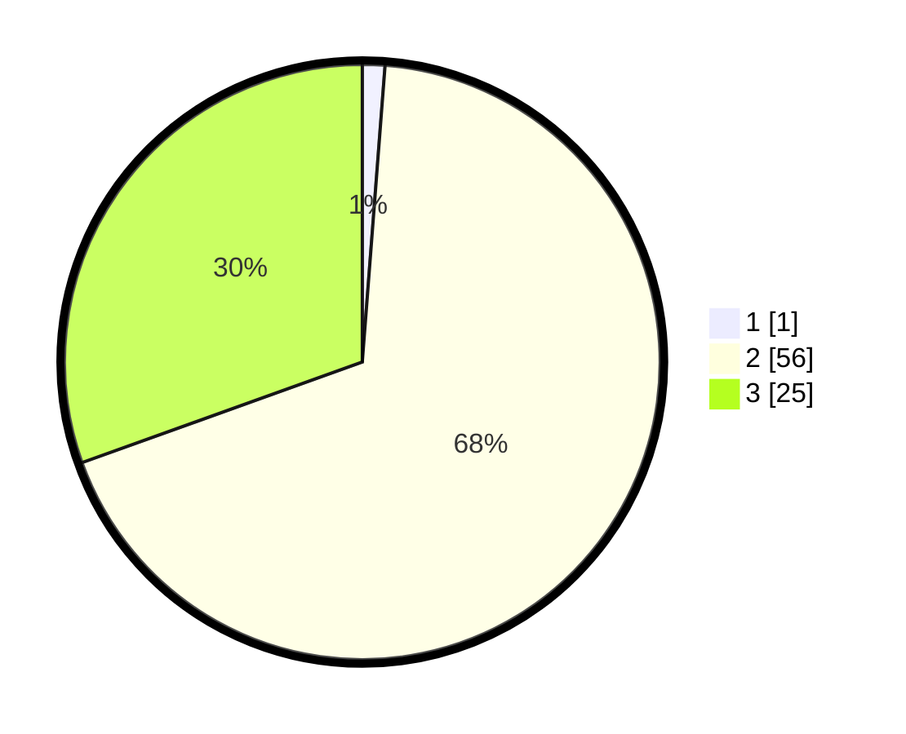

# Hasil

## Grafik

## Tabel

| No. | Nama Paslon    | Suara | Suara (raw) | Persentase |
|:--- |:-------------- | -----:| -----------:| ----------:|
| 1   | ANIES MUHAIMIN | 1     | [1][p-1]    | 1,22       |
| 2   | PRABOWO GIBRAN | 56    | [56][p-2]   | 68,29      |
| 3   | GANJAR MAHFUD  | 25    | [25][p-3]   | 30,49      |

[p-1]: https://github.com/gigit-pemilu/pemilu-2024-65-kalimantan-utara/blob/main/pilpres/hitung-suara/sub/65-kalimantan-utara/sub/03-nunukan/sub/19-krayan-barat/sub/2016-pa'-pirit/sub/001-tps/sub/paslon-1.txt
[p-2]: https://github.com/gigit-pemilu/pemilu-2024-65-kalimantan-utara/blob/main/pilpres/hitung-suara/sub/65-kalimantan-utara/sub/03-nunukan/sub/19-krayan-barat/sub/2016-pa'-pirit/sub/001-tps/sub/paslon-2.txt
[p-3]: https://github.com/gigit-pemilu/pemilu-2024-65-kalimantan-utara/blob/main/pilpres/hitung-suara/sub/65-kalimantan-utara/sub/03-nunukan/sub/19-krayan-barat/sub/2016-pa'-pirit/sub/001-tps/sub/paslon-3.txt

## Foto C Plano

https://sirekap-obj-formc.kpu.go.id/df5c/pemilu/ppwp/65/03/19/20/16/6503192016001-20240214-230002--54454a15-a8a9-4a16-b833-ec1780a227b7.jpg

https://sirekap-obj-formc.kpu.go.id/df5c/pemilu/ppwp/65/03/19/20/16/6503192016001-20240215-024443--184234f3-f08c-48a4-bf42-527361db0347.jpg

https://sirekap-obj-formc.kpu.go.id/df5c/pemilu/ppwp/65/03/19/20/16/6503192016001-20240214-230247--d3ec9c03-ef29-479e-8a2c-e6d8ce881f39.jpg

## Metadata

| Key        | Value               |
| ---------- | ------------------- |
| Time Stamp | 2024-02-16 00:30:27 |

