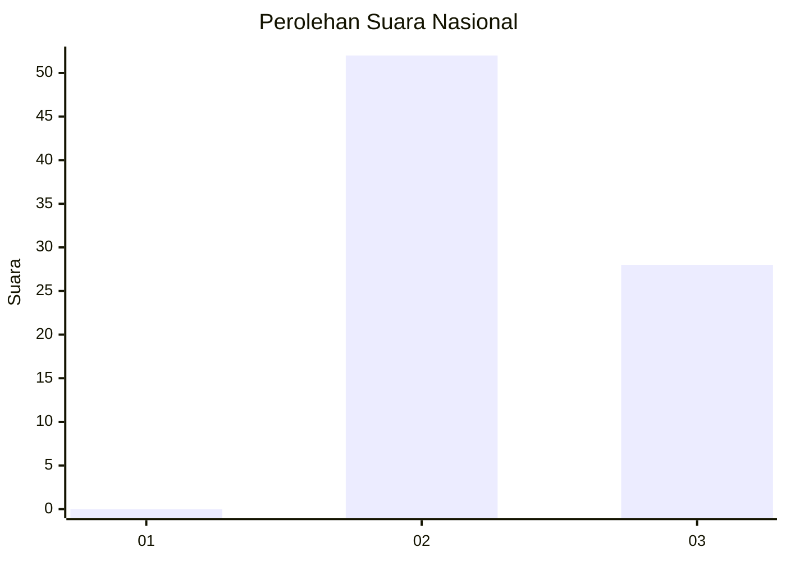
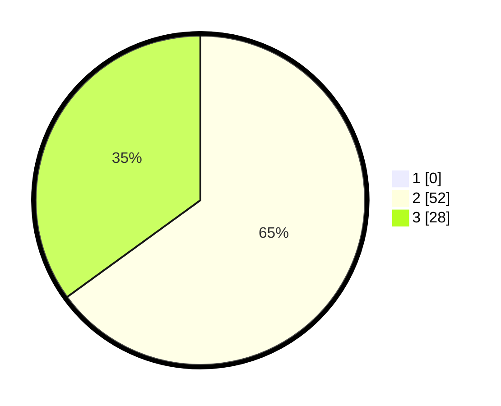

# Hasil

## Grafik

## Tabel

| No. | Nama Paslon    | Suara | Suara (raw) | Persentase |
|:--- |:-------------- | -----:| -----------:| ----------:|
| 1   | ANIES MUHAIMIN | 0     | [0][p-1]    | 0,00       |
| 2   | PRABOWO GIBRAN | 52    | [52][p-2]   | 65,00      |
| 3   | GANJAR MAHFUD  | 28    | [28][p-3]   | 35,00      |

[p-1]: https://github.com/gigit-pemilu/pemilu-2024/blob/main/pilpres/hitung-suara/sub/65-kalimantan-utara/sub/03-nunukan/sub/19-krayan-barat/sub/2017-liang-aliq/sub/001-tps/sub/paslon-1.txt
[p-2]: https://github.com/gigit-pemilu/pemilu-2024/blob/main/pilpres/hitung-suara/sub/65-kalimantan-utara/sub/03-nunukan/sub/19-krayan-barat/sub/2017-liang-aliq/sub/001-tps/sub/paslon-2.txt
[p-3]: https://github.com/gigit-pemilu/pemilu-2024/blob/main/pilpres/hitung-suara/sub/65-kalimantan-utara/sub/03-nunukan/sub/19-krayan-barat/sub/2017-liang-aliq/sub/001-tps/sub/paslon-3.txt

## Foto C Plano

https://sirekap-obj-formc.kpu.go.id/f35a/pemilu/ppwp/65/03/19/20/17/6503192017001-20240215-010807--8da144b0-584a-43ba-b0be-3ee6912b0d93.jpg

https://sirekap-obj-formc.kpu.go.id/f35a/pemilu/ppwp/65/03/19/20/17/6503192017001-20240215-010855--2c139d36-242a-4619-a517-b942e0e4d5f5.jpg

https://sirekap-obj-formc.kpu.go.id/f35a/pemilu/ppwp/65/03/19/20/17/6503192017001-20240215-011004--a56ffec3-a64b-401c-8c69-46842a71fdaf.jpg

## Metadata

| Key        | Value               |
| ---------- | ------------------- |
| Time Stamp | 2024-02-16 00:30:27 |

