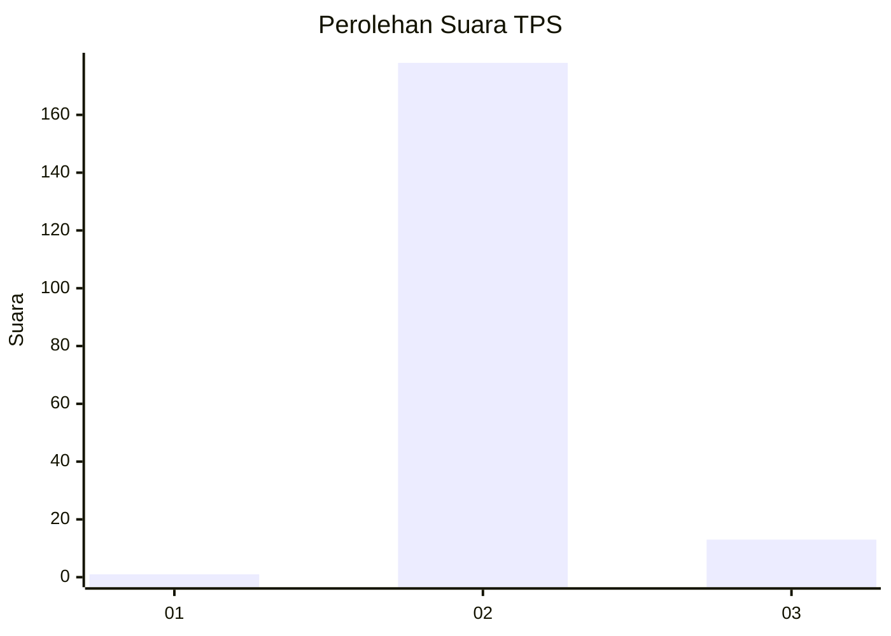
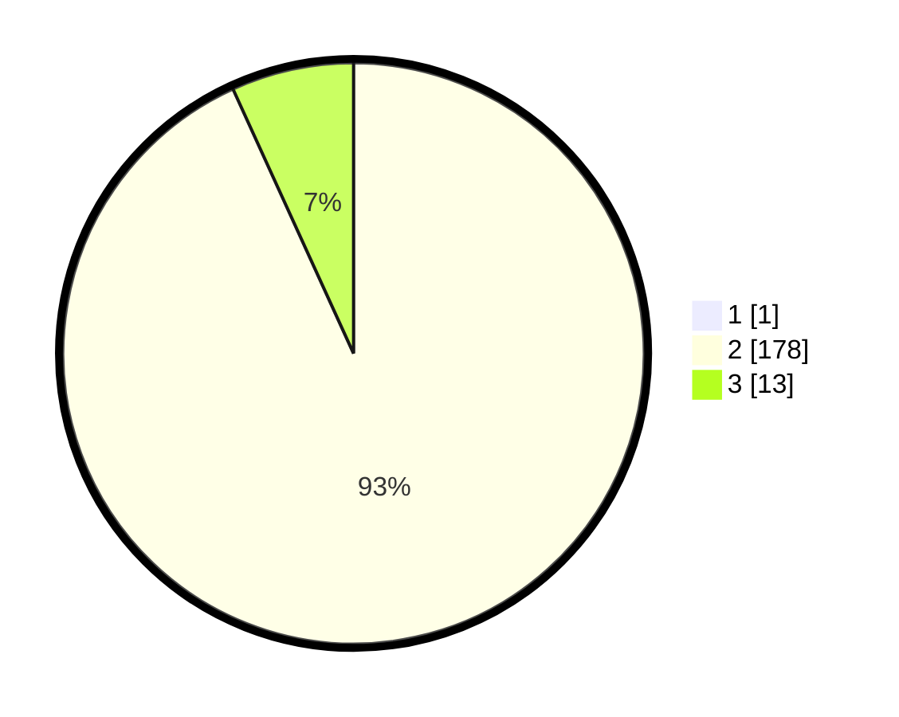

# Hasil

## Grafik

## Tabel

| No. | Nama Paslon    | Suara | Suara (raw) | Persentase |
|:--- |:-------------- | -----:| -----------:| ----------:|
| 1   | ANIES MUHAIMIN | 1     | [1][p-1]    | 0,52       |
| 2   | PRABOWO GIBRAN | 178   | [178][p-2]  | 92,71      |
| 3   | GANJAR MAHFUD  | 13    | [13][p-3]   | 6,77       |

[p-1]: https://github.com/gigit-pemilu/pemilu-2024-65-kalimantan-utara/blob/main/pilpres/hitung-suara/sub/65-kalimantan-utara/sub/03-nunukan/sub/20-lumbis-pansiangan/sub/2004-sumantipal/sub/001-tps/sub/paslon-1.txt
[p-2]: https://github.com/gigit-pemilu/pemilu-2024-65-kalimantan-utara/blob/main/pilpres/hitung-suara/sub/65-kalimantan-utara/sub/03-nunukan/sub/20-lumbis-pansiangan/sub/2004-sumantipal/sub/001-tps/sub/paslon-2.txt
[p-3]: https://github.com/gigit-pemilu/pemilu-2024-65-kalimantan-utara/blob/main/pilpres/hitung-suara/sub/65-kalimantan-utara/sub/03-nunukan/sub/20-lumbis-pansiangan/sub/2004-sumantipal/sub/001-tps/sub/paslon-3.txt

## Foto C Plano

https://sirekap-obj-formc.kpu.go.id/d7c8/pemilu/ppwp/65/03/20/20/04/6503202004001-20240215-120453--1d4b25e7-7470-4a48-b6f3-c450d6b1b670.jpg

https://sirekap-obj-formc.kpu.go.id/d7c8/pemilu/ppwp/65/03/20/20/04/6503202004001-20240217-123418--6ba54b91-eac9-4510-8cc8-c3afc1f3e0d2.jpg

https://sirekap-obj-formc.kpu.go.id/d7c8/pemilu/ppwp/65/03/20/20/04/6503202004001-20240215-123044--817e94f1-8a2f-4b38-9850-89ec11c16e30.jpg

## Metadata

| Key        | Value               |
| ---------- | ------------------- |
| Time Stamp | 2024-02-17 13:37:34 |

