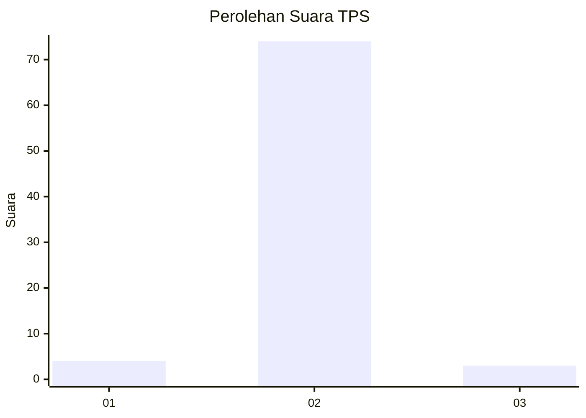
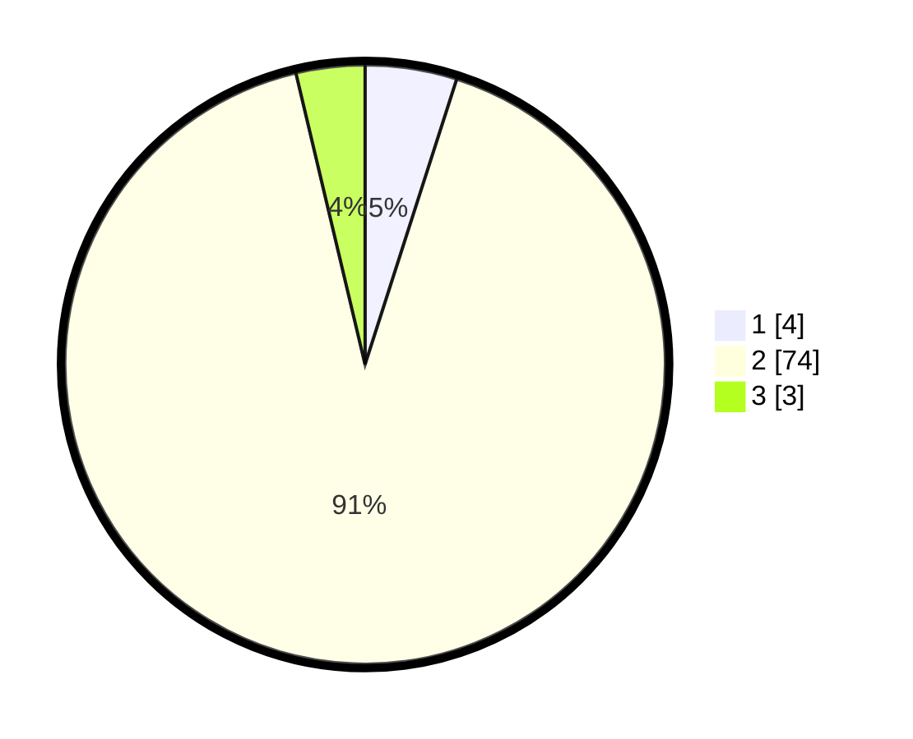

# Hasil

## Grafik

## Tabel

| No. | Nama Paslon    | Suara | Suara (raw) | Persentase |
|:--- |:-------------- | -----:| -----------:| ----------:|
| 1   | ANIES MUHAIMIN | 4     | [4][p-1]    | 4,94       |
| 2   | PRABOWO GIBRAN | 74    | [74][p-2]   | 91,36      |
| 3   | GANJAR MAHFUD  | 3     | [3][p-3]    | 3,70       |

[p-1]: https://github.com/gigit-pemilu/pemilu-2024-65-kalimantan-utara/blob/main/pilpres/hitung-suara/sub/65-kalimantan-utara/sub/03-nunukan/sub/20-lumbis-pansiangan/sub/2006-bululaun-hilir/sub/001-tps/sub/paslon-1.txt
[p-2]: https://github.com/gigit-pemilu/pemilu-2024-65-kalimantan-utara/blob/main/pilpres/hitung-suara/sub/65-kalimantan-utara/sub/03-nunukan/sub/20-lumbis-pansiangan/sub/2006-bululaun-hilir/sub/001-tps/sub/paslon-2.txt
[p-3]: https://github.com/gigit-pemilu/pemilu-2024-65-kalimantan-utara/blob/main/pilpres/hitung-suara/sub/65-kalimantan-utara/sub/03-nunukan/sub/20-lumbis-pansiangan/sub/2006-bululaun-hilir/sub/001-tps/sub/paslon-3.txt

## Foto C Plano

https://sirekap-obj-formc.kpu.go.id/bfad/pemilu/ppwp/65/03/20/20/06/6503202006001-20240215-083640--9413dd19-6065-4135-bd61-50889b35a22e.jpg

https://sirekap-obj-formc.kpu.go.id/bfad/pemilu/ppwp/65/03/20/20/06/6503202006001-20240215-083942--f6912a8a-5cc1-41d4-8053-89fe958cc767.jpg

https://sirekap-obj-formc.kpu.go.id/bfad/pemilu/ppwp/65/03/20/20/06/6503202006001-20240215-084030--8ea8ab9b-0d30-40c7-b700-e60c03b0d49d.jpg

## Metadata

| Key        | Value               |
| ---------- | ------------------- |
| Time Stamp | 2024-02-16 01:00:27 |

