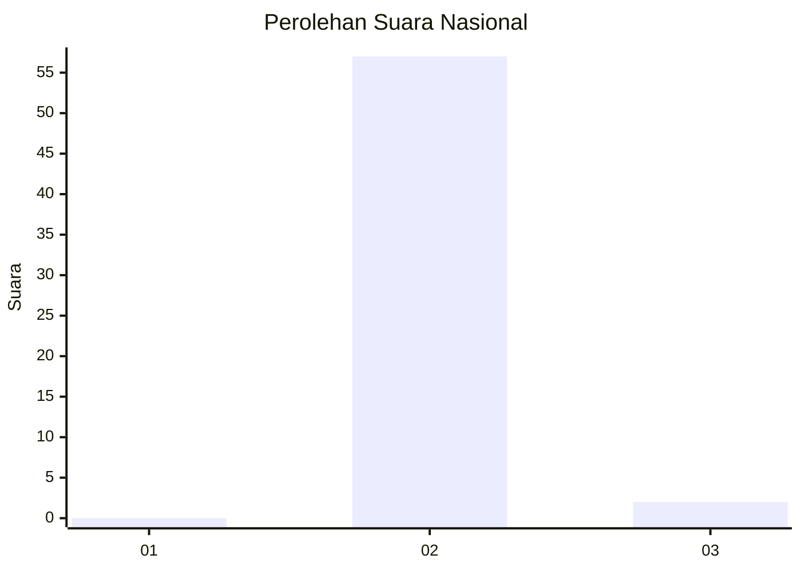
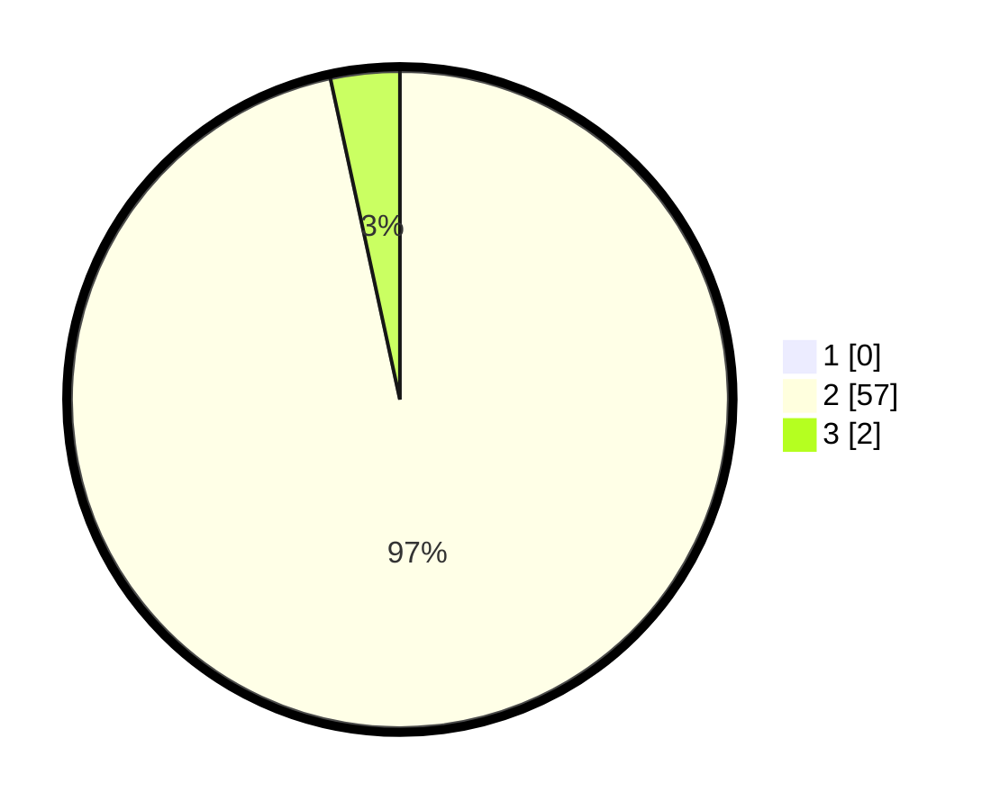

# Hasil

## Grafik

## Tabel

| No. | Nama Paslon    | Suara | Suara (raw) | Persentase |
|:--- |:-------------- | -----:| -----------:| ----------:|
| 1   | ANIES MUHAIMIN | 0     | [0][p-1]    | 0,00       |
| 2   | PRABOWO GIBRAN | 57    | [57][p-2]   | 96,61      |
| 3   | GANJAR MAHFUD  | 2     | [2][p-3]    | 3,39       |

[p-1]: https://github.com/gigit-pemilu/pemilu-2024/blob/main/pilpres/hitung-suara/sub/65-kalimantan-utara/sub/03-nunukan/sub/21-lumbis-hulu/sub/2003-bululaun-hulu/sub/001-tps/sub/paslon-1.txt
[p-2]: https://github.com/gigit-pemilu/pemilu-2024/blob/main/pilpres/hitung-suara/sub/65-kalimantan-utara/sub/03-nunukan/sub/21-lumbis-hulu/sub/2003-bululaun-hulu/sub/001-tps/sub/paslon-2.txt
[p-3]: https://github.com/gigit-pemilu/pemilu-2024/blob/main/pilpres/hitung-suara/sub/65-kalimantan-utara/sub/03-nunukan/sub/21-lumbis-hulu/sub/2003-bululaun-hulu/sub/001-tps/sub/paslon-3.txt

## Foto C Plano

https://sirekap-obj-formc.kpu.go.id/9493/pemilu/ppwp/65/03/21/20/03/6503212003001-20240217-200705--e56ef968-ba51-48a7-81c7-2f3d6a1d3421.jpg

https://sirekap-obj-formc.kpu.go.id/9493/pemilu/ppwp/65/03/21/20/03/6503212003001-20240217-200706--efc28d26-54cb-4e54-8e1c-347600997ffd.jpg

https://sirekap-obj-formc.kpu.go.id/9493/pemilu/ppwp/65/03/21/20/03/6503212003001-20240217-200706--b47d040a-2714-47ee-92c5-5058f4a21591.jpg

## Metadata

| Key        | Value               |
| ---------- | ------------------- |
| Time Stamp | 2024-02-19 06:16:00 |

## DATA PEMILIH TETAP

Jumlah pemilih dalam DPT: **59**.
 * L: **29**.
 * P: **30**.

## DATA PENGGUNA HAK PILIH

Jumlah pengguna hak pilih dalam DPT: **58**.
 * L: **29**.
 * P: **29**.

Jumlah pengguna hak pilih dalam DPTb: **0**.
 * L: **1**.
 * P: **0**.

Jumlah pengguna hak pilih dalam DPK: **59**.
 * L: **30**.
 * P: **29**.

Jumlah pengguna hak pilih: **59**.
 * L: **30**.
 * P: **29**.

## JUMLAH SUARA SAH DAN TIDAK SAH

JUMLAH SELURUH SUARA SAH: **59**.

JUMLAH SUARA TIDAK SAH: **0**.

JUMLAH SELURUH SUARA SAH DAN SUARA TIDAK SAH: **59**.

