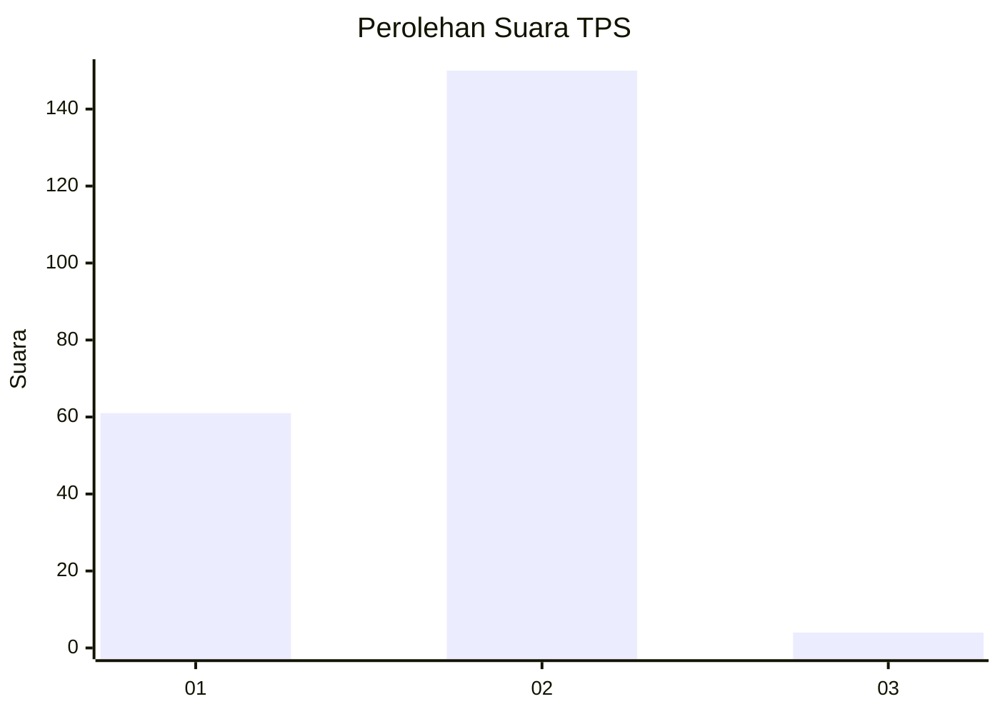
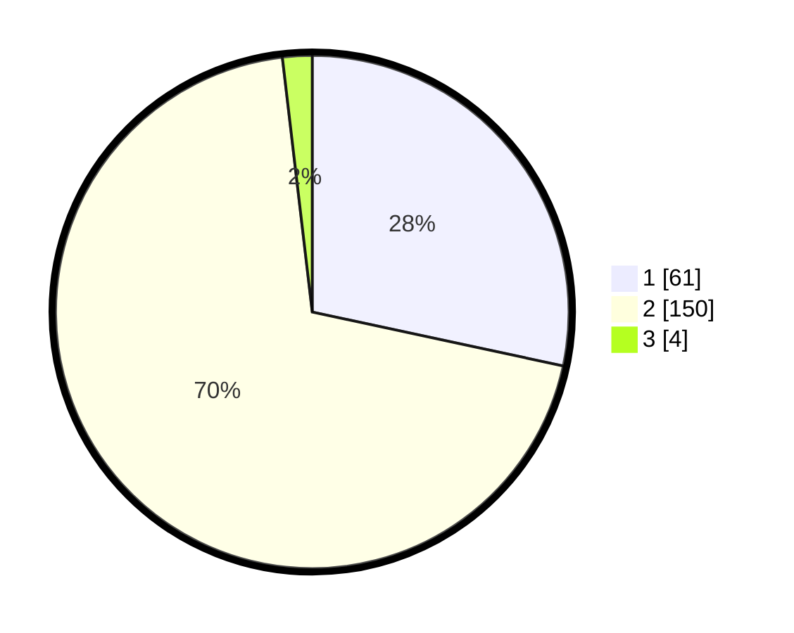

# Hasil

## Grafik

## Tabel

| No. | Nama Paslon    | Suara | Suara (raw) | Persentase |
|:--- |:-------------- | -----:| -----------:| ----------:|
| 1   | ANIES MUHAIMIN | 61    | [61][p-1]   | 28,37      |
| 2   | PRABOWO GIBRAN | 150   | [150][p-2]  | 69,77      |
| 3   | GANJAR MAHFUD  | 4     | [4][p-3]    | 1,86       |

[p-1]: https://github.com/gigit-pemilu/pemilu-2024-65-kalimantan-utara/blob/main/pilpres/hitung-suara/sub/65-kalimantan-utara/sub/71-kota-tarakan/sub/03-tarakan-timur/sub/1001-lingkas-ujung/sub/001-tps/sub/paslon-1.txt
[p-2]: https://github.com/gigit-pemilu/pemilu-2024-65-kalimantan-utara/blob/main/pilpres/hitung-suara/sub/65-kalimantan-utara/sub/71-kota-tarakan/sub/03-tarakan-timur/sub/1001-lingkas-ujung/sub/001-tps/sub/paslon-2.txt
[p-3]: https://github.com/gigit-pemilu/pemilu-2024-65-kalimantan-utara/blob/main/pilpres/hitung-suara/sub/65-kalimantan-utara/sub/71-kota-tarakan/sub/03-tarakan-timur/sub/1001-lingkas-ujung/sub/001-tps/sub/paslon-3.txt

## Foto C Plano

https://sirekap-obj-formc.kpu.go.id/d149/pemilu/ppwp/65/71/03/10/01/6571031001001-20240220-161459--782050dc-6147-4c95-82cd-b5eaa3c870a4.jpg

https://sirekap-obj-formc.kpu.go.id/d149/pemilu/ppwp/65/71/03/10/01/6571031001001-20240220-161643--82c78263-c1c5-4fe3-b38a-90bbf0e366dd.jpg

https://sirekap-obj-formc.kpu.go.id/d149/pemilu/ppwp/65/71/03/10/01/6571031001001-20240220-161757--8bf0a459-64cb-4224-965c-4c4969dd8e84.jpg

## Metadata

| Key        | Value               |
| ---------- | ------------------- |
| Time Stamp | 2024-02-25 12:00:00 |

