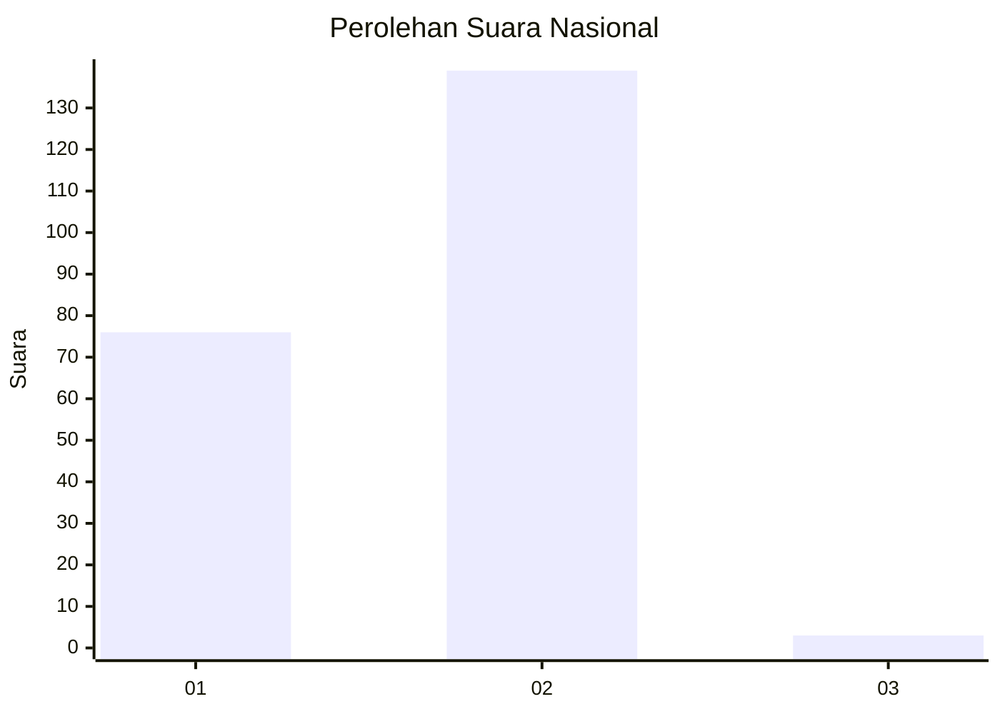
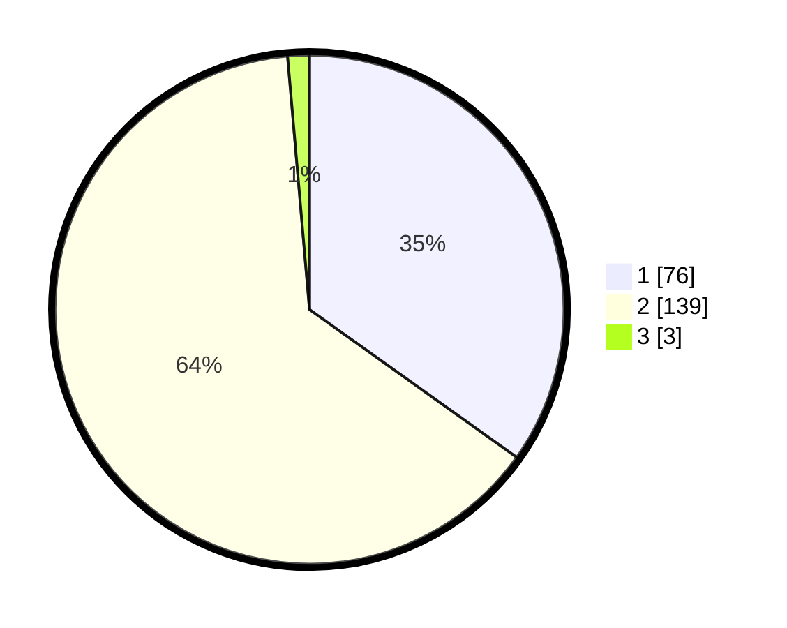

# Hasil

## Grafik

## Tabel

| No. | Nama Paslon    | Suara | Suara (raw) | Persentase |
|:--- |:-------------- | -----:| -----------:| ----------:|
| 1   | ANIES MUHAIMIN | 76    | [76][p-1]   | 34,86      |
| 2   | PRABOWO GIBRAN | 139   | [139][p-2]  | 63,76      |
| 3   | GANJAR MAHFUD  | 3     | [3][p-3]    | 1,38       |

[p-1]: https://github.com/gigit-pemilu/pemilu-2024/blob/main/pilpres/hitung-suara/sub/65-kalimantan-utara/sub/71-kota-tarakan/sub/03-tarakan-timur/sub/1001-lingkas-ujung/sub/003-tps/sub/paslon-1.txt
[p-2]: https://github.com/gigit-pemilu/pemilu-2024/blob/main/pilpres/hitung-suara/sub/65-kalimantan-utara/sub/71-kota-tarakan/sub/03-tarakan-timur/sub/1001-lingkas-ujung/sub/003-tps/sub/paslon-2.txt
[p-3]: https://github.com/gigit-pemilu/pemilu-2024/blob/main/pilpres/hitung-suara/sub/65-kalimantan-utara/sub/71-kota-tarakan/sub/03-tarakan-timur/sub/1001-lingkas-ujung/sub/003-tps/sub/paslon-3.txt

## Foto C Plano

https://sirekap-obj-formc.kpu.go.id/e36e/pemilu/ppwp/65/71/03/10/01/6571031001003-20240215-012744--0f093909-a8af-4999-948e-955142831ba5.jpg

https://sirekap-obj-formc.kpu.go.id/e36e/pemilu/ppwp/65/71/03/10/01/6571031001003-20240215-013006--b12189f1-a45d-46d9-a73a-2eb4536969b9.jpg

https://sirekap-obj-formc.kpu.go.id/e36e/pemilu/ppwp/65/71/03/10/01/6571031001003-20240215-045131--355f125a-ac2b-419a-abe4-5d82eb549a42.jpg

## Metadata

| Key        | Value               |
| ---------- | ------------------- |
| Time Stamp | 2024-02-24 22:31:28 |

